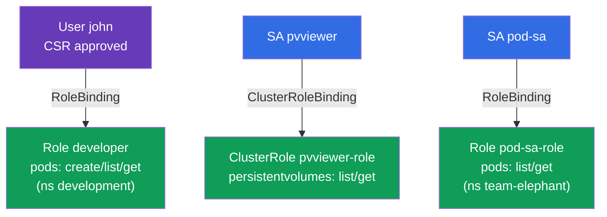

# Lab 113 — RBAC и сертификаты: Role, ClusterRole, ServiceAccount, CSR

## Описание

Практическая работа по управлению доступом. Вы выдадите права пользователю-человеку
через **CSR API** (сертификат + Role + RoleBinding) и настроите доступ для приложений
через **ServiceAccount** (в связке с Role/ClusterRole). Это ядро домена безопасности CKA
и частые задания на обоих экзаменах.

Все задания в экзаменационном стиле с автопроверкой `check_result` (в т.ч. через
`kubectl auth can-i --as`).

## Цель

Закрепить главы курса:

- [Глава 21. ServiceAccount; authn/authz/admission](../../course/21/ru.md)
- [Глава 38. RBAC: Role, ClusterRole и binding'и](../../course/38/ru.md)
- [Глава 39. TLS-сертификаты, kubeconfig и CSR API](../../course/39/ru.md)

## Что мы создаём и зачем

| Объект | Что это | Зачем в этой лабе |
|--------|---------|-------------------|
| **CSR `john-developer` + Role/RoleBinding** | доступ человеку | учимся выдавать сертификат через CSR и давать права в неймспейсе |
| **SA `pvviewer` + ClusterRole/CRB + под** | доступ приложению на уровне кластера | SA получает право `list persistentvolumes` (cluster-scoped) |
| **SA `pod-sa` + Role/RoleBinding + под** (`team-elephant`) | доступ приложению в неймспейсе | SA получает право `list/get pods` |



## Инфраструктура

| Компонент  | Описание                                                    |
|------------|-------------------------------------------------------------|
| `k8s-1`    | Kubernetes `1.35.2` (kubeadm), Calico, metrics-server, одноузловой |
| `worker`   | Рабочая машина с `kubectl`, `openssl` и `check_result`      |

## Развёртывание

```bash
TASK=113 make run_cka_task
```

## Задания

---
|        **1**        | **Выдать доступ пользователю через CSR + RBAC**             |
| :-----------------: | :----------------------------------------------------------- |
| Что делаем          | Генерируем CSR, одобряем, даём права на поды в неймспейсе     |
| Критерии приёмки    | - Неймспейс `development`<br/>- CSR `john-developer` — Approved<br/>- Role `developer` (pods: create,list,get), RoleBinding `developer-role-binding` для `john`<br/>- `john` может create/get pods в `development` |
---
|        **2**        | **Дать SA доступ на уровне кластера**                       |
| :-----------------: | :----------------------------------------------------------- |
| Что делаем          | SA + ClusterRole + ClusterRoleBinding + под с этим SA         |
| Критерии приёмки    | - ServiceAccount `pvviewer`<br/>- ClusterRole `pvviewer-role` (persistentvolumes: list,get), ClusterRoleBinding `pvviewer-role-binding`<br/>- Под `pvviewer` использует SA; SA может `list persistentvolumes` |
---
|        **3**        | **Дать SA доступ в неймспейсе**                             |
| :-----------------: | :----------------------------------------------------------- |
| Что делаем          | SA + Role + RoleBinding + под с этим SA                       |
| Критерии приёмки    | - Неймспейс `team-elephant`<br/>- ServiceAccount `pod-sa`, Role `pod-sa-role` (pods: list,get), RoleBinding `pod-sa-roleBinding`<br/>- Под `pod-sa` использует SA; SA может `list pods` |
---

## Проверка результата

```bash
check_result
```

## Решение

[worker/files/solutions/1.MD](worker/files/solutions/1.MD)

## Покрытие мок-экзаменов

CKA mock 01 (№17 — user+CSR+Role, №18 — SA+ClusterRole), CKA mock 02 (№13 — SA+Role),
CKAD mock 02 (№15 — SA+Role).

## Удаление

```bash
TASK=113 make delete_cka_task
```
