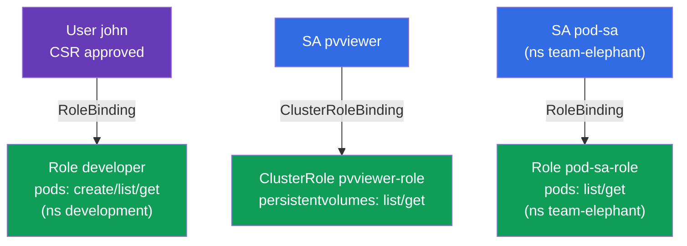

# Lab 113 — RBAC и сертификаты: Role, ClusterRole, ServiceAccount, CSR

## Описание

Практическая работа по управлению доступом. Вы выдадите права пользователю-человеку
через **CSR API** (сертификат + Role + RoleBinding) и настроите доступ для приложений
через **ServiceAccount** (в связке с Role/ClusterRole). Это ядро домена безопасности CKA
и частые задания на обоих экзаменах.

Все задания оформлены в экзаменационном стиле (как реальные вопросы CKA/CKAD) с
автоматической проверкой командой `check_result` (в т.ч. через `kubectl auth can-i --as`).

## Цель

Закрепить материал глав курса:

- [Глава 21. ServiceAccount; authn/authz/admission](../../course/21/ru.md) — как аутентифицируются приложения, стадии обработки запроса к API
- [Глава 38. RBAC: Role, ClusterRole и binding'и](../../course/38/ru.md) — права в namespace и на уровне кластера, привязка к субъектам
- [Глава 39. TLS-сертификаты, kubeconfig и CSR API](../../course/39/ru.md) — выдача клиентского сертификата человеку через CSR

## Что мы создаём и зачем

В этой лабе мы раздаём доступ разным субъектам — человеку и приложениям — и проверяем
права через `kubectl auth can-i`. Каждый объект решает свою задачу:

| Объект | Что это | Зачем в этой лабе |
|--------|---------|-------------------|
| **CSR `john-developer` + Role/RoleBinding** | доступ человеку | учимся выдавать клиентский сертификат через CSR API и давать права в namespace (главы 38, 39) |
| **SA `pvviewer` + ClusterRole/CRB + Pod** | доступ приложению на уровне кластера | SA получает право `list persistentvolumes` (cluster-scoped, главы 21, 38) |
| **SA `pod-sa` + Role/RoleBinding + Pod** (`team-elephant`) | доступ приложению в namespace | SA получает право `list/get pods` в своём namespace (главы 21, 38) |

Итоговая картина того, что будет развёрнуто:



## Инфраструктура

Окружение разворачивается в AWS (`eu-central-1`) через Terragrunt и состоит из:

| Компонент  | Описание                                                    |
|------------|-------------------------------------------------------------|
| `vpc`      | VPC `10.10.0.0/16` с публичными подсетями                    |
| `ssh-keys` | SSH-ключи для доступа к нодам                                |
| `k8s-1`    | Kubernetes `1.35.2` (kubeadm), CNI Calico, metrics-server, одноузловой |
| `worker`   | Рабочая машина с `kubectl`, `openssl` и `check_result`      |

Инстансы: `t3.medium` (master) Ubuntu `22.04`. Кластер одноузловой — master
«разтейнчен» (снят taint `control-plane`), поэтому поды планируются прямо на него.

## Развёртывание

```bash
TASK=113 make run_cka_task
```

После создания подключитесь к рабочей машине (worker) по SSH и выполняйте задания
оттуда. `kubectl` уже настроен на контекст `cluster1-admin@cluster1`.

Полезные команды на рабочей машине:

```bash
time_left       # сколько осталось времени
check_result    # проверить решение
```

## Задания

---
|        **1**        | **Выдать доступ пользователю через CSR + RBAC**             |
| :-----------------: | :----------------------------------------------------------- |
| Что делаем          | Создайте namespace `development`. Сгенерируйте ключ и запрос на сертификат (`openssl genrsa`, `openssl req ... -subj "/CN=john"`), создайте объект `CertificateSigningRequest` с именем `john-developer` (`signerName: kubernetes.io/kube-apiserver-client`, usage `client auth`, `request` = base64 от `.csr`) и одобрите его (`kubectl certificate approve john-developer`). Создайте Role `developer` в `development` с правами `create,list,get` на `pods` и RoleBinding `developer-role-binding`, привязывающий Role к пользователю `john`. |
| Критерии приёмки    | - namespace `development` существует;<br/>- CSR `john-developer` в статусе `Approved`;<br/>- Role `developer` (pods: create/list/get) и RoleBinding `developer-role-binding` для `john`;<br/>- `john` может `create` и `get` Pods в `development` (`kubectl auth can-i --as=john`). |
---
|        **2**        | **Дать SA доступ на уровне кластера**                       |
| :-----------------: | :----------------------------------------------------------- |
| Что делаем          | Создайте ServiceAccount `pvviewer` (в namespace `default`). Создайте ClusterRole `pvviewer-role` с правами `list,get` на `persistentvolumes` и ClusterRoleBinding `pvviewer-role-binding`, привязывающий его к SA `default:pvviewer`. Запустите Pod `pvviewer`, который использует этот ServiceAccount (`spec.serviceAccountName: pvviewer`). |
| Критерии приёмки    | - ServiceAccount `pvviewer` существует;<br/>- ClusterRole `pvviewer-role` (persistentvolumes: list/get) и ClusterRoleBinding `pvviewer-role-binding`;<br/>- Pod `pvviewer` использует этот SA;<br/>- SA может `list persistentvolumes` (`--as=system:serviceaccount:default:pvviewer`). |
---
|        **3**        | **Дать SA доступ в namespace**                             |
| :-----------------: | :----------------------------------------------------------- |
| Что делаем          | Создайте namespace `team-elephant` и в нём ServiceAccount `pod-sa`. Создайте Role `pod-sa-role` с правами `list,get` на `pods` и RoleBinding `pod-sa-roleBinding`, привязывающий Role к SA `team-elephant:pod-sa`. Запустите в `team-elephant` Pod `pod-sa`, который использует этот ServiceAccount. |
| Критерии приёмки    | - namespace `team-elephant` существует;<br/>- ServiceAccount `pod-sa`, Role `pod-sa-role` (pods: list/get) и RoleBinding `pod-sa-roleBinding`;<br/>- Pod `pod-sa` использует этот SA;<br/>- SA может `list pods` в `team-elephant` (`--as=system:serviceaccount:team-elephant:pod-sa`). |
---

## Проверка результата

На рабочей машине запустите автоматическую проверку:

```bash
check_result
```

Скрипт прогонит тесты и покажет, сколько заданий выполнено.

## Решение

Эталонное решение: [worker/files/solutions/1.MD](worker/files/solutions/1.MD)

## Покрытие мок-экзаменов

Лаба закрывает задания моков по RBAC и сертификатам: CKA mock 01 (№17 — user+CSR+Role,
№18 — SA+ClusterRole), CKA mock 02 (№13 — SA+Role), CKAD mock 02 (№15 — SA+Role).

## Удаление кластера и ресурсов

```bash
TASK=113 make delete_cka_task
```
