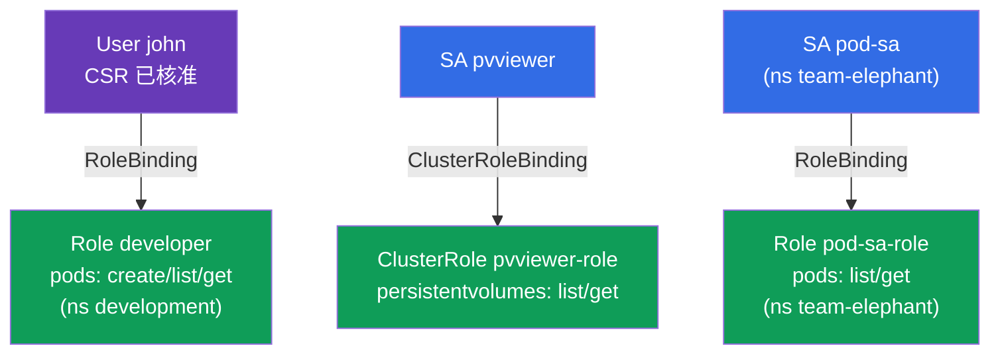

[Русская версия](README_RU.MD) · [Eng version](README.MD) · [Versión en español](README_ES.MD) · [Version française](README_FR.MD) · [Deutsche Version](README_DE.MD) · [ქართული ვერსია](README_GE.MD) · [日本語版](README_JP.MD)

# Lab 113 - RBAC 與憑證:Role、ClusterRole、ServiceAccount、CSR

## 說明

關於存取權管理的實作練習。你會透過 **CSR API**(憑證 + Role + RoleBinding)
為真人使用者授予權限,並透過 **ServiceAccount**(搭配 Role/ClusterRole)
為應用程式設定存取權。這是 CKA 安全領域的核心,
也是兩場考試中的常見題目。

所有任務都以考試風格撰寫(就像真正的 CKA/CKAD 題目),並透過
`check_result` 指令自動驗證(其中也包含 `kubectl auth can-i --as`)。

## 目標

鞏固以下課程章節的內容:

- [第 21 章。ServiceAccount;authn/authz/admission](../../course/21/README.md) - 應用程式如何進行認證、API 請求的處理階段
- [第 38 章。RBAC:Role、ClusterRole 與 binding](../../course/38/README.md) - namespace 層級與叢集層級的權限、與主體的綁定
- [第 39 章。TLS 憑證、kubeconfig 與 CSR API](../../course/39/README.md) - 透過 CSR 為真人簽發用戶端憑證

## 我們要建立什麼,以及為什麼

在這個實驗中,我們把存取權分配給不同的主體 - 真人與應用程式 - 並用
`kubectl auth can-i` 驗證權限。每個物件都有自己的用途:

| 物件 | 這是什麼 | 為什麼出現在這個實驗中 |
|--------|---------|-------------------|
| **CSR `john-developer` + Role/RoleBinding** | 給真人的存取權 | 學會透過 CSR API 簽發用戶端憑證,並在 namespace 中授予權限(第 38、39 章) |
| **SA `pvviewer` + ClusterRole/CRB + Pod** | 給應用程式的叢集層級存取權 | SA 取得 `list persistentvolumes` 權限(cluster-scoped,第 21、38 章) |
| **SA `pod-sa` + Role/RoleBinding + Pod**(`team-elephant`) | 給應用程式的 namespace 層級存取權 | SA 在自己的 namespace 中取得 `list/get pods` 權限(第 21、38 章) |

最終部署出來的整體樣貌:



## 基礎架構

環境透過 Terragrunt 部署在 AWS(`eu-central-1`),由以下部分組成:

| 元件       | 說明                                                        |
|------------|-------------------------------------------------------------|
| `vpc`      | VPC `10.10.0.0/16`,含公有子網路                              |
| `ssh-keys` | 用於存取節點的 SSH 金鑰                                       |
| `k8s-1`    | Kubernetes `1.35.2`(kubeadm),CNI Calico,metrics-server,單節點 |
| `worker`   | 工作機,具備 `kubectl`、`openssl` 與 `check_result`           |

執行個體:`t3.medium`(master),Ubuntu `22.04`。叢集為單節點 - master
已解除污點(移除了 `control-plane` taint),因此 Pod 會直接排程到它上面。

## 部署

```bash
TASK=113 make run_cka_task
```

建立完成後,請透過 SSH 連線到工作機(worker),並在那裡完成任務。
`kubectl` 已經指向 `cluster1-admin@cluster1` context。

工作機上的實用指令:

```bash
time_left       # 還剩多少時間
check_result    # 檢查解答
```

## 任務

---
|        **1**        | **透過 CSR + RBAC 為使用者授予存取權**                        |
| :-----------------: | :----------------------------------------------------------- |
| 要做什麼            | 建立 namespace `development`。產生金鑰與憑證請求(`openssl genrsa`、`openssl req ... -subj "/CN=john"`),建立名為 `john-developer` 的 `CertificateSigningRequest` 物件(`signerName: kubernetes.io/kube-apiserver-client`,usage 為 `client auth`,`request` = `.csr` 的 base64),並核准它(`kubectl certificate approve john-developer`)。在 `development` 中建立 Role `developer`,對 `pods` 具備 `create,list,get` 權限,並建立 RoleBinding `developer-role-binding`,把該 Role 綁定到使用者 `john`。 |
| 驗收標準            | - namespace `development` 存在;<br/>- CSR `john-developer` 處於 `Approved` 狀態;<br/>- 有 Role `developer`(pods: create/list/get)與給 `john` 的 RoleBinding `developer-role-binding`;<br/>- `john` 可以在 `development` 中 `create` 與 `get` Pods(`kubectl auth can-i --as=john`)。 |
---
|        **2**        | **給 SA 叢集層級的存取權**                                    |
| :-----------------: | :----------------------------------------------------------- |
| 要做什麼            | 建立 ServiceAccount `pvviewer`(在 namespace `default` 中)。建立 ClusterRole `pvviewer-role`,對 `persistentvolumes` 具備 `list,get` 權限,並建立 ClusterRoleBinding `pvviewer-role-binding`,把它綁定到 SA `default:pvviewer`。執行使用該 ServiceAccount 的 Pod `pvviewer`(`spec.serviceAccountName: pvviewer`)。 |
| 驗收標準            | - ServiceAccount `pvviewer` 存在;<br/>- 有 ClusterRole `pvviewer-role`(persistentvolumes: list/get)與 ClusterRoleBinding `pvviewer-role-binding`;<br/>- Pod `pvviewer` 使用該 SA;<br/>- SA 可以 `list persistentvolumes`(`--as=system:serviceaccount:default:pvviewer`)。 |
---
|        **3**        | **給 SA 在 namespace 中的存取權**                             |
| :-----------------: | :----------------------------------------------------------- |
| 要做什麼            | 建立 namespace `team-elephant`,並在其中建立 ServiceAccount `pod-sa`。建立 Role `pod-sa-role`,對 `pods` 具備 `list,get` 權限,並建立 RoleBinding `pod-sa-roleBinding`,把該 Role 綁定到 SA `team-elephant:pod-sa`。在 `team-elephant` 中執行使用該 ServiceAccount 的 Pod `pod-sa`。 |
| 驗收標準            | - namespace `team-elephant` 存在;<br/>- 有 ServiceAccount `pod-sa`、Role `pod-sa-role`(pods: list/get)與 RoleBinding `pod-sa-roleBinding`;<br/>- Pod `pod-sa` 使用該 SA;<br/>- SA 可以在 `team-elephant` 中 `list pods`(`--as=system:serviceaccount:team-elephant:pod-sa`)。 |
---

## 檢查結果

在工作機上執行自動檢查:

```bash
check_result
```

腳本會跑完測試,並顯示已完成多少任務。

## 解答

參考解答:[worker/files/solutions/1_TW.MD](worker/files/solutions/1_TW.MD)

## 模擬考涵蓋範圍

本實驗涵蓋模擬考中關於 RBAC 與憑證的題目:CKA mock 01(第 17 題 - user+CSR+Role、
第 18 題 - SA+ClusterRole)、CKA mock 02(第 13 題 - SA+Role)、CKAD mock 02(第 15 題 - SA+Role)。

## 刪除叢集與資源

```bash
TASK=113 make delete_cka_task
```
