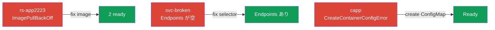

[Русская версия](README_RU.MD) · [Eng version](README.MD) · [Versión en español](README_ES.MD) · [Version française](README_FR.MD) · [Deutsche Version](README_DE.MD) · [ქართული ვერსია](README_GE.MD) · [繁體中文版](README_TW.MD)

# Lab 114 - Troubleshooting：壊れたリソースを直す

## 概要

Troubleshooting ドメイン（CKA の 30%）の実習です。クラスタにはあらかじめ
**壊れた**オブジェクトが展開されています - あなたの課題は、体系的な
デバッグ手順を適用して原因を見つけ、取り除くことです：`get` → `describe`（Events）→ `logs` → 修正。課題は
典型的な障害を模しています：ImagePullBackOff、selector の誤りによる空の Endpoints、
そして ConfigMap が無いことによる CreateContainerConfigError です。

すべての課題は試験形式（実際の CKA/CKAD の問題と同じスタイル）で書かれており、
`check_result` コマンドで自動的に検証されます。

## 目的

次のコース章の内容を定着させます：

- [第 44 章。アプリケーション障害のデバッグ](../../course/44/README.md) - `get` → `describe` → `logs` の手順、Pods のステータスの読み解き
- [第 45 章。control plane と worker ノードのデバッグ](../../course/45/README.md) - ノードとシステムコンポーネントの診断
- [第 46 章。サービスとネットワークのデバッグ](../../course/46/README.md) - Service ↔ Endpoints ↔ ラベルのつながり

## 何を直し、なぜ直すのか

この実習では、独立した 3 つの障害を直します：壊れたイメージ、Service と Pods の
切れたつながり、そして足りない設定です。それぞれの故障は、デバッグ手順の
別々の部分を練習させてくれます：

| 故障 | 症状 | 原因 | 何を学べるか |
|---------|---------|---------|-----------|
| **ReplicaSet `rs-app2223`**（namespace `rsapp`） | ImagePullBackOff | イメージのタグが誤り | イメージの問題の切り分けと RS の Pods の再作成（第 44 章） |
| **Service `svc-broken`**（namespace `tsvc`） | 空の Endpoints | selector が Pods の label と一致しない | Service ↔ Endpoints ↔ ラベルのつながり（第 46 章） |
| **Deployment `capp`**（namespace `cfgapp`） | CreateContainerConfigError | 必要な ConfigMap が無い | 設定の依存関係（第 44 章） |

最終的にデプロイされる全体像：



## インフラ

環境は Terragrunt により AWS（`eu-central-1`）に展開され、次の要素で構成されます：

| コンポーネント | 説明                                                            |
|------------|----------------------------------------------------------------------|
| `vpc`      | パブリックサブネットを持つ VPC `10.10.0.0/16`                          |
| `ssh-keys` | ノードへアクセスするための SSH キー                                      |
| `k8s-1`    | Kubernetes `1.35.2`（kubeadm）、CNI Calico、metrics-server、単一ノード；起動時に壊れたオブジェクトを展開する |
| `worker`   | `kubectl` と `check_result` を備えた作業マシン                         |

インスタンス：`t4g.medium`（master）、Ubuntu `22.04`。クラスタは単一ノード構成で、master の
taint は解除されています（`control-plane` taint を削除）。そのため Pod は master 上に直接スケジュールされます。

## デプロイ

```bash
TASK=114 make run_cka_task
```

作成が完了したら、SSH で作業マシン（worker）に接続し、そこから課題を進めて
ください。`kubectl` はすでに `cluster1-admin@cluster1` コンテキストに設定されています。

作業マシンで使える便利なコマンド：

```bash
time_left       # 残り時間
check_result    # 解答をチェックする
```

## 課題

---
|        **1**        | **ReplicaSet を直す**                                        |
| :-----------------: | :----------------------------------------------------------- |
| やること            | namespace `rsapp` では ReplicaSet `rs-app2223` の Pods が `ImagePullBackOff` のまま止まっています。次の手順をたどってください：`kubectl get po -n rsapp`（ステータスを確認）、`kubectl describe po -n rsapp <pod>`（Events で - イメージ `viktoruj/ping_pong:doesnotexist123` が取得できていない）。`kubectl edit rs rs-app2223 -n rsapp` で RS のテンプレートのイメージを動くもの（`viktoruj/ping_pong:latest`）に直してください。RS はテンプレートを変えても Pods を作り直しません - 古い Pods を削除して（`kubectl delete po -n rsapp -l <label>`）、RS に新しいものを立ち上げさせます。`2` つの ready なレプリカを達成してください。 |
| 受け入れ基準        | - ReplicaSet `rs-app2223`（namespace `rsapp`）：`2` つの Ready レプリカ。 |
---
|        **2**        | **Service を直す（Endpoints が空）**                          |
| :-----------------: | :----------------------------------------------------------- |
| やること            | namespace `tsvc` の Service `svc-broken` はトラフィックを流していません - Endpoints が空です。診断：`kubectl get endpoints svc-broken -n tsvc`（空）、`kubectl describe svc svc-broken -n tsvc`（selector、たとえば `app=WRONG`）、`kubectl get pods -n tsvc --show-labels`（Pods には label `app=web` が付いている）。Service の selector を Pods の実際の label に合わせ（`kubectl patch svc svc-broken -n tsvc -p '{"spec":{"selector":{"app":"web"}}}'`）、Endpoints が埋まったことを確認してください。 |
| 受け入れ基準        | - Service `svc-broken`（namespace `tsvc`）：Endpoints が空でない（アドレスが 1 つ以上）。 |
---
|        **3**        | **Deployment を直す（ConfigMap が無い）**                     |
| :-----------------: | :----------------------------------------------------------- |
| やること            | namespace `cfgapp` の Deployment `capp` が `CreateContainerConfigError` で落ちています。手順：`kubectl get po -n cfgapp`（ステータスを確認）、`kubectl describe po -n cfgapp <pod>`（Events で - ConfigMap `missing-config` が見つからない）。足りない ConfigMap を作成し（`kubectl create configmap missing-config -n cfgapp --from-literal=KEY=value`）、Deployment が ready になるまで待ってください（`kubectl rollout status deploy capp -n cfgapp`）。 |
| 受け入れ基準        | - Deployment `capp`（namespace `cfgapp`）：Ready レプリカが 1 つ以上。 |
---

## 結果のチェック

作業マシンで自動チェックを実行します：

```bash
check_result
```

スクリプトがテストを実行し、いくつの課題が完了したかを表示します。

## 解答

参考解答：[worker/files/solutions/1_JP.MD](worker/files/solutions/1_JP.MD)

## 模擬試験のカバー範囲

この実習は模擬試験の troubleshooting 課題をカバーします：CKAD mock 01（第 4 問 - fix ReplicaSet）、
CKA mock 01/02 の一般的な troubleshooting スキル（ステータス、Endpoints、
設定の読み解き）、そして CKAD mock 02（第 7/第 8 問 - fix ingress/netpol）です。

## クラスタとリソースの削除

```bash
TASK=114 make delete_cka_task
```
