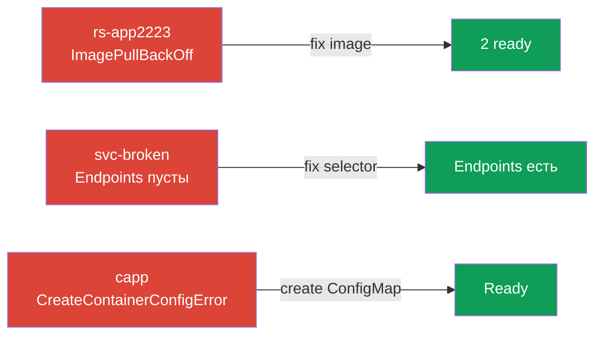

# Lab 114 — Troubleshooting: чиним сломанные ресурсы

## Описание

Практическая работа по домену Troubleshooting (30% CKA). В кластере заранее развёрнуты
**сломанные** объекты — ваша задача найти и устранить причины, применяя систематический
маршрут отладки: `get` → `describe` (Events) → `logs` → починка. Задания имитируют
типовые инциденты: ImagePullBackOff, пустые Endpoints из-за неверного селектора и
CreateContainerConfigError из-за отсутствующего ConfigMap.

Все задания в экзаменационном стиле с автопроверкой `check_result`.

## Цель

Закрепить главы курса:

- [Глава 44. Отладка сбоев приложений](../../course/44/ru.md)
- [Глава 45. Отладка control plane и worker-нод](../../course/45/ru.md)
- [Глава 46. Отладка сервисов и сети](../../course/46/ru.md)

## Что мы чиним и зачем

| Поломка | Симптом | Причина | Чему учит |
|---------|---------|---------|-----------|
| **ReplicaSet `rs-app2223`** (ns `rsapp`) | ImagePullBackOff | неверный тег образа | разбор проблем образа и пересоздание подов RS |
| **Service `svc-broken`** (ns `tsvc`) | пустые Endpoints | селектор не совпал с метками подов | связка Service ↔ Endpoints ↔ метки |
| **Deployment `capp`** (ns `cfgapp`) | CreateContainerConfigError | нет нужного ConfigMap | зависимости конфигурации |



## Инфраструктура

| Компонент  | Описание                                                             |
|------------|----------------------------------------------------------------------|
| `k8s-1`    | Kubernetes `1.35.2` (kubeadm), Calico, metrics-server; при старте разворачивает сломанные объекты |
| `worker`   | Рабочая машина с `kubectl` и `check_result`                          |

## Развёртывание

```bash
TASK=114 make run_cka_task
```

## Задания

---
|        **1**        | **Починить ReplicaSet**                                     |
| :-----------------: | :----------------------------------------------------------- |
| Что делаем          | Находим причину (образ) и приводим RS к 2 готовым подам       |
| Критерии приёмки    | - ReplicaSet `rs-app2223` (ns `rsapp`): 2 Ready реплики |
---
|        **2**        | **Починить сервис (пустые Endpoints)**                      |
| :-----------------: | :----------------------------------------------------------- |
| Что делаем          | Исправляем селектор сервиса под метки подов                   |
| Критерии приёмки    | - Service `svc-broken` (ns `tsvc`): Endpoints не пусты |
---
|        **3**        | **Починить деплой (нет ConfigMap)**                        |
| :-----------------: | :----------------------------------------------------------- |
| Что делаем          | Создаём недостающий ConfigMap, на который ссылается под       |
| Критерии приёмки    | - Deployment `capp` (ns `cfgapp`): Ready |
---

## Проверка результата

```bash
check_result
```

## Решение

[worker/files/solutions/1.MD](worker/files/solutions/1.MD)

## Покрытие мок-экзаменов

CKAD mock 01 (№4 — fix ReplicaSet); общий навык troubleshooting из CKA mock 01/02
(разбор статусов, Endpoints, конфигурации) и CKAD mock 02 (№7/№8 — fix ingress/netpol).

## Удаление

```bash
TASK=114 make delete_cka_task
```
