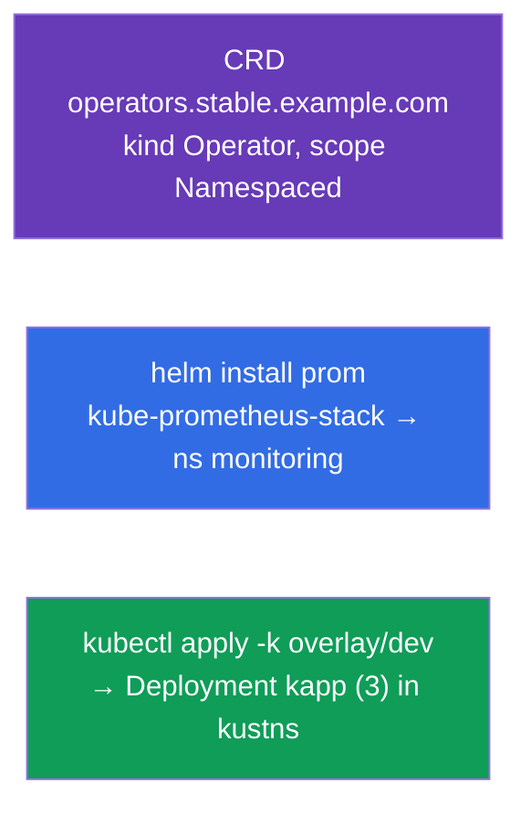

[Русская версия](README_RU.MD) · [Versión en español](README_ES.MD) · [Version française](README_FR.MD) · [Deutsche Version](README_DE.MD) · [ქართული ვერსია](README_GE.MD) · [繁體中文版](README_TW.MD) · [日本語版](README_JP.MD)

# Lab 115 — Extension and Packaging: CRD, Helm, Kustomize

## Description

A hands-on lab about extending the API and about tools for packaging and customizing
manifests. You will create your own object type with a **CustomResourceDefinition**,
install ready-made software with **Helm** (Prometheus) and adapt manifests to an
environment with **Kustomize** (base + overlay). These topics are part of the CKA
curriculum (Helm/Kustomize, CRD/operators) and show up in CKAD mocks.

All tasks are written in exam style (like real CKA/CKAD questions) with automatic
validation via the `check_result` command.

## Goal

Reinforce the material from the course chapters:

- [Chapter 41. CRDs and Operators](../../course/41/README.md) — extending the API with your own resource type
- [Chapter 42. Helm](../../course/42/README.md) — chart repositories, installing releases
- [Chapter 43. Kustomize](../../course/43/README.md) — base + overlay, overriding fields without templates

## What We Build and Why

In this lab we extend and package cluster resources with three different tools.
Every object serves its own purpose:

| Object | What it is | Why it is in this lab |
|--------|------------|-----------------------|
| **CRD `operators.stable.example.com`** | a new object type in the API | learn to extend Kubernetes with your own resource (chapter 41) |
| **Helm release `prom`** (namespace `monitoring`) | installing a ready-made chart | install Prometheus from a repository with a single command (chapter 42) |
| **Kustomize overlay** → Deployment `kapp` | adapting manifests | apply base + overlay (namespace, replicas) (chapter 43) |

The final picture of what will be deployed:



## Infrastructure

The environment is deployed in AWS (`eu-central-1`) via Terragrunt and consists of:

| Component  | Description                                                          |
|------------|----------------------------------------------------------------------|
| `vpc`      | VPC `10.10.0.0/16` with public subnets                                |
| `ssh-keys` | SSH keys for node access                                             |
| `k8s-1`    | Kubernetes `1.35.2` (kubeadm), Calico CNI, metrics-server, single-node |
| `worker`   | Work machine with `kubectl` and `check_result`; on start it installs `helm` and prepares the kustomize files in `/var/work/115/kustomize` |

Instances: `t4g.medium` (master), Ubuntu `22.04`. The cluster is single-node — the master is
untainted (the `control-plane` taint is removed), so Pods are scheduled directly on it.

## Deployment

```bash
TASK=115 make run_cka_task
```

Once it is created, connect to the work machine (worker) over SSH and do the tasks from
there. `kubectl` is already pointed at the `cluster1-admin@cluster1` context.

Handy commands on the work machine:

```bash
time_left       # how much time is left
check_result    # check your solution
```

## Tasks

---
|        **1**        | **Create a CustomResourceDefinition**                      |
| :-----------------: | :----------------------------------------------------------- |
| What to do          | Extend the cluster API with your own object type. Create the CRD `operators.stable.example.com`: group `stable.example.com`, scope `Namespaced`, names — plural `operators`, singular `operator`, kind `Operator`, shortNames `op`. Version `v1` (served + storage) with an `openAPIV3Schema` schema where `spec` contains the fields `email` (string), `name` (string) and `age` (integer). Apply the manifest (`kubectl apply -f crd.yaml`) and check with `kubectl get crd operators.stable.example.com`. |
| Acceptance criteria | - CRD `operators.stable.example.com`;<br/>- group `stable.example.com`, kind `Operator`, scope `Namespaced`;<br/>- names: plural `operators`, singular `operator`, shortNames `op`;<br/>- schema: `email` (string), `name` (string), `age` (integer). |
---
|        **2**        | **Install the Prometheus Helm chart**                      |
| :-----------------: | :----------------------------------------------------------- |
| What to do          | Add the `prometheus-community` repository (`helm repo add prometheus-community https://prometheus-community.github.io/helm-charts` + `helm repo update`), create the namespace `monitoring` and install the `kube-prometheus-stack` chart as a release named `prom` in that namespace (`helm install prom prometheus-community/kube-prometheus-stack -n monitoring`). Check with `helm ls -n monitoring`. |
| Acceptance criteria | - repo `prometheus-community` is added;<br/>- Helm release `prom` in namespace `monitoring` (chart `kube-prometheus-stack`). |
---
|        **3**        | **Apply the Kustomize overlay**                            |
| :-----------------: | :----------------------------------------------------------- |
| What to do          | The prepared files live in `/var/work/115/kustomize` (base + overlay `dev` with namespace `kustns` and `replicas: 3`). Create the namespace `kustns`, optionally preview the result (`kubectl kustomize /var/work/115/kustomize/overlays/dev`) and apply the `dev` overlay with `kubectl apply -k /var/work/115/kustomize/overlays/dev`. As a result, Deployment `kapp` with `3` replicas must appear in namespace `kustns`. |
| Acceptance criteria | - Deployment `kapp` in namespace `kustns` with `3` replicas (from the `dev` overlay). |
---

## Checking the Result

On the work machine run the automatic validation:

```bash
check_result
```

The script runs the tests and shows how many tasks are complete.

## Solution

Reference solution: [worker/files/solutions/1.MD](worker/files/solutions/1.MD)

## Mock Exam Coverage

The lab covers the mock-exam tasks on extension and packaging: CKAD mock 01 (#16 — CRD,
#18 — Helm Prometheus), CKAD mock 02 (#14 — Helm Prometheus); Kustomize — from the CKA
curriculum (Helm/Kustomize).

## Deleting the Cluster and Resources

```bash
TASK=115 make delete_cka_task
```
