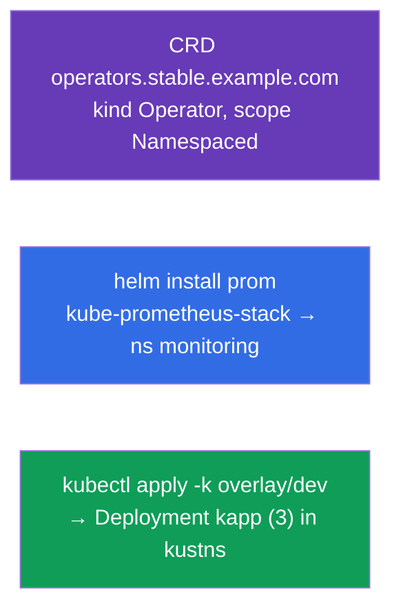

[Русская версия](README_RU.MD) · [Eng version](README.MD) · [Versión en español](README_ES.MD) · [Version française](README_FR.MD) · [ქართული ვერსია](README_GE.MD) · [繁體中文版](README_TW.MD) · [日本語版](README_JP.MD)

# Lab 115 — Erweiterung und Verpackung: CRD, Helm, Kustomize

## Beschreibung

Praxisübung zur Erweiterung der API und zu Werkzeugen für das Verpacken und Anpassen von
Manifesten. Du erstellst einen eigenen Objekttyp über eine **CustomResourceDefinition**,
installierst fertige Software mit **Helm** (Prometheus) und passt Manifeste mit
**Kustomize** an die Umgebung an (base + overlay). Diese Themen sind Teil des
CKA-Programms (Helm/Kustomize, CRD/Operatoren) und kommen in CKAD-Mocks vor.

Alle Aufgaben sind im Prüfungsstil formuliert (wie echte CKA/CKAD-Fragen) mit automatischer
Prüfung über den Befehl `check_result`.

## Ziel

Den Stoff der Kurskapitel festigen:

- [Kapitel 41. CRDs und Operatoren](../../course/41/de.md) — die API mit einem eigenen Ressourcentyp erweitern
- [Kapitel 42. Helm](../../course/42/de.md) — Chart-Repositories, Installation von Releases
- [Kapitel 43. Kustomize](../../course/43/de.md) — base + overlay, Felder ohne Templates überschreiben

## Was wir erstellen und warum

In diesem Lab erweitern und verpacken wir Cluster-Ressourcen mit drei verschiedenen
Werkzeugen. Jedes Objekt erfüllt seine eigene Aufgabe:

| Objekt | Was das ist | Warum in diesem Lab |
|--------|-------------|---------------------|
| **CRD `operators.stable.example.com`** | ein neuer Objekttyp in der API | wir lernen, Kubernetes mit einer eigenen Ressource zu erweitern (Kapitel 41) |
| **Helm-Release `prom`** (Namespace `monitoring`) | Installation eines fertigen Charts | wir installieren Prometheus aus einem Repository mit einem Befehl (Kapitel 42) |
| **Kustomize-Overlay** → Deployment `kapp` | Anpassung von Manifesten | wir wenden base + overlay an (Namespace, Replicas) (Kapitel 43) |

Das Gesamtbild dessen, was ausgerollt wird:



## Infrastruktur

Die Umgebung wird in AWS (`eu-central-1`) über Terragrunt ausgerollt und besteht aus:

| Komponente | Beschreibung                                                         |
|------------|----------------------------------------------------------------------|
| `vpc`      | VPC `10.10.0.0/16` mit öffentlichen Subnetzen                         |
| `ssh-keys` | SSH-Schlüssel für den Zugriff auf die Nodes                            |
| `k8s-1`    | Kubernetes `1.35.2` (kubeadm), CNI Calico, metrics-server, ein Node    |
| `worker`   | Arbeitsmaschine mit `kubectl` und `check_result`; beim Start installiert sie `helm` und legt die Kustomize-Dateien in `/var/work/115/kustomize` an |

Instanzen: `t3.medium` (Master), Ubuntu `22.04`. Der Cluster hat einen Node — beim Master
ist der Taint `control-plane` entfernt, daher werden Pods direkt auf ihm geplant.

## Bereitstellung

```bash
TASK=115 make run_cka_task
```

Verbinde dich nach dem Erstellen per SSH mit der Arbeitsmaschine (Worker) und erledige die
Aufgaben von dort. `kubectl` ist bereits auf den Kontext `cluster1-admin@cluster1`
eingestellt.

Nützliche Befehle auf der Arbeitsmaschine:

```bash
time_left       # wie viel Zeit noch bleibt
check_result    # Lösung prüfen
```

## Aufgaben

---
|        **1**        | **Eine CustomResourceDefinition erstellen**                |
| :-----------------: | :----------------------------------------------------------- |
| Was wir tun         | Erweitere die Cluster-API mit einem eigenen Objekttyp. Erstelle die CRD `operators.stable.example.com`: group `stable.example.com`, scope `Namespaced`, names — plural `operators`, singular `operator`, kind `Operator`, shortNames `op`. Version `v1` (served + storage) mit dem Schema `openAPIV3Schema`, in dem `spec` die Felder `email` (string), `name` (string) und `age` (integer) enthält. Wende das Manifest an (`kubectl apply -f crd.yaml`) und prüfe mit `kubectl get crd operators.stable.example.com`. |
| Abnahmekriterien    | - CRD `operators.stable.example.com`;<br/>- group `stable.example.com`, kind `Operator`, scope `Namespaced`;<br/>- names: plural `operators`, singular `operator`, shortNames `op`;<br/>- Schema: `email` (string), `name` (string), `age` (integer). |
---
|        **2**        | **Den Prometheus-Helm-Chart installieren**                 |
| :-----------------: | :----------------------------------------------------------- |
| Was wir tun         | Füge das Repository `prometheus-community` hinzu (`helm repo add prometheus-community https://prometheus-community.github.io/helm-charts` + `helm repo update`), erstelle den Namespace `monitoring` und installiere den Chart `kube-prometheus-stack` als Release mit dem Namen `prom` in diesem Namespace (`helm install prom prometheus-community/kube-prometheus-stack -n monitoring`). Prüfe mit `helm ls -n monitoring`. |
| Abnahmekriterien    | - Repo `prometheus-community` ist hinzugefügt;<br/>- Helm-Release `prom` im Namespace `monitoring` (Chart `kube-prometheus-stack`). |
---
|        **3**        | **Das Kustomize-Overlay anwenden**                         |
| :-----------------: | :----------------------------------------------------------- |
| Was wir tun         | Die fertigen Dateien liegen in `/var/work/115/kustomize` (base + overlay `dev` mit Namespace `kustns` und `replicas: 3`). Erstelle den Namespace `kustns`, sieh dir bei Bedarf das Ergebnis an (`kubectl kustomize /var/work/115/kustomize/overlays/dev`) und wende das Overlay `dev` mit dem Befehl `kubectl apply -k /var/work/115/kustomize/overlays/dev` an. Am Ende muss im Namespace `kustns` das Deployment `kapp` mit `3` Replicas erscheinen. |
| Abnahmekriterien    | - Deployment `kapp` im Namespace `kustns` mit `3` Replicas (aus dem Overlay `dev`). |
---

## Ergebnisprüfung

Starte auf der Arbeitsmaschine die automatische Prüfung:

```bash
check_result
```

Das Skript führt die Tests aus und zeigt, wie viele Aufgaben erledigt sind.

## Lösung

Referenzlösung: [worker/files/solutions/1_DE.MD](worker/files/solutions/1_DE.MD)

## Abdeckung der Mock-Prüfungen

Das Lab deckt die Mock-Aufgaben zu Erweiterung und Verpackung ab: CKAD mock 01 (Nr. 16 — CRD,
Nr. 18 — Helm Prometheus), CKAD mock 02 (Nr. 14 — Helm Prometheus); Kustomize — aus dem
CKA-Programm (Helm/Kustomize).

## Löschen von Cluster und Ressourcen

```bash
TASK=115 make delete_cka_task
```
