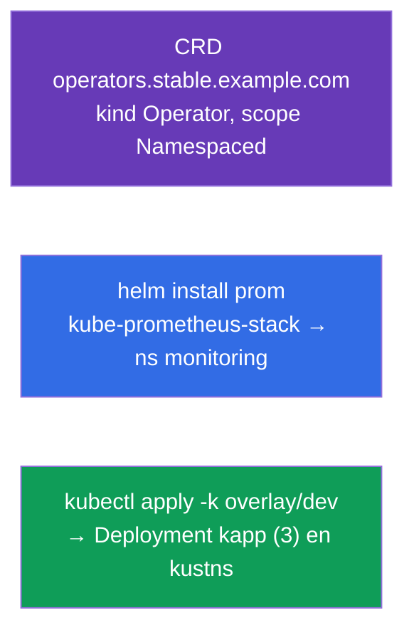

[Русская версия](README_RU.MD) · [Eng version](README.MD) · [Version française](README_FR.MD) · [Deutsche Version](README_DE.MD) · [ქართული ვერსია](README_GE.MD) · [繁體中文版](README_TW.MD) · [日本語版](README_JP.MD)

# Lab 115 — Extensión y empaquetado: CRD, Helm, Kustomize

## Descripción

Práctica sobre la extensión de la API y las herramientas de empaquetado y personalización
de manifiestos. Crearás tu propio tipo de objeto mediante una **CustomResourceDefinition**,
instalarás software ya preparado con **Helm** (Prometheus) y adaptarás manifiestos al
entorno con **Kustomize** (base + overlay). Estos temas forman parte del programa de CKA
(Helm/Kustomize, CRD/operadores) y aparecen en los simulados de CKAD.

Todas las tareas están redactadas en estilo de examen (como las preguntas reales de
CKA/CKAD) con verificación automática mediante el comando `check_result`.

## Objetivo

Consolidar el material de los capítulos del curso:

- [Capítulo 41. CRD y operadores](../../course/41/es.md) — extender la API con un tipo de recurso propio
- [Capítulo 42. Helm](../../course/42/es.md) — repositorios de charts, instalación de releases
- [Capítulo 43. Kustomize](../../course/43/es.md) — base + overlay, sobrescribir campos sin plantillas

## Qué creamos y para qué

En este laboratorio extendemos y empaquetamos recursos del clúster con tres herramientas
distintas. Cada objeto resuelve su propia tarea:

| Objeto | Qué es | Para qué está en este laboratorio |
|--------|--------|-----------------------------------|
| **CRD `operators.stable.example.com`** | un nuevo tipo de objeto en la API | aprendemos a extender Kubernetes con un recurso propio (capítulo 41) |
| **Release de Helm `prom`** (namespace `monitoring`) | instalación de un chart ya preparado | instalamos Prometheus desde un repositorio con un solo comando (capítulo 42) |
| **Overlay de Kustomize** → Deployment `kapp` | adaptación de manifiestos | aplicamos base + overlay (namespace, réplicas) (capítulo 43) |

Panorama final de lo que quedará despliegado:



## Infraestructura

El entorno se despliega en AWS (`eu-central-1`) mediante Terragrunt y consta de:

| Componente | Descripción                                                          |
|------------|----------------------------------------------------------------------|
| `vpc`      | VPC `10.10.0.0/16` con subredes públicas                              |
| `ssh-keys` | Claves SSH para el acceso a los nodos                                 |
| `k8s-1`    | Kubernetes `1.35.2` (kubeadm), CNI Calico, metrics-server, de un solo nodo |
| `worker`   | Máquina de trabajo con `kubectl` y `check_result`; al arrancar instala `helm` y prepara los ficheros de kustomize en `/var/work/115/kustomize` |

Instancias: `t4g.medium` (master), Ubuntu `22.04`. El clúster es de un solo nodo: al master
se le ha quitado el taint `control-plane`, por lo que los pods se planifican directamente
en él.

## Despliegue

```bash
TASK=115 make run_cka_task
```

Tras la creación, conéctate por SSH a la máquina de trabajo (worker) y realiza las tareas
desde allí. `kubectl` ya está configurado con el contexto `cluster1-admin@cluster1`.

Comandos útiles en la máquina de trabajo:

```bash
time_left       # cuánto tiempo queda
check_result    # comprobar la solución
```

## Tareas

---
|        **1**        | **Crear una CustomResourceDefinition**                     |
| :-----------------: | :----------------------------------------------------------- |
| Qué hacemos         | Extiende la API del clúster con tu propio tipo de objeto. Crea la CRD `operators.stable.example.com`: group `stable.example.com`, scope `Namespaced`, names — plural `operators`, singular `operator`, kind `Operator`, shortNames `op`. Versión `v1` (served + storage) con el esquema `openAPIV3Schema`, donde `spec` contiene los campos `email` (string), `name` (string) y `age` (integer). Aplica el manifiesto (`kubectl apply -f crd.yaml`) y comprueba con `kubectl get crd operators.stable.example.com`. |
| Criterios de aceptación | - CRD `operators.stable.example.com`;<br/>- group `stable.example.com`, kind `Operator`, scope `Namespaced`;<br/>- names: plural `operators`, singular `operator`, shortNames `op`;<br/>- esquema: `email` (string), `name` (string), `age` (integer). |
---
|        **2**        | **Instalar el chart de Helm de Prometheus**                |
| :-----------------: | :----------------------------------------------------------- |
| Qué hacemos         | Añade el repositorio `prometheus-community` (`helm repo add prometheus-community https://prometheus-community.github.io/helm-charts` + `helm repo update`), crea el namespace `monitoring` e instala el chart `kube-prometheus-stack` como release con el nombre `prom` en ese namespace (`helm install prom prometheus-community/kube-prometheus-stack -n monitoring`). Comprueba con `helm ls -n monitoring`. |
| Criterios de aceptación | - el repo `prometheus-community` está añadido;<br/>- release de Helm `prom` en el namespace `monitoring` (chart `kube-prometheus-stack`). |
---
|        **3**        | **Aplicar el overlay de Kustomize**                        |
| :-----------------: | :----------------------------------------------------------- |
| Qué hacemos         | Los ficheros ya preparados están en `/var/work/115/kustomize` (base + overlay `dev` con namespace `kustns` y `replicas: 3`). Crea el namespace `kustns`, si quieres revisa el resultado (`kubectl kustomize /var/work/115/kustomize/overlays/dev`) y aplica el overlay `dev` con el comando `kubectl apply -k /var/work/115/kustomize/overlays/dev`. Al final, en el namespace `kustns` debe aparecer el Deployment `kapp` con `3` réplicas. |
| Criterios de aceptación | - Deployment `kapp` en el namespace `kustns` con `3` réplicas (del overlay `dev`). |
---

## Comprobación del resultado

En la máquina de trabajo lanza la verificación automática:

```bash
check_result
```

El script ejecuta los tests y muestra cuántas tareas están completadas.

## Solución

Solución de referencia: [worker/files/solutions/1_ES.MD](worker/files/solutions/1_ES.MD)

## Cobertura de exámenes simulados

El laboratorio cubre las tareas de los simulados sobre extensión y empaquetado: CKAD mock 01
(n.º 16 — CRD, n.º 18 — Helm Prometheus), CKAD mock 02 (n.º 14 — Helm Prometheus);
Kustomize — del programa de CKA (Helm/Kustomize).

## Eliminación del clúster y los recursos

```bash
TASK=115 make delete_cka_task
```
