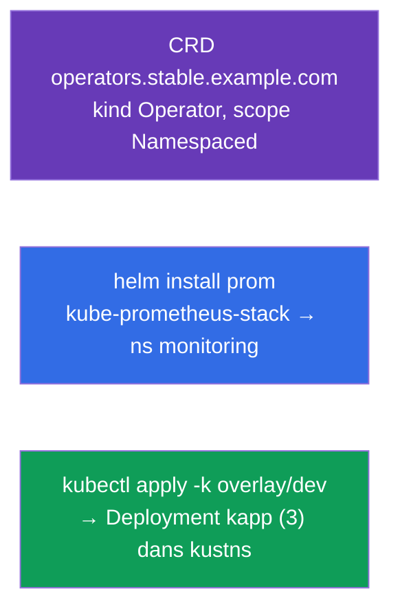

[Русская версия](README_RU.MD) · [Eng version](README.MD) · [Versión en español](README_ES.MD) · [Deutsche Version](README_DE.MD) · [ქართული ვერსია](README_GE.MD)

# Lab 115 — Extension et empaquetage : CRD, Helm, Kustomize

## Description

Travail pratique sur l'extension de l'API et sur les outils d'empaquetage et de
personnalisation des manifestes. Vous allez créer votre propre type d'objet via une
**CustomResourceDefinition**, installer un logiciel prêt à l'emploi avec **Helm**
(Prometheus) et adapter des manifestes à l'environnement avec **Kustomize**
(base + overlay). Ces sujets font partie du programme CKA (Helm/Kustomize, CRD/opérateurs)
et apparaissent dans les examens blancs CKAD.

Toutes les tâches sont rédigées dans le style de l'examen (comme les vraies questions
CKA/CKAD) avec une vérification automatique via la commande `check_result`.

## Objectif

Consolider le contenu des chapitres du cours :

- [Chapitre 41. CRD et opérateurs](../../course/41/ru.md) — étendre l'API avec son propre type de ressource
- [Chapitre 42. Helm](../../course/42/ru.md) — dépôts de charts, installation de releases
- [Chapitre 43. Kustomize](../../course/43/ru.md) — base + overlay, redéfinir des champs sans templates

## Ce que nous créons et pourquoi

Dans ce lab, nous étendons et empaquetons les ressources du cluster avec trois outils
différents. Chaque objet a son propre rôle :

| Objet | Ce que c'est | Pourquoi dans ce lab |
|-------|--------------|----------------------|
| **CRD `operators.stable.example.com`** | un nouveau type d'objet dans l'API | apprendre à étendre Kubernetes avec sa propre ressource (chapitre 41) |
| **Release Helm `prom`** (namespace `monitoring`) | installation d'un chart prêt à l'emploi | installer Prometheus depuis un dépôt en une seule commande (chapitre 42) |
| **Overlay Kustomize** → Deployment `kapp` | adaptation des manifestes | appliquer base + overlay (namespace, réplicas) (chapitre 43) |

Vue d'ensemble de ce qui sera déployé :



## Infrastructure

L'environnement est déployé dans AWS (`eu-central-1`) via Terragrunt et se compose de :

| Composant  | Description                                                          |
|------------|----------------------------------------------------------------------|
| `vpc`      | VPC `10.10.0.0/16` avec des sous-réseaux publics                      |
| `ssh-keys` | Clés SSH pour l'accès aux nœuds                                       |
| `k8s-1`    | Kubernetes `1.35.2` (kubeadm), CNI Calico, metrics-server, mono-nœud   |
| `worker`   | Machine de travail avec `kubectl` et `check_result` ; au démarrage, elle installe `helm` et prépare les fichiers kustomize dans `/var/work/115/kustomize` |

Instances : `t3.medium` (master), Ubuntu `22.04`. Le cluster est mono-nœud — le taint
`control-plane` a été retiré du master, les pods sont donc planifiés directement dessus.

## Déploiement

```bash
TASK=115 make run_cka_task
```

Après la création, connectez-vous en SSH à la machine de travail (worker) et effectuez les
tâches depuis celle-ci. `kubectl` est déjà configuré sur le contexte
`cluster1-admin@cluster1`.

Commandes utiles sur la machine de travail :

```bash
time_left       # combien de temps il reste
check_result    # vérifier la solution
```

## Tâches

---
|        **1**        | **Créer une CustomResourceDefinition**                     |
| :-----------------: | :----------------------------------------------------------- |
| Ce qu'on fait       | Étendez l'API du cluster avec votre propre type d'objet. Créez la CRD `operators.stable.example.com` : group `stable.example.com`, scope `Namespaced`, names — plural `operators`, singular `operator`, kind `Operator`, shortNames `op`. Version `v1` (served + storage) avec le schéma `openAPIV3Schema`, où `spec` contient les champs `email` (string), `name` (string) et `age` (integer). Appliquez le manifeste (`kubectl apply -f crd.yaml`) et vérifiez avec `kubectl get crd operators.stable.example.com`. |
| Critères d'acceptation | - CRD `operators.stable.example.com` ;<br/>- group `stable.example.com`, kind `Operator`, scope `Namespaced` ;<br/>- names : plural `operators`, singular `operator`, shortNames `op` ;<br/>- schéma : `email` (string), `name` (string), `age` (integer). |
---
|        **2**        | **Installer le chart Helm de Prometheus**                  |
| :-----------------: | :----------------------------------------------------------- |
| Ce qu'on fait       | Ajoutez le dépôt `prometheus-community` (`helm repo add prometheus-community https://prometheus-community.github.io/helm-charts` + `helm repo update`), créez le namespace `monitoring` et installez le chart `kube-prometheus-stack` comme release nommée `prom` dans ce namespace (`helm install prom prometheus-community/kube-prometheus-stack -n monitoring`). Vérifiez avec `helm ls -n monitoring`. |
| Critères d'acceptation | - le dépôt `prometheus-community` est ajouté ;<br/>- release Helm `prom` dans le namespace `monitoring` (chart `kube-prometheus-stack`). |
---
|        **3**        | **Appliquer l'overlay Kustomize**                          |
| :-----------------: | :----------------------------------------------------------- |
| Ce qu'on fait       | Les fichiers prêts se trouvent dans `/var/work/115/kustomize` (base + overlay `dev` avec le namespace `kustns` et `replicas: 3`). Créez le namespace `kustns`, si vous le souhaitez prévisualisez le résultat (`kubectl kustomize /var/work/115/kustomize/overlays/dev`) et appliquez l'overlay `dev` avec la commande `kubectl apply -k /var/work/115/kustomize/overlays/dev`. Au final, le Deployment `kapp` avec `3` réplicas doit apparaître dans le namespace `kustns`. |
| Critères d'acceptation | - Deployment `kapp` dans le namespace `kustns` avec `3` réplicas (issu de l'overlay `dev`). |
---

## Vérification du résultat

Sur la machine de travail, lancez la vérification automatique :

```bash
check_result
```

Le script exécute les tests et affiche le nombre de tâches réussies.

## Solution

Solution de référence : [worker/files/solutions/1_FR.MD](worker/files/solutions/1_FR.MD)

## Couverture des examens blancs

Le lab couvre les tâches des examens blancs sur l'extension et l'empaquetage : CKAD mock 01
(n° 16 — CRD, n° 18 — Helm Prometheus), CKAD mock 02 (n° 14 — Helm Prometheus) ;
Kustomize — issu du programme CKA (Helm/Kustomize).

## Suppression du cluster et des ressources

```bash
TASK=115 make delete_cka_task
```
