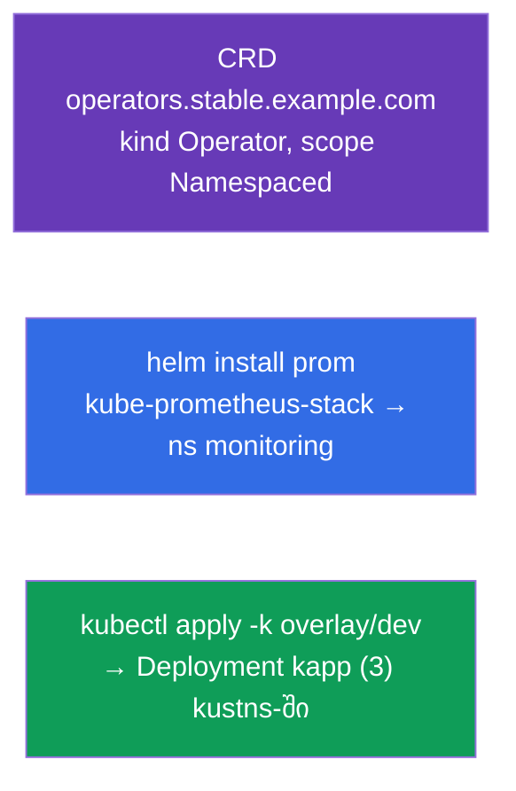

[Русская версия](README_RU.MD) · [Eng version](README.MD) · [Versión en español](README_ES.MD) · [Version française](README_FR.MD) · [Deutsche Version](README_DE.MD) · [繁體中文版](README_TW.MD) · [日本語版](README_JP.MD)

# Lab 115 — გაფართოება და შეფუთვა: CRD, Helm, Kustomize

## აღწერა

პრაქტიკული სამუშაო API-ს გაფართოებასა და მანიფესტების შეფუთვის/მორგების ინსტრუმენტებზე.
თქვენ შექმნით საკუთარ ობიექტის ტიპს **CustomResourceDefinition**-ის მეშვეობით, დააყენებთ
მზა პროგრამულ უზრუნველყოფას **Helm**-ით (Prometheus) და მოარგებთ მანიფესტებს გარემოს
**Kustomize**-ით (base + overlay). ეს თემები შევიდა CKA-ს პროგრამაში (Helm/Kustomize,
CRD/ოპერატორები) და გვხვდება CKAD-ის mock-ებში.

ყველა დავალება გამოცდის სტილშია გაფორმებული (როგორც რეალური CKA/CKAD კითხვები) და მათი
შემოწმება ავტომატურად ხდება ბრძანებით `check_result`.

## მიზანი

განამტკიცოთ კურსის თავების მასალა:

- [თავი 41. CRD და ოპერატორები](../../course/41/ge.md) — API-ს გაფართოება საკუთარი რესურსის ტიპით
- [თავი 42. Helm](../../course/42/ge.md) — chart-ების რეპოზიტორიები, release-ების დაყენება
- [თავი 43. Kustomize](../../course/43/ge.md) — base + overlay, ველების გადაფარვა შაბლონების გარეშე

## რას ვქმნით და რისთვის

ამ ლაბორატორიაში ვაფართოებთ და ვაფუთავთ კლასტერის რესურსებს სამი სხვადასხვა ინსტრუმენტით.
თითოეული ობიექტი თავის ამოცანას ასრულებს:

| ობიექტი | რა არის ეს | რისთვის არის ამ ლაბორატორიაში |
|---------|------------|-------------------------------|
| **CRD `operators.stable.example.com`** | ახალი ობიექტის ტიპი API-ში | ვსწავლობთ Kubernetes-ის გაფართოებას საკუთარი რესურსით (თავი 41) |
| **Helm-release `prom`** (namespace `monitoring`) | მზა chart-ის დაყენება | Prometheus-ს ვაყენებთ რეპოზიტორიიდან ერთი ბრძანებით (თავი 42) |
| **Kustomize overlay** → Deployment `kapp` | მანიფესტების მორგება | ვიყენებთ base + overlay-ს (namespace, რეპლიკები) (თავი 43) |

საბოლოო სურათი იმისა, რაც განთავსდება:



## ინფრასტრუქტურა

გარემო იშლება AWS-ში (`eu-central-1`) Terragrunt-ის მეშვეობით და შედგება:

| კომპონენტი | აღწერა                                                            |
|------------|-------------------------------------------------------------------|
| `vpc`      | VPC `10.10.0.0/16` საჯარო ქვექსელებით                              |
| `ssh-keys` | SSH-გასაღებები node-ებზე წვდომისთვის                                |
| `k8s-1`    | Kubernetes `1.35.2` (kubeadm), CNI Calico, metrics-server, ერთკვანძიანი |
| `worker`   | სამუშაო მანქანა `kubectl`-ით და `check_result`-ით; გაშვებისას აყენებს `helm`-ს და ამზადებს kustomize-ფაილებს `/var/work/115/kustomize`-ში |

ინსტანსები: `t3.medium` (master), Ubuntu `22.04`. კლასტერი ერთკვანძიანია — master-ს
მოშორებულია taint `control-plane`, ამიტომ pod-ები პირდაპირ მასზე იგეგმება.

## განთავსება

```bash
TASK=115 make run_cka_task
```

შექმნის შემდეგ დაუკავშირდით სამუშაო მანქანას (worker) SSH-ით და დავალებები შეასრულეთ
იქიდან. `kubectl` უკვე კონფიგურირებულია კონტექსტზე `cluster1-admin@cluster1`.

სასარგებლო ბრძანებები სამუშაო მანქანაზე:

```bash
time_left       # რამდენი დრო დარჩა
check_result    # ამოხსნის შემოწმება
```

## დავალებები

---
|        **1**        | **შექმენით CustomResourceDefinition**                        |
| :-----------------: | :----------------------------------------------------------- |
| რას ვაკეთებთ        | გააფართოვეთ კლასტერის API საკუთარი ობიექტის ტიპით. შექმენით CRD `operators.stable.example.com`: group `stable.example.com`, scope `Namespaced`, names — plural `operators`, singular `operator`, kind `Operator`, shortNames `op`. ვერსია `v1` (served + storage) სქემით `openAPIV3Schema`, სადაც `spec` შეიცავს ველებს `email` (string), `name` (string) და `age` (integer). გამოიყენეთ მანიფესტი (`kubectl apply -f crd.yaml`) და შეამოწმეთ `kubectl get crd operators.stable.example.com`. |
| მიღების კრიტერიუმები | - CRD `operators.stable.example.com`;<br/>- group `stable.example.com`, kind `Operator`, scope `Namespaced`;<br/>- names: plural `operators`, singular `operator`, shortNames `op`;<br/>- სქემა: `email` (string), `name` (string), `age` (integer). |
---
|        **2**        | **დააყენეთ Prometheus-ის Helm-chart**                        |
| :-----------------: | :----------------------------------------------------------- |
| რას ვაკეთებთ        | დაამატეთ რეპოზიტორი `prometheus-community` (`helm repo add prometheus-community https://prometheus-community.github.io/helm-charts` + `helm repo update`), შექმენით namespace `monitoring` და დააყენეთ chart `kube-prometheus-stack` როგორც release სახელით `prom` ამ namespace-ში (`helm install prom prometheus-community/kube-prometheus-stack -n monitoring`). შეამოწმეთ `helm ls -n monitoring`. |
| მიღების კრიტერიუმები | - repo `prometheus-community` დამატებულია;<br/>- Helm-release `prom` namespace `monitoring`-ში (chart `kube-prometheus-stack`). |
---
|        **3**        | **გამოიყენეთ Kustomize-overlay**                             |
| :-----------------: | :----------------------------------------------------------- |
| რას ვაკეთებთ        | მზა ფაილები მდებარეობს `/var/work/115/kustomize`-ში (base + overlay `dev` namespace `kustns`-ით და `replicas: 3`-ით). შექმენით namespace `kustns`, სურვილისამებრ ნახეთ შედეგი (`kubectl kustomize /var/work/115/kustomize/overlays/dev`) და გამოიყენეთ overlay `dev` ბრძანებით `kubectl apply -k /var/work/115/kustomize/overlays/dev`. საბოლოოდ namespace `kustns`-ში უნდა გამოჩნდეს Deployment `kapp` `3` რეპლიკით. |
| მიღების კრიტერიუმები | - Deployment `kapp` namespace `kustns`-ში `3` რეპლიკით (overlay `dev`-იდან). |
---

## შედეგის შემოწმება

სამუშაო მანქანაზე გაუშვით ავტომატური შემოწმება:

```bash
check_result
```

სკრიპტი გაატარებს ტესტებს და აჩვენებს, რამდენი დავალებაა შესრულებული.

## ამოხსნა

ეტალონური ამოხსნა: [worker/files/solutions/1_GE.MD](worker/files/solutions/1_GE.MD)

## Mock-გამოცდების დაფარვა

ლაბორატორია ფარავს mock-ების დავალებებს გაფართოებასა და შეფუთვაზე: CKAD mock 01 (№16 — CRD,
№18 — Helm Prometheus), CKAD mock 02 (№14 — Helm Prometheus); Kustomize — CKA-ს პროგრამიდან
(Helm/Kustomize).

## კლასტერისა და რესურსების წაშლა

```bash
TASK=115 make delete_cka_task
```
