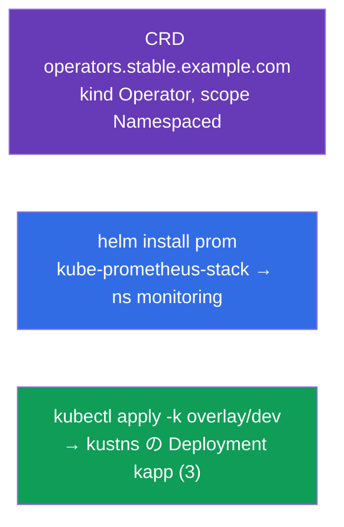

[Русская версия](README_RU.MD) · [Eng version](README.MD) · [Versión en español](README_ES.MD) · [Version française](README_FR.MD) · [Deutsche Version](README_DE.MD) · [ქართული ვერსია](README_GE.MD) · [繁體中文版](README_TW.MD)

# Lab 115 - 拡張とパッケージング：CRD、Helm、Kustomize

## 概要

API の拡張と、manifest のパッケージング/カスタマイズのためのツールについての実習です。
**CustomResourceDefinition** で独自のオブジェクト型を作成し、**Helm** で既製の
ソフトウェア（Prometheus）をインストールし、**Kustomize**（base + overlay）で
manifest を環境に合わせて調整します。これらのトピックは CKA の出題範囲
（Helm/Kustomize、CRD/operators）に含まれており、CKAD の模擬試験にも登場します。

すべての課題は試験形式（実際の CKA/CKAD の問題と同じスタイル）で書かれており、
`check_result` コマンドで自動的に検証されます。

## 目的

次のコース章の内容を定着させます：

- [第 41 章。CRD と operators](../../course/41/README.md) - 独自のリソース型による API の拡張
- [第 42 章。Helm](../../course/42/README.md) - chart リポジトリ、リリースのインストール
- [第 43 章。Kustomize](../../course/43/README.md) - base + overlay、テンプレートなしでのフィールド上書き

## 何を作り、なぜ作るのか

この実習では、3 つの異なるツールでクラスタのリソースを拡張し、パッケージングします。
各オブジェクトにはそれぞれの役割があります：

| オブジェクト | これは何か | この実習での役割 |
|--------|---------|-------------------|
| **CRD `operators.stable.example.com`** | API における新しいオブジェクト型 | 独自のリソースで Kubernetes を拡張する方法を学ぶ（第 41 章） |
| **Helm リリース `prom`**（namespace `monitoring`） | 既製の chart のインストール | リポジトリから 1 つのコマンドで Prometheus を導入する（第 42 章） |
| **Kustomize overlay** → Deployment `kapp` | manifest の調整 | base + overlay（namespace、レプリカ数）を適用する（第 43 章） |

最終的にデプロイされる全体像：



## インフラ

環境は Terragrunt により AWS（`eu-central-1`）に展開され、次の要素で構成されます：

| コンポーネント | 説明                                                              |
|------------|----------------------------------------------------------------------|
| `vpc`      | パブリックサブネットを持つ VPC `10.10.0.0/16`                          |
| `ssh-keys` | ノードへアクセスするための SSH キー                                     |
| `k8s-1`    | Kubernetes `1.35.2`（kubeadm）、CNI Calico、metrics-server、単一ノード   |
| `worker`   | `kubectl` と `check_result` を備えた作業マシン。起動時に `helm` を導入し、`/var/work/115/kustomize` に kustomize ファイルを準備します |

インスタンス：`t4g.medium`（master）、Ubuntu `22.04`。クラスタは単一ノード構成で、master の
taint は解除されています（`control-plane` taint を削除）。そのため Pod は master 上に直接スケジュールされます。

## デプロイ

```bash
TASK=115 make run_cka_task
```

作成が完了したら、SSH で作業マシン（worker）に接続し、そこから課題を進めてください。
`kubectl` はすでに `cluster1-admin@cluster1` コンテキストに設定されています。

作業マシンで使える便利なコマンド：

```bash
time_left       # 残り時間
check_result    # 解答をチェックする
```

## 課題

---
|        **1**        | **CustomResourceDefinition を作成する**                     |
| :-----------------: | :----------------------------------------------------------- |
| やること            | 独自のオブジェクト型でクラスタの API を拡張してください。CRD `operators.stable.example.com` を作成します：group は `stable.example.com`、scope は `Namespaced`、names - plural `operators`、singular `operator`、kind `Operator`、shortNames `op`。バージョンは `v1`（served + storage）で、`openAPIV3Schema` スキーマを持ち、その `spec` にはフィールド `email`（string）、`name`（string）、`age`（integer）が含まれます。manifest を適用し（`kubectl apply -f crd.yaml`）、`kubectl get crd operators.stable.example.com` で確認してください。 |
| 受け入れ基準        | - CRD `operators.stable.example.com`；<br/>- group `stable.example.com`、kind `Operator`、scope `Namespaced`；<br/>- names：plural `operators`、singular `operator`、shortNames `op`；<br/>- schema：`email`（string）、`name`（string）、`age`（integer）。 |
---
|        **2**        | **Prometheus の Helm chart をインストールする**             |
| :-----------------: | :----------------------------------------------------------- |
| やること            | リポジトリ `prometheus-community` を追加し（`helm repo add prometheus-community https://prometheus-community.github.io/helm-charts` + `helm repo update`）、namespace `monitoring` を作成して、その namespace に chart `kube-prometheus-stack` を `prom` という名前のリリースとしてインストールしてください（`helm install prom prometheus-community/kube-prometheus-stack -n monitoring`）。`helm ls -n monitoring` で確認します。 |
| 受け入れ基準        | - repo `prometheus-community` が追加されている；<br/>- namespace `monitoring` に Helm リリース `prom` がある（chart は `kube-prometheus-stack`）。 |
---
|        **3**        | **Kustomize overlay を適用する**                            |
| :-----------------: | :----------------------------------------------------------- |
| やること            | 準備済みのファイルは `/var/work/115/kustomize` にあります（base + overlay `dev`、namespace は `kustns`、`replicas: 3`）。namespace `kustns` を作成し、必要なら結果をプレビューして（`kubectl kustomize /var/work/115/kustomize/overlays/dev`）、`kubectl apply -k /var/work/115/kustomize/overlays/dev` で overlay `dev` を適用してください。最終的に namespace `kustns` に `3` レプリカの Deployment `kapp` が現れる必要があります。 |
| 受け入れ基準        | - namespace `kustns` に `3` レプリカの Deployment `kapp` がある（overlay `dev` によるもの）。 |
---

## 結果のチェック

作業マシンで自動チェックを実行します：

```bash
check_result
```

スクリプトがテストを実行し、いくつの課題が完了したかを表示します。

## 解答

参考解答：[worker/files/solutions/1_JP.MD](worker/files/solutions/1_JP.MD)

## 模擬試験のカバー範囲

この実習は模擬試験の拡張とパッケージングに関する課題をカバーします：CKAD mock 01（第 16 問 - CRD、
第 18 問 - Helm Prometheus）、CKAD mock 02（第 14 問 - Helm Prometheus）；Kustomize - CKA の
出題範囲（Helm/Kustomize）より。

## クラスタとリソースの削除

```bash
TASK=115 make delete_cka_task
```
