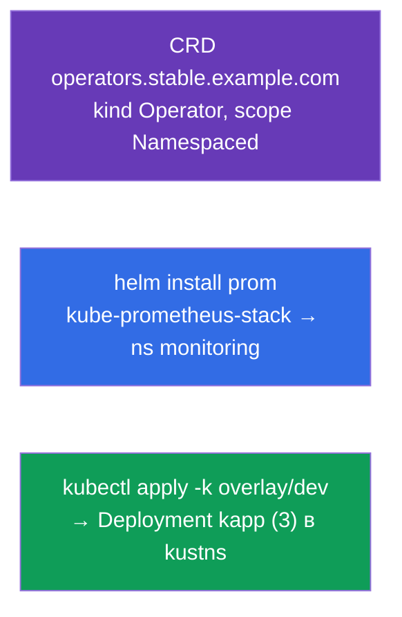

# Lab 115 — Расширение и упаковка: CRD, Helm, Kustomize

## Описание

Практическая работа по расширению API и инструментам упаковки/настройки манифестов. Вы
создадите свой тип объекта через **CustomResourceDefinition**, установите готовое ПО
через **Helm** (Prometheus) и адаптируете манифесты под окружение через **Kustomize**
(base + overlay). Эти темы вошли в программу CKA (Helm/Kustomize, CRD/операторы) и
встречаются в CKAD-моках.

Все задания оформлены в экзаменационном стиле (как реальные вопросы CKA/CKAD) с
автоматической проверкой командой `check_result`.

## Цель

Закрепить материал глав курса:

- [Глава 41. CRD и операторы](../../course/41/ru.md) — расширение API собственным типом ресурса
- [Глава 42. Helm](../../course/42/ru.md) — репозитории чартов, установка релизов
- [Глава 43. Kustomize](../../course/43/ru.md) — base + overlay, переопределение полей без шаблонов

## Что мы создаём и зачем

В этой лабе мы расширяем и упаковываем ресурсы кластера тремя разными инструментами.
Каждый объект решает свою задачу:

| Объект | Что это | Зачем в этой лабе |
|--------|---------|-------------------|
| **CRD `operators.stable.example.com`** | новый тип объекта в API | учимся расширять Kubernetes своим ресурсом (глава 41) |
| **Helm-релиз `prom`** (namespace `monitoring`) | установка готового чарта | ставим Prometheus из репозитория одной командой (глава 42) |
| **Kustomize overlay** → Deployment `kapp` | адаптация манифестов | применяем base + overlay (namespace, реплики) (глава 43) |

Итоговая картина того, что будет развёрнуто:



## Инфраструктура

Окружение разворачивается в AWS (`eu-central-1`) через Terragrunt и состоит из:

| Компонент  | Описание                                                             |
|------------|----------------------------------------------------------------------|
| `vpc`      | VPC `10.10.0.0/16` с публичными подсетями                            |
| `ssh-keys` | SSH-ключи для доступа к нодам                                        |
| `k8s-1`    | Kubernetes `1.35.2` (kubeadm), CNI Calico, metrics-server, одноузловой |
| `worker`   | Рабочая машина с `kubectl` и `check_result`; при старте ставит `helm` и готовит kustomize-файлы в `/var/work/115/kustomize` |

Инстансы: `t3.medium` (master) Ubuntu `22.04`. Кластер одноузловой — master
«разтейнчен» (снят taint `control-plane`), поэтому поды планируются прямо на него.

## Развёртывание

```bash
TASK=115 make run_cka_task
```

После создания подключитесь к рабочей машине (worker) по SSH и выполняйте задания
оттуда. `kubectl` уже настроен на контекст `cluster1-admin@cluster1`.

Полезные команды на рабочей машине:

```bash
time_left       # сколько осталось времени
check_result    # проверить решение
```

## Задания

---
|        **1**        | **Создать CustomResourceDefinition**                       |
| :-----------------: | :----------------------------------------------------------- |
| Что делаем          | Расширьте API кластера собственным типом объекта. Создайте CRD `operators.stable.example.com`: group `stable.example.com`, scope `Namespaced`, names — plural `operators`, singular `operator`, kind `Operator`, shortNames `op`. Версия `v1` (served + storage) со схемой `openAPIV3Schema`, где `spec` содержит поля `email` (string), `name` (string) и `age` (integer). Примените манифест (`kubectl apply -f crd.yaml`) и проверьте `kubectl get crd operators.stable.example.com`. |
| Критерии приёмки    | - CRD `operators.stable.example.com`;<br/>- group `stable.example.com`, kind `Operator`, scope `Namespaced`;<br/>- names: plural `operators`, singular `operator`, shortNames `op`;<br/>- schema: `email` (string), `name` (string), `age` (integer). |
---
|        **2**        | **Установить Helm-чарт Prometheus**                        |
| :-----------------: | :----------------------------------------------------------- |
| Что делаем          | Добавьте репозиторий `prometheus-community` (`helm repo add prometheus-community https://prometheus-community.github.io/helm-charts` + `helm repo update`), создайте namespace `monitoring` и установите чарт `kube-prometheus-stack` как релиз с именем `prom` в этот namespace (`helm install prom prometheus-community/kube-prometheus-stack -n monitoring`). Проверьте `helm ls -n monitoring`. |
| Критерии приёмки    | - repo `prometheus-community` добавлен;<br/>- Helm-релиз `prom` в namespace `monitoring` (чарт `kube-prometheus-stack`). |
---
|        **3**        | **Применить Kustomize-overlay**                            |
| :-----------------: | :----------------------------------------------------------- |
| Что делаем          | Готовые файлы лежат в `/var/work/115/kustomize` (base + overlay `dev` с namespace `kustns` и `replicas: 3`). Создайте namespace `kustns`, при желании просмотрите результат (`kubectl kustomize /var/work/115/kustomize/overlays/dev`) и примените overlay `dev` командой `kubectl apply -k /var/work/115/kustomize/overlays/dev`. В итоге в namespace `kustns` должен появиться Deployment `kapp` с `3` репликами. |
| Критерии приёмки    | - Deployment `kapp` в namespace `kustns` с `3` репликами (из overlay `dev`). |
---

## Проверка результата

На рабочей машине запустите автоматическую проверку:

```bash
check_result
```

Скрипт прогонит тесты и покажет, сколько заданий выполнено.

## Решение

Эталонное решение: [worker/files/solutions/1.MD](worker/files/solutions/1.MD)

## Покрытие мок-экзаменов

Лаба закрывает задания моков по расширению и упаковке: CKAD mock 01 (№16 — CRD,
№18 — Helm Prometheus), CKAD mock 02 (№14 — Helm Prometheus); Kustomize — из программы
CKA (Helm/Kustomize).

## Удаление кластера и ресурсов

```bash
TASK=115 make delete_cka_task
```
