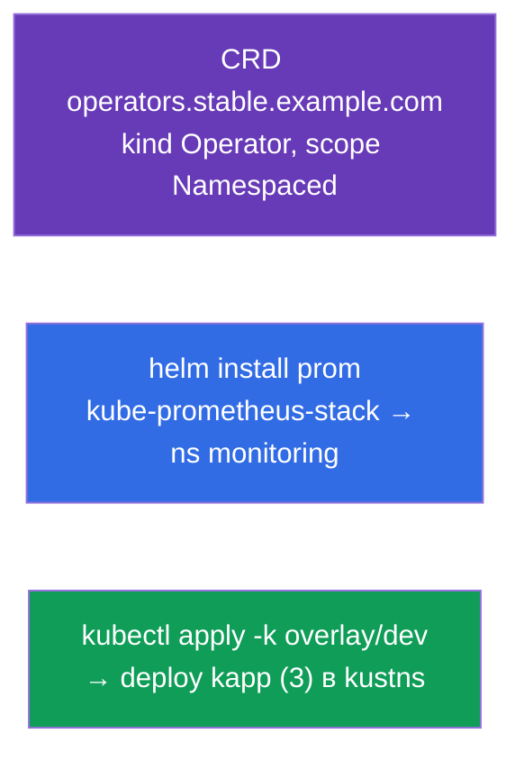

# Lab 115 — Расширение и упаковка: CRD, Helm, Kustomize

## Описание

Практическая работа по расширению API и инструментам упаковки/настройки манифестов. Вы
создадите свой тип объекта через **CustomResourceDefinition**, установите готовое ПО
через **Helm** (Prometheus) и адаптируете манифесты под окружение через **Kustomize**
(base + overlay). Эти темы вошли в программу CKA (Helm/Kustomize, CRD/операторы) и
встречаются в CKAD-моках.

Все задания в экзаменационном стиле с автопроверкой `check_result`.

## Цель

Закрепить главы курса:

- [Глава 41. CRD и операторы](../../course/41/ru.md)
- [Глава 42. Helm](../../course/42/ru.md)
- [Глава 43. Kustomize](../../course/43/ru.md)

## Что мы создаём и зачем

| Объект | Что это | Зачем в этой лабе |
|--------|---------|-------------------|
| **CRD `operators.stable.example.com`** | новый тип объекта в API | учимся расширять Kubernetes своим ресурсом |
| **Helm-релиз `prom`** (неймспейс `monitoring`) | установка готового чарта | ставим Prometheus из репозитория одной командой |
| **Kustomize overlay** → деплой `kapp` | адаптация манифестов | применяем base + overlay (namespace, реплики) |



## Инфраструктура

| Компонент  | Описание                                                             |
|------------|----------------------------------------------------------------------|
| `k8s-1`    | Kubernetes `1.35.2` (kubeadm), Calico, metrics-server, одноузловой    |
| `worker`   | Рабочая машина; при старте ставит `helm` и готовит kustomize-файлы в `/var/work/115/kustomize` |

## Развёртывание

```bash
TASK=115 make run_cka_task
```

## Задания

---
|        **1**        | **Создать CustomResourceDefinition**                       |
| :-----------------: | :----------------------------------------------------------- |
| Что делаем          | Расширяем API своим типом объекта                             |
| Критерии приёмки    | - CRD `operators.stable.example.com`<br/>- group `stable.example.com`, kind `Operator`, scope `Namespaced`<br/>- names: plural `operators`, singular `operator`, shortNames `op`<br/>- schema: `email`(string), `name`(string), `age`(integer) |
---
|        **2**        | **Установить Helm-чарт Prometheus**                        |
| :-----------------: | :----------------------------------------------------------- |
| Что делаем          | Добавляем репозиторий и ставим чарт как релиз                 |
| Критерии приёмки    | - Repo `prometheus-community`<br/>- Release `prom` в неймспейсе `monitoring` (чарт `kube-prometheus-stack`) |
---
|        **3**        | **Применить Kustomize-overlay**                            |
| :-----------------: | :----------------------------------------------------------- |
| Что делаем          | Применяем base + overlay с переопределением namespace и реплик |
| Критерии приёмки    | - Deployment `kapp` в неймспейсе `kustns` с `3` репликами (из overlay `dev`) |
---

## Проверка результата

```bash
check_result
```

## Решение

[worker/files/solutions/1.MD](worker/files/solutions/1.MD)

## Покрытие мок-экзаменов

CKAD mock 01 (№16 — CRD, №18 — Helm Prometheus), CKAD mock 02 (№14 — Helm Prometheus);
Kustomize — из программы CKA (Helm/Kustomize).

## Удаление

```bash
TASK=115 make delete_cka_task
```
