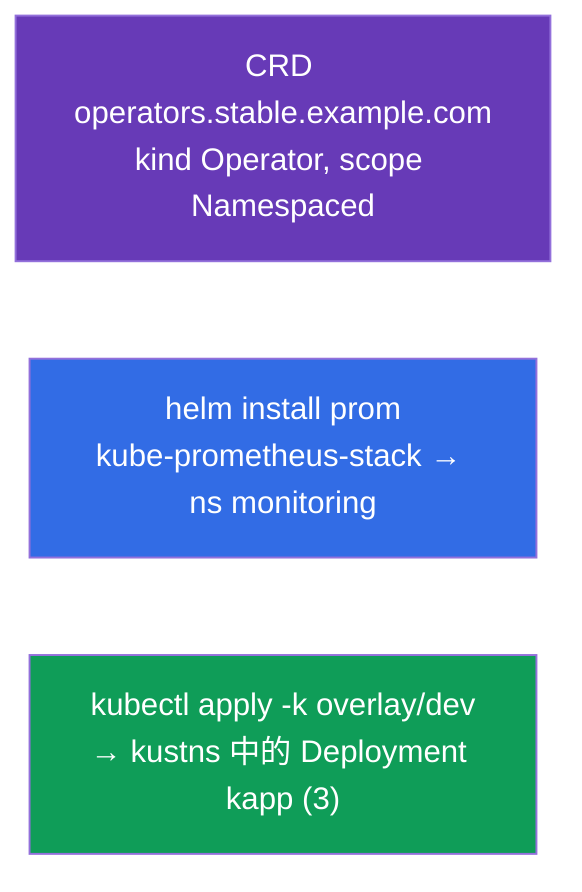

[Русская версия](README_RU.MD) · [Eng version](README.MD) · [Versión en español](README_ES.MD) · [Version française](README_FR.MD) · [Deutsche Version](README_DE.MD) · [ქართული ვერსია](README_GE.MD) · [日本語版](README_JP.MD)

# Lab 115 - 擴充與封裝:CRD、Helm、Kustomize

## 說明

關於擴充 API,以及封裝與客製化 manifest 工具的實作練習。你會透過
**CustomResourceDefinition** 建立自己的物件型別,用 **Helm** 安裝現成軟體
(Prometheus),並用 **Kustomize**(base + overlay)把 manifest 調整成
符合特定環境。這些主題屬於 CKA 大綱(Helm/Kustomize、CRD/operators),
也會出現在 CKAD 模擬考中。

所有任務都以考試風格撰寫(就像真正的 CKA/CKAD 題目),並透過
`check_result` 指令自動驗證。

## 目標

鞏固以下課程章節的內容:

- [第 41 章。CRD 與 operators](../../course/41/README.md) - 用自己的資源型別擴充 API
- [第 42 章。Helm](../../course/42/README.md) - chart 儲存庫、安裝 release
- [第 43 章。Kustomize](../../course/43/README.md) - base + overlay,不用模板就能覆寫欄位

## 我們要建立什麼,以及為什麼

在這個實驗中,我們用三種不同的工具來擴充與封裝叢集資源。
每個物件都有自己的用途:

| 物件 | 這是什麼 | 為什麼出現在這個實驗中 |
|--------|---------|-------------------|
| **CRD `operators.stable.example.com`** | API 中的新物件型別 | 學會用自己的資源擴充 Kubernetes(第 41 章) |
| **Helm release `prom`**(namespace `monitoring`) | 安裝現成的 chart | 用一條指令從儲存庫安裝 Prometheus(第 42 章) |
| **Kustomize overlay** → Deployment `kapp` | 調整 manifest | 套用 base + overlay(namespace、副本數)(第 43 章) |

最終部署出來的整體樣貌:



## 基礎架構

環境透過 Terragrunt 部署在 AWS(`eu-central-1`),由以下部分組成:

| 元件       | 說明                                                                 |
|------------|----------------------------------------------------------------------|
| `vpc`      | VPC `10.10.0.0/16`,含公有子網路                                       |
| `ssh-keys` | 用於存取節點的 SSH 金鑰                                                |
| `k8s-1`    | Kubernetes `1.35.2`(kubeadm),CNI Calico,metrics-server,單節點       |
| `worker`   | 工作機,具備 `kubectl` 與 `check_result`;啟動時會安裝 `helm`,並在 `/var/work/115/kustomize` 準備好 kustomize 檔案 |

執行個體:`t3.medium`(master),Ubuntu `22.04`。叢集為單節點 - master
已解除污點(移除了 `control-plane` taint),因此 Pod 會直接排程到它上面。

## 部署

```bash
TASK=115 make run_cka_task
```

建立完成後,請透過 SSH 連線到工作機(worker),並在那裡完成任務。
`kubectl` 已經指向 `cluster1-admin@cluster1` context。

工作機上的實用指令:

```bash
time_left       # 還剩多少時間
check_result    # 檢查解答
```

## 任務

---
|        **1**        | **建立 CustomResourceDefinition**                          |
| :-----------------: | :----------------------------------------------------------- |
| 要做什麼            | 用自己的物件型別擴充叢集 API。建立 CRD `operators.stable.example.com`:group 為 `stable.example.com`、scope 為 `Namespaced`、names - plural `operators`、singular `operator`、kind `Operator`、shortNames `op`。版本 `v1`(served + storage),並帶有 `openAPIV3Schema` schema,其中 `spec` 包含欄位 `email`(string)、`name`(string)與 `age`(integer)。套用 manifest(`kubectl apply -f crd.yaml`),並用 `kubectl get crd operators.stable.example.com` 檢查。 |
| 驗收標準            | - CRD `operators.stable.example.com`;<br/>- group `stable.example.com`、kind `Operator`、scope `Namespaced`;<br/>- names:plural `operators`、singular `operator`、shortNames `op`;<br/>- schema:`email`(string)、`name`(string)、`age`(integer)。 |
---
|        **2**        | **安裝 Prometheus 的 Helm chart**                          |
| :-----------------: | :----------------------------------------------------------- |
| 要做什麼            | 加入 `prometheus-community` 儲存庫(`helm repo add prometheus-community https://prometheus-community.github.io/helm-charts` + `helm repo update`),建立 namespace `monitoring`,並在該 namespace 中把 chart `kube-prometheus-stack` 安裝成名為 `prom` 的 release(`helm install prom prometheus-community/kube-prometheus-stack -n monitoring`)。用 `helm ls -n monitoring` 檢查。 |
| 驗收標準            | - 已加入 repo `prometheus-community`;<br/>- namespace `monitoring` 中有 Helm release `prom`(chart 為 `kube-prometheus-stack`)。 |
---
|        **3**        | **套用 Kustomize overlay**                                 |
| :-----------------: | :----------------------------------------------------------- |
| 要做什麼            | 準備好的檔案放在 `/var/work/115/kustomize`(base + overlay `dev`,其中 namespace 為 `kustns`,`replicas: 3`)。建立 namespace `kustns`,可以先預覽結果(`kubectl kustomize /var/work/115/kustomize/overlays/dev`),再用 `kubectl apply -k /var/work/115/kustomize/overlays/dev` 套用 overlay `dev`。最終在 namespace `kustns` 中應該出現帶有 `3` 個副本的 Deployment `kapp`。 |
| 驗收標準            | - namespace `kustns` 中有帶 `3` 個副本的 Deployment `kapp`(來自 overlay `dev`)。 |
---

## 檢查結果

在工作機上執行自動檢查:

```bash
check_result
```

腳本會跑完測試,並顯示已完成多少任務。

## 解答

參考解答:[worker/files/solutions/1_TW.MD](worker/files/solutions/1_TW.MD)

## 模擬考涵蓋範圍

本實驗涵蓋模擬考中關於擴充與封裝的題目:CKAD mock 01(第 16 題 - CRD、
第 18 題 - Helm Prometheus)、CKAD mock 02(第 14 題 - Helm Prometheus);Kustomize - 來自
CKA 大綱(Helm/Kustomize)。

## 刪除叢集與資源

```bash
TASK=115 make delete_cka_task
```
