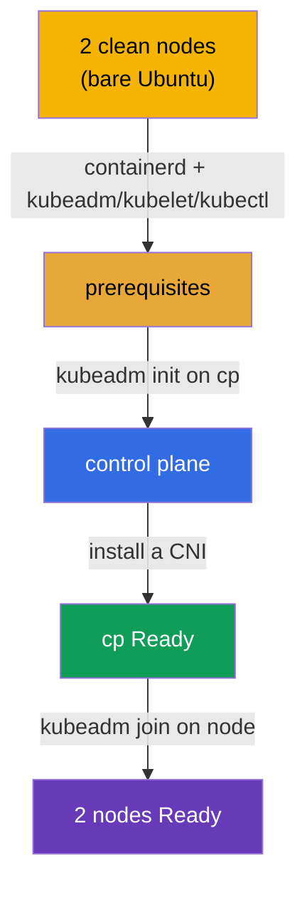

[Русская версия](README_RU.MD) · [Versión en español](README_ES.MD) · [Version française](README_FR.MD) · [Deutsche Version](README_DE.MD) · [ქართული ვერსია](README_GE.MD)

# Lab 116 — kubeadm: Build a Cluster from Scratch (init + join)

## Description

You are given **two completely clean** Ubuntu nodes — no container runtime and no
Kubernetes packages. You do the whole setup **yourself, from scratch**: install and
configure **containerd**, the prerequisites (swap, kernel modules, sysctl), the
`kubeadm`/`kubelet`/`kubectl` packages, then run `kubeadm init` on the control plane,
install a CNI and join the worker with `kubeadm join`.

All tasks are written in exam style (like real CKA questions) with automatic validation
via the `check_result` command. The difference from lab 111 (where you upgrade an existing
cluster) — here there is no cluster and not even a runtime: you assemble everything from a
bare OS.

## Goal

Reinforce the material from the course chapters:

- [Chapter 35. Installing a cluster with kubeadm](../../course/35/ru.md) — prerequisites, container runtime, `kubeadm init`/`join`
- [Chapter 30. The Kubernetes network model and CNI](../../course/30/ru.md) — installing a CNI, without which nodes never become `Ready`

## What We Do and Why

In this lab we walk the entire cluster installation path from a bare OS to two working
nodes. Every step is a separate stage of the setup:

| Step | What we do | Why |
|------|------------|-----|
| **Prerequisites + containerd** | swap off, kernel modules, sysctl, installing and configuring containerd (`SystemdCgroup=true`), the `kubeadm`/`kubelet`/`kubectl` v1.35 packages on both nodes | without a runtime and the prerequisites the `kubeadm` preflight will not pass (chapter 35) |
| **`kubeadm init`** | initializing the control plane on `cp`, setting up kubeconfig | bring up the control plane and register the first node (chapter 35) |
| **Installing a CNI** | apply a network plugin (Calico, for example) | without a CNI the node stays `NotReady` — Pod networking does not work (chapter 30) |
| **`kubeadm join`** | join the worker node `node` to the cluster | end up with a full two-node cluster (chapter 35) |

The final picture of what will be deployed:



## Infrastructure

The environment is deployed in AWS (`eu-central-1`) via Terragrunt and consists of two
clean nodes:

| Component | Description                                                              |
|-----------|--------------------------------------------------------------------------|
| `node-1`  | Clean node `cp` — the future control plane; `check_result` runs here      |
| `node-2`  | Clean node `node` — the future worker                                    |

Both nodes are bare Ubuntu 22.04: **no container runtime and no Kubernetes packages**.
You connect over SSH to node `cp`; from there `node` is reachable with `ssh node`.

## Deployment

```bash
TASK=116 make run_cka_task
```

In the Terragrunt output after `make run_cka_task`, find the `worker_pc_ssh` line — that is
the SSH to node `cp` (control plane). Next to it, `hosts_list` lists all nodes with their
public IPs. Connect to `cp` over SSH and work from there; the worker is reachable inside
the environment with `ssh node`.

Example output (the key lines):

```
hosts_list = [
  "cp=3.76.118.135",
]
worker_pc_ssh = "   ssh ubuntu@3.76.118.135 password= mcwKw0ZlRu   "
```

Here `3.76.118.135` is the public IP of node `cp` and `mcwKw0ZlRu` is the password. We
connect:

```bash
ssh ubuntu@3.76.118.135     # enter the password from the output
```

From inside node `cp` the worker is reachable by name:

```bash
ssh node                    # switch to the worker node
```

Handy commands on node `cp`:

```bash
time_left       # how much time is left
check_result    # check your solution
```

## Tasks

The work is done on node `cp` (control plane), the worker is reachable as `ssh node`.

> **Preparation (on both nodes).** Before `kubeadm init`, install and configure everything
> yourself: swap off, kernel modules (`overlay`, `br_netfilter`), sysctl, **containerd**
> (with `SystemdCgroup=true`), the `kubeadm`/`kubelet`/`kubectl` v1.35 packages. Without
> this, `kubeadm init`/`join` will not pass preflight. The exact commands are in the
> solution.

---
|        **1**        | **Initialize the control plane**                             |
| :-----------------: | :----------------------------------------------------------- |
| What to do          | On node `cp` run `sudo kubeadm init --pod-network-cidr=192.168.0.0/16`. Set up kubeconfig so that `kubectl` works: `mkdir -p $HOME/.kube`, copy `/etc/kubernetes/admin.conf` to `$HOME/.kube/config` and change the owner. Check `kubectl get nodes` — node `cp` will show up in the `NotReady` state (there is no CNI yet). |
| Acceptance criteria | - the file `/etc/kubernetes/admin.conf` is created;<br/>- node `cp` is registered in the cluster. |
---
|        **2**        | **Install a CNI**                                            |
| :-----------------: | :----------------------------------------------------------- |
| What to do          | Install a network plugin (Calico, for example): `kubectl apply -f https://raw.githubusercontent.com/projectcalico/calico/v3.28.2/manifests/calico.yaml`. Wait until the CNI Pods come up and node `cp` moves to `Ready` (`kubectl get nodes`). |
| Acceptance criteria | - node `cp` is in the `Ready` state. |
---
|        **3**        | **Join the worker**                                          |
| :-----------------: | :----------------------------------------------------------- |
| What to do          | On `cp` get the join command: `sudo kubeadm token create --print-join-command`. Log in to the worker (`ssh node`) and run it as root (`sudo kubeadm join <cp-private-ip>:6443 --token ... --discovery-token-ca-cert-hash sha256:...`). Come back to `cp` and make sure the cluster has 2 nodes and both are `Ready` (`kubectl get nodes`). |
| Acceptance criteria | - the cluster has 2 nodes;<br/>- both nodes are in the `Ready` state. |
---

## Checking the Result

On node `cp` run the automatic validation:

```bash
check_result
```

The script runs the tests and shows how many tasks are complete.

## Solution

Reference solution: [node-1/files/solutions/1.MD](node-1/files/solutions/1.MD)

## Mock Exam Coverage

The Cluster Architecture, Installation & Configuration domain (CKA) — installing a kubeadm
cluster from scratch (init + CNI + join).

## Deleting the Cluster and Resources

```bash
TASK=116 make delete_cka_task
```
