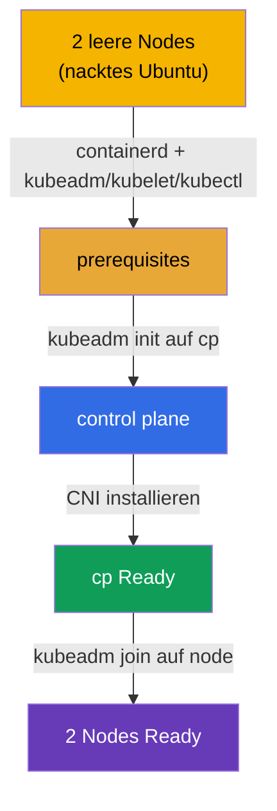

[Русская версия](README_RU.MD) · [Eng version](README.MD) · [Versión en español](README_ES.MD) · [Version française](README_FR.MD) · [ქართული ვერსია](README_GE.MD)

# Lab 116 — kubeadm: Cluster von Null aufbauen (init + join)

## Beschreibung

Gegeben sind **zwei völlig leere** Ubuntu-Nodes — ohne Container Runtime und ohne
Kubernetes-Pakete. Das komplette Setup machst du **selbst, von Null**: Du installierst und
konfigurierst **containerd**, die Prerequisites (Swap, Kernel-Module, sysctl), die Pakete
`kubeadm`/`kubelet`/`kubectl`, führst dann `kubeadm init` auf der Control Plane aus,
installierst ein CNI und hängst den Worker per `kubeadm join` an.

Alle Aufgaben sind im Prüfungsstil formuliert (wie echte CKA-Fragen) mit automatischer
Prüfung über den Befehl `check_result`. Der Unterschied zu Lab 111 (dort wird ein
bestehender Cluster aktualisiert): Hier gibt es weder Cluster noch Runtime — du baust alles
vom nackten Betriebssystem auf.

## Ziel

Den Stoff der Kurskapitel festigen:

- [Kapitel 35. Cluster-Installation mit kubeadm](../../course/35/ru.md) — Prerequisites, Container Runtime, `kubeadm init`/`join`
- [Kapitel 30. Kubernetes-Netzwerkmodell und CNI](../../course/30/ru.md) — Installation des CNI, ohne das Nodes nicht in `Ready` wechseln

## Was wir tun und warum

In diesem Lab gehen wir den gesamten Weg der Cluster-Installation vom nackten
Betriebssystem bis zu zwei arbeitenden Nodes. Jeder Schritt ist eine eigene Phase des
Setups:

| Schritt | Was wir tun | Warum |
|---------|-------------|-------|
| **Prerequisites + containerd** | Swap off, Kernel-Module, sysctl, Installation und Konfiguration von containerd (`SystemdCgroup=true`), Pakete `kubeadm`/`kubelet`/`kubectl` v1.35 auf beiden Nodes | ohne Runtime und Prerequisites besteht der Preflight von `kubeadm` nicht (Kapitel 35) |
| **`kubeadm init`** | Initialisierung der Control Plane auf `cp`, Einrichtung des kubeconfig | wir bringen die Control Plane hoch und registrieren den ersten Node (Kapitel 35) |
| **CNI-Installation** | wir wenden das Netzwerk-Plugin an (zum Beispiel Calico) | ohne CNI bleibt der Node `NotReady` — das Pod-Netzwerk funktioniert nicht (Kapitel 30) |
| **`kubeadm join`** | wir hängen den Worker-Node `node` an den Cluster | wir erhalten einen vollwertigen Cluster aus zwei Nodes (Kapitel 35) |

Das Gesamtbild dessen, was bereitgestellt wird:



## Infrastruktur

Die Umgebung wird in AWS (`eu-central-1`) via Terragrunt bereitgestellt und besteht aus
zwei leeren Nodes:

| Komponente | Beschreibung                                                            |
|------------|-------------------------------------------------------------------------|
| `node-1`   | Leerer Node `cp` — die künftige Control Plane; hier läuft `check_result` |
| `node-2`   | Leerer Node `node` — der künftige Worker                                |

Beide Nodes sind nacktes Ubuntu 22.04: **ohne Container Runtime und ohne
Kubernetes-Pakete**. Die Verbindung erfolgt per SSH zum Node `cp`; von dort ist `node` mit
dem Befehl `ssh node` erreichbar.

## Bereitstellung

```bash
TASK=116 make run_cka_task
```

Suche im Terragrunt-Output nach `make run_cka_task` die Zeile `worker_pc_ssh` — das ist der
SSH-Zugang zum Node `cp` (Control Plane). Daneben sind in `hosts_list` alle Nodes mit ihren
öffentlichen IPs aufgeführt. Verbinde dich per SSH mit `cp` und arbeite von dort; der Worker
ist innerhalb der Umgebung mit dem Befehl `ssh node` erreichbar.

Beispiel-Output (die wichtigsten Zeilen):

```
hosts_list = [
  "cp=3.76.118.135",
]
worker_pc_ssh = "   ssh ubuntu@3.76.118.135 password= mcwKw0ZlRu   "
```

Hier ist `3.76.118.135` die öffentliche IP des Nodes `cp` und `mcwKw0ZlRu` das Passwort. Wir
verbinden uns:

```bash
ssh ubuntu@3.76.118.135     # das Passwort aus dem Output eingeben
```

Vom Node `cp` aus ist der Worker über seinen Namen erreichbar:

```bash
ssh node                    # Wechsel auf den Worker-Node
```

Nützliche Befehle auf dem Node `cp`:

```bash
time_left       # wie viel Zeit bleibt
check_result    # Lösung prüfen
```

## Aufgaben

Gearbeitet wird auf dem Node `cp` (Control Plane), der Worker ist als `ssh node`
erreichbar.

> **Vorbereitung (auf beiden Nodes).** Installiere und konfiguriere vor `kubeadm init` alles
> selbst: Swap off, Kernel-Module (`overlay`, `br_netfilter`), sysctl, **containerd** (mit
> `SystemdCgroup=true`), Pakete `kubeadm`/`kubelet`/`kubectl` v1.35. Ohne das bestehen
> `kubeadm init`/`join` den Preflight nicht. Die genauen Befehle stehen in der Lösung.

---
|        **1**        | **Control Plane initialisieren**                             |
| :-----------------: | :----------------------------------------------------------- |
| Was wir tun         | Führe auf dem Node `cp` `sudo kubeadm init --pod-network-cidr=192.168.0.0/16` aus. Richte kubeconfig ein, damit `kubectl` funktioniert: `mkdir -p $HOME/.kube`, kopiere `/etc/kubernetes/admin.conf` nach `$HOME/.kube/config` und ändere den Besitzer. Prüfe `kubectl get nodes` — der Node `cp` erscheint im Status `NotReady` (es gibt noch kein CNI). |
| Abnahmekriterien    | - die Datei `/etc/kubernetes/admin.conf` ist erstellt;<br/>- der Node `cp` ist im Cluster registriert. |
---
|        **2**        | **CNI installieren**                                         |
| :-----------------: | :----------------------------------------------------------- |
| Was wir tun         | Installiere das Netzwerk-Plugin (zum Beispiel Calico): `kubectl apply -f https://raw.githubusercontent.com/projectcalico/calico/v3.28.2/manifests/calico.yaml`. Warte, bis die CNI-Pods hochkommen und der Node `cp` in `Ready` wechselt (`kubectl get nodes`). |
| Abnahmekriterien    | - der Node `cp` hat den Status `Ready`. |
---
|        **3**        | **Worker anhängen**                                          |
| :-----------------: | :----------------------------------------------------------- |
| Was wir tun         | Hole auf `cp` den Join-Befehl: `sudo kubeadm token create --print-join-command`. Melde dich auf dem Worker an (`ssh node`) und führe ihn als root aus (`sudo kubeadm join <cp-private-ip>:6443 --token ... --discovery-token-ca-cert-hash sha256:...`). Kehre zu `cp` zurück und stelle sicher, dass der Cluster 2 Nodes hat und beide `Ready` sind (`kubectl get nodes`). |
| Abnahmekriterien    | - der Cluster hat 2 Nodes;<br/>- beide Nodes haben den Status `Ready`. |
---

## Ergebnisprüfung

Starte auf dem Node `cp` die automatische Prüfung:

```bash
check_result
```

Das Skript führt die Tests aus und zeigt, wie viele Aufgaben erledigt sind.

## Lösung

Referenzlösung: [node-1/files/solutions/1_DE.MD](node-1/files/solutions/1_DE.MD)

## Abdeckung der Mock-Prüfungen

Domäne Cluster Architecture, Installation & Configuration (CKA) — Installation eines
kubeadm-Clusters von Null (init + CNI + join).

## Löschen von Cluster und Ressourcen

```bash
TASK=116 make delete_cka_task
```
