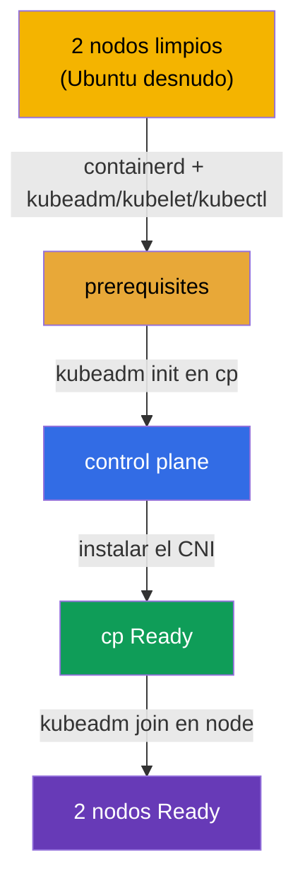

[Русская версия](README_RU.MD) · [Eng version](README.MD) · [Version française](README_FR.MD) · [Deutsche Version](README_DE.MD) · [ქართული ვერსია](README_GE.MD) · [繁體中文版](README_TW.MD) · [日本語版](README_JP.MD)

# Lab 116 — kubeadm: levantar un clúster desde cero (init + join)

## Descripción

Se te dan **dos nodos Ubuntu completamente limpios**, sin container runtime y sin paquetes
de Kubernetes. Todo el setup lo haces **tú mismo, desde cero**: instalas y configuras
**containerd**, los prerequisites (swap, módulos del kernel, sysctl), los paquetes
`kubeadm`/`kubelet`/`kubectl` y después ejecutas `kubeadm init` en el control plane,
instalas un CNI y añades el worker con `kubeadm join`.

Todas las tareas están redactadas en estilo de examen (como preguntas reales de CKA) con
comprobación automática mediante el comando `check_result`. La diferencia con el
laboratorio 111 (allí se actualiza un clúster ya listo) es que aquí no hay ni clúster ni
siquiera runtime: lo montas todo desde un sistema operativo desnudo.

## Objetivo

Consolidar el material de los capítulos del curso:

- [Capítulo 35. Instalación del clúster con kubeadm](../../course/35/es.md) — prerequisites, container runtime, `kubeadm init`/`join`
- [Capítulo 30. Modelo de red de Kubernetes y CNI](../../course/30/es.md) — instalación del CNI, sin el cual los nodos no pasan a `Ready`

## Qué hacemos y para qué

En este laboratorio recorremos todo el camino de instalación de un clúster, desde el
sistema operativo desnudo hasta dos nodos operativos. Cada paso es una etapa aparte del
setup:

| Paso | Qué hacemos | Para qué |
|------|-------------|----------|
| **Prerequisites + containerd** | swap off, módulos del kernel, sysctl, instalación y configuración de containerd (`SystemdCgroup=true`), paquetes `kubeadm`/`kubelet`/`kubectl` v1.35 en ambos nodos | sin runtime ni prerequisites no pasará el preflight de `kubeadm` (capítulo 35) |
| **`kubeadm init`** | inicialización del control plane en `cp`, configuración de kubeconfig | levantamos el control plane y registramos el primer nodo (capítulo 35) |
| **Instalación del CNI** | aplicamos el plugin de red (por ejemplo, Calico) | sin CNI el nodo se queda en `NotReady`: la red de pods no funciona (capítulo 30) |
| **`kubeadm join`** | añadimos el nodo worker `node` al clúster | obtenemos un clúster completo de dos nodos (capítulo 35) |

Imagen final de lo que se despliega:



## Infraestructura

El entorno se despliega en AWS (`eu-central-1`) mediante Terragrunt y consta de dos nodos
limpios:

| Componente | Descripción                                                             |
|------------|-------------------------------------------------------------------------|
| `node-1`   | Nodo limpio `cp`, el futuro control plane; aquí se ejecuta `check_result` |
| `node-2`   | Nodo limpio `node`, el futuro worker                                     |

Ambos nodos son Ubuntu 22.04 desnudo: **sin container runtime y sin paquetes de
Kubernetes**. La conexión es por SSH al nodo `cp`; desde él se accede a `node` con el
comando `ssh node`.

## Despliegue

```bash
TASK=116 make run_cka_task
```

En el output de Terragrunt tras `make run_cka_task` busca la línea `worker_pc_ssh`: es el
SSH al nodo `cp` (control plane). Al lado, en `hosts_list`, se enumeran todos los nodos con
sus IP públicas. Conéctate a `cp` por SSH y trabaja desde ahí; el worker está accesible
dentro del entorno con el comando `ssh node`.

Ejemplo de output (líneas clave):

```
hosts_list = [
  "cp=3.76.118.135",
]
worker_pc_ssh = "   ssh ubuntu@3.76.118.135 password= mcwKw0ZlRu   "
```

Aquí `3.76.118.135` es la IP pública del nodo `cp` y `mcwKw0ZlRu` es la contraseña. Nos
conectamos:

```bash
ssh ubuntu@3.76.118.135     # introducimos la contraseña del output
```

Desde dentro del nodo `cp` el worker está accesible por nombre:

```bash
ssh node                    # pasamos al nodo worker
```

Comandos útiles en el nodo `cp`:

```bash
time_left       # cuánto tiempo queda
check_result    # comprobar la solución
```

## Tareas

El trabajo se realiza en el nodo `cp` (control plane); el worker está accesible como
`ssh node`.

> **Preparación (en ambos nodos).** Antes de `kubeadm init` instala y configura todo tú
> mismo: swap off, módulos del kernel (`overlay`, `br_netfilter`), sysctl, **containerd**
> (con `SystemdCgroup=true`), paquetes `kubeadm`/`kubelet`/`kubectl` v1.35. Sin esto,
> `kubeadm init`/`join` no pasarán el preflight. Los comandos exactos están en la solución.

---
|        **1**        | **Inicializar el control plane**                             |
| :-----------------: | :----------------------------------------------------------- |
| Qué hacemos         | En el nodo `cp` ejecuta `sudo kubeadm init --pod-network-cidr=192.168.0.0/16`. Configura kubeconfig para que funcione `kubectl`: `mkdir -p $HOME/.kube`, copia `/etc/kubernetes/admin.conf` a `$HOME/.kube/config` y cambia el propietario. Comprueba `kubectl get nodes`: el nodo `cp` aparecerá en estado `NotReady` (aún no hay CNI). |
| Criterios de aceptación | - el fichero `/etc/kubernetes/admin.conf` está creado;<br/>- el nodo `cp` está registrado en el clúster. |
---
|        **2**        | **Instalar el CNI**                                          |
| :-----------------: | :----------------------------------------------------------- |
| Qué hacemos         | Instala el plugin de red (por ejemplo, Calico): `kubectl apply -f https://raw.githubusercontent.com/projectcalico/calico/v3.28.2/manifests/calico.yaml`. Espera hasta que los Pods del CNI se levanten y el nodo `cp` pase a `Ready` (`kubectl get nodes`). |
| Criterios de aceptación | - el nodo `cp` está en estado `Ready`. |
---
|        **3**        | **Añadir el worker**                                         |
| :-----------------: | :----------------------------------------------------------- |
| Qué hacemos         | En `cp` obtén el comando join: `sudo kubeadm token create --print-join-command`. Entra en el worker (`ssh node`) y ejecútalo como root (`sudo kubeadm join <cp-private-ip>:6443 --token ... --discovery-token-ca-cert-hash sha256:...`). Vuelve a `cp` y asegúrate de que en el clúster hay 2 nodos y ambos están `Ready` (`kubectl get nodes`). |
| Criterios de aceptación | - en el clúster hay 2 nodos;<br/>- ambos nodos están en estado `Ready`. |
---

## Comprobación del resultado

En el nodo `cp` ejecuta la comprobación automática:

```bash
check_result
```

El script pasará los tests y mostrará cuántas tareas se han completado.

## Solución

Solución de referencia: [node-1/files/solutions/1_ES.MD](node-1/files/solutions/1_ES.MD)

## Cobertura de exámenes simulados

Dominio Cluster Architecture, Installation & Configuration (CKA): instalación de un clúster
kubeadm desde cero (init + CNI + join).

## Eliminación del clúster y los recursos

```bash
TASK=116 make delete_cka_task
```
