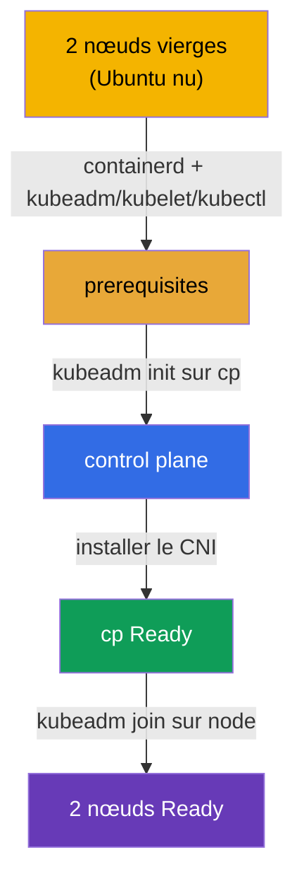

[Русская версия](README_RU.MD) · [Eng version](README.MD) · [Versión en español](README_ES.MD) · [Deutsche Version](README_DE.MD) · [ქართული ვერსია](README_GE.MD) · [繁體中文版](README_TW.MD) · [日本語版](README_JP.MD)

# Lab 116 — kubeadm : monter un cluster de zéro (init + join)

## Description

On vous donne **deux nœuds Ubuntu totalement vierges** — sans container runtime et sans
paquets Kubernetes. Vous faites toute l'installation **vous-même, de zéro** : vous
installez et configurez **containerd**, les prerequisites (swap, modules du noyau, sysctl),
les paquets `kubeadm`/`kubelet`/`kubectl`, puis vous lancez `kubeadm init` sur le control
plane, installez un CNI et rattachez le worker avec `kubeadm join`.

Toutes les tâches sont rédigées dans le style de l'examen (comme de vraies questions CKA)
avec une vérification automatique via la commande `check_result`. La différence avec le lab
111 (où l'on met à niveau un cluster déjà prêt) : ici il n'y a ni cluster, ni même de
runtime — vous assemblez tout depuis un OS nu.

## Objectif

Consolider le contenu des chapitres du cours :

- [Chapitre 35. Installation d'un cluster avec kubeadm](../../course/35/fr.md) — prerequisites, container runtime, `kubeadm init`/`join`
- [Chapitre 30. Modèle réseau de Kubernetes et CNI](../../course/30/fr.md) — installation du CNI, sans lequel les nœuds ne passent pas en `Ready`

## Ce que nous faisons et pourquoi

Dans ce lab, nous parcourons tout le chemin d'installation d'un cluster, de l'OS nu à deux
nœuds opérationnels. Chaque étape est une phase distincte de l'installation :

| Étape | Ce qu'on fait | Pourquoi |
|-------|---------------|----------|
| **Prerequisites + containerd** | swap off, modules du noyau, sysctl, installation et configuration de containerd (`SystemdCgroup=true`), paquets `kubeadm`/`kubelet`/`kubectl` v1.35 sur les deux nœuds | sans runtime ni prerequisites, le preflight de `kubeadm` échouera (chapitre 35) |
| **`kubeadm init`** | initialisation du control plane sur `cp`, configuration du kubeconfig | on lance le control plane et on enregistre le premier nœud (chapitre 35) |
| **Installation du CNI** | on applique le plugin réseau (par exemple Calico) | sans CNI, le nœud reste `NotReady` — le réseau des pods ne fonctionne pas (chapitre 30) |
| **`kubeadm join`** | on rattache le nœud worker `node` au cluster | on obtient un cluster complet de deux nœuds (chapitre 35) |

Image finale de ce qui sera déployé :



## Infrastructure

L'environnement est déployé dans AWS (`eu-central-1`) via Terragrunt et se compose de deux
nœuds vierges :

| Composant | Description                                                             |
|-----------|-------------------------------------------------------------------------|
| `node-1`  | Nœud vierge `cp` — le futur control plane ; c'est ici qu'on lance `check_result` |
| `node-2`  | Nœud vierge `node` — le futur worker                                    |

Les deux nœuds sont un Ubuntu 22.04 nu : **sans container runtime et sans paquets
Kubernetes**. La connexion se fait en SSH sur le nœud `cp` ; depuis celui-ci, `node` est
accessible avec la commande `ssh node`.

## Déploiement

```bash
TASK=116 make run_cka_task
```

Dans l'output de Terragrunt après `make run_cka_task`, repérez la ligne `worker_pc_ssh` —
c'est le SSH vers le nœud `cp` (control plane). Juste à côté, `hosts_list` liste tous les
nœuds avec leurs IP publiques. Connectez-vous à `cp` en SSH et travaillez depuis là ; le
worker est accessible à l'intérieur de l'environnement avec la commande `ssh node`.

Exemple d'output (lignes clés) :

```
hosts_list = [
  "cp=3.76.118.135",
]
worker_pc_ssh = "   ssh ubuntu@3.76.118.135 password= mcwKw0ZlRu   "
```

Ici `3.76.118.135` est l'IP publique du nœud `cp`, `mcwKw0ZlRu` le mot de passe. On se
connecte :

```bash
ssh ubuntu@3.76.118.135     # on saisit le mot de passe de l'output
```

Depuis l'intérieur du nœud `cp`, le worker est accessible par son nom :

```bash
ssh node                    # passage sur le nœud worker
```

Commandes utiles sur le nœud `cp` :

```bash
time_left       # temps restant
check_result    # vérifier la solution
```

## Tâches

Le travail se fait sur le nœud `cp` (control plane), le worker est accessible via
`ssh node`.

> **Préparation (sur les deux nœuds).** Avant `kubeadm init`, installez et configurez tout
> vous-même : swap off, modules du noyau (`overlay`, `br_netfilter`), sysctl, **containerd**
> (avec `SystemdCgroup=true`), paquets `kubeadm`/`kubelet`/`kubectl` v1.35. Sans cela,
> `kubeadm init`/`join` ne passeront pas le preflight. Les commandes exactes sont dans la
> solution.

---
|        **1**        | **Initialiser le control plane**                             |
| :-----------------: | :----------------------------------------------------------- |
| Ce qu'on fait       | Sur le nœud `cp`, exécutez `sudo kubeadm init --pod-network-cidr=192.168.0.0/16`. Configurez le kubeconfig pour que `kubectl` fonctionne : `mkdir -p $HOME/.kube`, copiez `/etc/kubernetes/admin.conf` vers `$HOME/.kube/config` et changez le propriétaire. Vérifiez avec `kubectl get nodes` — le nœud `cp` apparaîtra à l'état `NotReady` (pas encore de CNI). |
| Critères d'acceptation | - le fichier `/etc/kubernetes/admin.conf` est créé ;<br/>- le nœud `cp` est enregistré dans le cluster. |
---
|        **2**        | **Installer le CNI**                                         |
| :-----------------: | :----------------------------------------------------------- |
| Ce qu'on fait       | Installez le plugin réseau (par exemple Calico) : `kubectl apply -f https://raw.githubusercontent.com/projectcalico/calico/v3.28.2/manifests/calico.yaml`. Attendez que les Pods du CNI démarrent et que le nœud `cp` passe à `Ready` (`kubectl get nodes`). |
| Critères d'acceptation | - le nœud `cp` est à l'état `Ready`. |
---
|        **3**        | **Rattacher le worker**                                      |
| :-----------------: | :----------------------------------------------------------- |
| Ce qu'on fait       | Sur `cp`, récupérez la commande join : `sudo kubeadm token create --print-join-command`. Connectez-vous au worker (`ssh node`) et exécutez-la en root (`sudo kubeadm join <cp-private-ip>:6443 --token ... --discovery-token-ca-cert-hash sha256:...`). Revenez sur `cp` et assurez-vous que le cluster compte 2 nœuds, tous deux `Ready` (`kubectl get nodes`). |
| Critères d'acceptation | - le cluster compte 2 nœuds ;<br/>- les deux nœuds sont à l'état `Ready`. |
---

## Vérification du résultat

Sur le nœud `cp`, lancez la vérification automatique :

```bash
check_result
```

Le script exécutera les tests et affichera combien de tâches sont réussies.

## Solution

Solution de référence : [node-1/files/solutions/1_FR.MD](node-1/files/solutions/1_FR.MD)

## Couverture des examens blancs

Domaine Cluster Architecture, Installation & Configuration (CKA) — installation d'un cluster
kubeadm de zéro (init + CNI + join).

## Suppression du cluster et des ressources

```bash
TASK=116 make delete_cka_task
```
