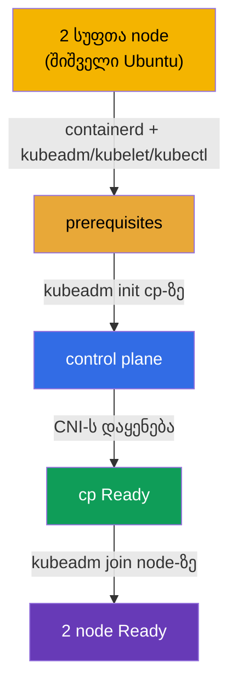

[Русская версия](README_RU.MD) · [Eng version](README.MD) · [Versión en español](README_ES.MD) · [Version française](README_FR.MD) · [Deutsche Version](README_DE.MD)

# Lab 116 — kubeadm: კლასტერის აწყობა ნულიდან (init + join)

## აღწერა

მოცემულია **ორი სრულიად სუფთა** Ubuntu node — container runtime-ისა და Kubernetes-ის
პაკეტების გარეშე. სრულ სეტაპს **თავად აკეთებთ, ნულიდან**: აყენებთ და კონფიგურირებთ
**containerd**-ს, prerequisites-ს (swap, ბირთვის მოდულები, sysctl), პაკეტებს
`kubeadm`/`kubelet`/`kubectl`, შემდეგ ასრულებთ `kubeadm init`-ს control plane-ზე, აყენებთ
CNI-ს და აერთებთ worker-ს `kubeadm join`-ით.

ყველა დავალება გამოცდის სტილშია გაფორმებული (როგორც რეალური CKA კითხვები) და მათი შემოწმება
ავტომატურად ხდება ბრძანებით `check_result`. განსხვავება ლაბორატორია 111-სგან (სადაც უკვე
მზა კლასტერს ანახლებენ) — აქ არც კლასტერია, არც თუნდაც რანთაიმი: ყველაფერს შიშველი OS-იდან
აწყობთ.

## მიზანი

განამტკიცოთ კურსის თავების მასალა:

- [თავი 35. კლასტერის დაყენება kubeadm-ის დახმარებით](../../course/35/ru.md) — prerequisites, container runtime, `kubeadm init`/`join`
- [თავი 30. Kubernetes-ის ქსელური მოდელი და CNI](../../course/30/ru.md) — CNI-ს დაყენება, რომლის გარეშე node-ები `Ready`-ში არ გადადიან

## რას ვაკეთებთ და რისთვის

ამ ლაბორატორიაში გავდივართ კლასტერის დაყენების მთელ გზას შიშველი OS-იდან ორ მუშა node-მდე.
თითოეული ნაბიჯი სეტაპის ცალკე ეტაპია:

| ნაბიჯი | რას ვაკეთებთ | რისთვის |
|--------|--------------|---------|
| **Prerequisites + containerd** | swap off, ბირთვის მოდულები, sysctl, containerd-ის დაყენება და კონფიგურაცია (`SystemdCgroup=true`), პაკეტები `kubeadm`/`kubelet`/`kubectl` v1.35 ორივე node-ზე | რანთაიმისა და prerequisites-ის გარეშე `kubeadm`-ის preflight ვერ გაივლის (თავი 35) |
| **`kubeadm init`** | control plane-ის ინიციალიზაცია `cp`-ზე, kubeconfig-ის კონფიგურაცია | ვუშვებთ control plane-ს და ვარეგისტრირებთ პირველ node-ს (თავი 35) |
| **CNI-ს დაყენება** | ვიყენებთ ქსელურ პლაგინს (მაგალითად, Calico) | CNI-ს გარეშე node რჩება `NotReady`-ში — pod-ების ქსელი არ მუშაობს (თავი 30) |
| **`kubeadm join`** | ვაერთებთ worker-node `node`-ს კლასტერთან | ვიღებთ სრულფასოვან კლასტერს ორი node-ისგან (თავი 35) |

საბოლოო სურათი იმისა, რაც განთავსდება:



## ინფრასტრუქტურა

გარემო იშლება AWS-ში (`eu-central-1`) Terragrunt-ის მეშვეობით და შედგება ორი სუფთა
node-ისგან:

| კომპონენტი | აღწერა                                                                |
|------------|-----------------------------------------------------------------------|
| `node-1`   | სუფთა node `cp` — მომავალი control plane; აქ ეშვება `check_result`     |
| `node-2`   | სუფთა node `node` — მომავალი worker                                   |

ორივე node შიშველი Ubuntu 22.04-ია: **container runtime-ისა და Kubernetes-ის პაკეტების
გარეშე**. დაკავშირება — SSH-ით node `cp`-ზე; მისგან `node` ხელმისაწვდომია ბრძანებით
`ssh node`.

## განთავსება

```bash
TASK=116 make run_cka_task
```

Terragrunt-ის output-ში `make run_cka_task`-ის შემდეგ იპოვეთ სტრიქონი `worker_pc_ssh` — ეს
არის SSH node `cp`-ზე (control plane). გვერდით, `hosts_list`-ში, ჩამოთვლილია ყველა node
თავისი საჯარო IP-ებით. დაუკავშირდით `cp`-ს SSH-ით და იმუშავეთ იქიდან; worker
ხელმისაწვდომია გარემოს შიგნით ბრძანებით `ssh node`.

output-ის მაგალითი (ძირითადი სტრიქონები):

```
hosts_list = [
  "cp=3.76.118.135",
]
worker_pc_ssh = "   ssh ubuntu@3.76.118.135 password= mcwKw0ZlRu   "
```

აქ `3.76.118.135` — node `cp`-ის საჯარო IP, `mcwKw0ZlRu` — პაროლი. ვუკავშირდებით:

```bash
ssh ubuntu@3.76.118.135     # შევიყვანთ პაროლს output-იდან
```

node `cp`-ის შიგნიდან worker ხელმისაწვდომია სახელით:

```bash
ssh node                    # გადასვლა worker-node-ზე
```

სასარგებლო ბრძანებები node `cp`-ზე:

```bash
time_left       # რამდენი დრო დარჩა
check_result    # ამოხსნის შემოწმება
```

## დავალებები

სამუშაო მიმდინარეობს node `cp`-ზე (control plane), worker ხელმისაწვდომია როგორც
`ssh node`.

> **მოსამზადებელი ნაბიჯები (ორივე node-ზე).** `kubeadm init`-მდე დააყენეთ და დააკონფიგურეთ
> ყველაფერი თავად: swap off, ბირთვის მოდულები (`overlay`, `br_netfilter`), sysctl,
> **containerd** (`SystemdCgroup=true`-თი), პაკეტები `kubeadm`/`kubelet`/`kubectl` v1.35.
> ამის გარეშე `kubeadm init`/`join` preflight-ს ვერ გაივლის. ზუსტი ბრძანებები — ამოხსნაშია.

---
|        **1**        | **control plane-ის ინიციალიზაცია**                           |
| :-----------------: | :----------------------------------------------------------- |
| რას ვაკეთებთ        | node `cp`-ზე შეასრულეთ `sudo kubeadm init --pod-network-cidr=192.168.0.0/16`. დააკონფიგურეთ kubeconfig, რომ `kubectl` იმუშაოს: `mkdir -p $HOME/.kube`, დააკოპირეთ `/etc/kubernetes/admin.conf` `$HOME/.kube/config`-ში და შეუცვალეთ მფლობელი. შეამოწმეთ `kubectl get nodes` — node `cp` გამოჩნდება სტატუსში `NotReady` (CNI ჯერ არ არის). |
| მიღების კრიტერიუმები | - ფაილი `/etc/kubernetes/admin.conf` შექმნილია;<br/>- node `cp` დარეგისტრირებულია კლასტერში. |
---
|        **2**        | **CNI-ს დაყენება**                                           |
| :-----------------: | :----------------------------------------------------------- |
| რას ვაკეთებთ        | დააყენეთ ქსელური პლაგინი (მაგალითად, Calico): `kubectl apply -f https://raw.githubusercontent.com/projectcalico/calico/v3.28.2/manifests/calico.yaml`. დაელოდეთ, სანამ CNI-ს Pod-ები აიწევს და node `cp` გადავა `Ready`-ში (`kubectl get nodes`). |
| მიღების კრიტერიუმები | - node `cp` სტატუსში `Ready`. |
---
|        **3**        | **worker-ის მიერთება**                                       |
| :-----------------: | :----------------------------------------------------------- |
| რას ვაკეთებთ        | `cp`-ზე მიიღეთ join-ბრძანება: `sudo kubeadm token create --print-join-command`. შედით worker-ზე (`ssh node`) და შეასრულეთ იგი root-ით (`sudo kubeadm join <cp-private-ip>:6443 --token ... --discovery-token-ca-cert-hash sha256:...`). დაბრუნდით `cp`-ზე და დარწმუნდით, რომ კლასტერში 2 node-ია და ორივე `Ready` (`kubectl get nodes`). |
| მიღების კრიტერიუმები | - კლასტერში 2 node-ია;<br/>- ორივე node სტატუსში `Ready`. |
---

## შედეგის შემოწმება

node `cp`-ზე გაუშვით ავტომატური შემოწმება:

```bash
check_result
```

სკრიპტი გაატარებს ტესტებს და აჩვენებს, რამდენი დავალებაა შესრულებული.

## ამოხსნა

ეტალონური ამოხსნა: [node-1/files/solutions/1_GE.MD](node-1/files/solutions/1_GE.MD)

## Mock-გამოცდების დაფარვა

დომენი Cluster Architecture, Installation & Configuration (CKA) — kubeadm კლასტერის
დაყენება ნულიდან (init + CNI + join).

## კლასტერისა და რესურსების წაშლა

```bash
TASK=116 make delete_cka_task
```
