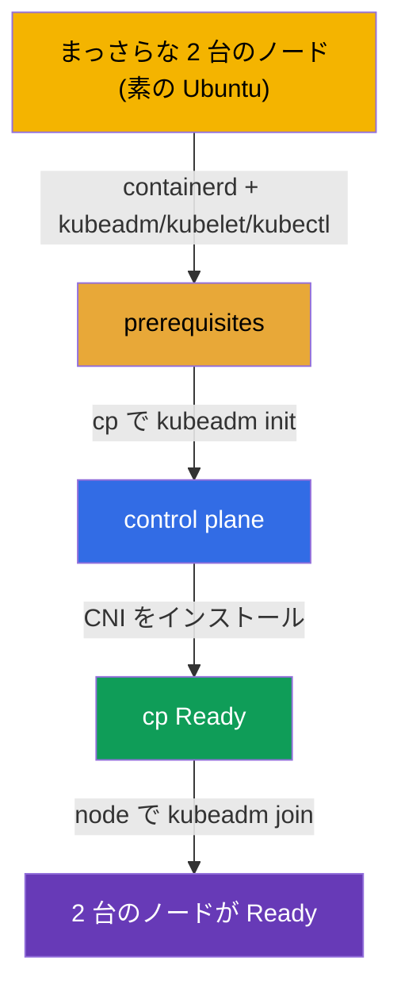

[Русская версия](README_RU.MD) · [Eng version](README.MD) · [Versión en español](README_ES.MD) · [Version française](README_FR.MD) · [Deutsche Version](README_DE.MD) · [ქართული ვერსია](README_GE.MD) · [繁體中文版](README_TW.MD)

# Lab 116 - kubeadm：クラスタをゼロから立ち上げる（init + join）

## 概要

**完全にまっさらな 2 台のノード**（Ubuntu）が与えられます - container runtime も
Kubernetes のパッケージもありません。セットアップは全部**自分でゼロから**行います：
**containerd** のインストールと設定、prerequisites（swap、カーネルモジュール、sysctl）、
`kubeadm`/`kubelet`/`kubectl` のパッケージ、そのあと control plane で `kubeadm init`、
CNI のインストール、そして `kubeadm join` による worker の参加です。

すべての課題は試験形式（実際の CKA の問題と同じスタイル）で書かれており、
`check_result` コマンドで自動的に検証されます。実習 111（あちらは既存のクラスタを
アップグレードする）との違いは - ここにはクラスタもランタイムすらないという点です：素の
OS からすべてを組み立てます。

## 目的

次のコース章の内容を定着させます：

- [第 35 章。kubeadm を使ったクラスタのインストール](../../course/35/README.md) - prerequisites、container runtime、`kubeadm init`/`join`
- [第 30 章。Kubernetes のネットワークモデルと CNI](../../course/30/README.md) - CNI のインストール。これがないとノードは `Ready` になりません

## 何を作り、なぜ作るのか

この実習では、素の OS から 2 台の稼働ノードに至るまで、クラスタのインストールの全工程を
たどります。各ステップはセットアップの独立した段階です：

| ステップ | やること | なぜ |
|-----|------------|-------|
| **Prerequisites + containerd** | swap off、カーネルモジュール、sysctl、containerd のインストールと設定（`SystemdCgroup=true`）、両方のノードへ `kubeadm`/`kubelet`/`kubectl` v1.35 のパッケージを導入 | ランタイムと prerequisites がないと `kubeadm` の preflight を通過できない（第 35 章） |
| **`kubeadm init`** | `cp` 上で control plane を初期化し、kubeconfig を設定する | control plane を立ち上げ、最初のノードを登録する（第 35 章） |
| **CNI のインストール** | ネットワークプラグイン（例えば Calico）を適用する | CNI がないとノードは `NotReady` のまま - Pod のネットワークが動かない（第 30 章） |
| **`kubeadm join`** | worker ノード `node` をクラスタに参加させる | 2 ノード構成の完全なクラスタが手に入る（第 35 章） |

最終的にデプロイされる全体像：



## インフラ

環境は Terragrunt により AWS（`eu-central-1`）に展開され、まっさらな 2 台のノードで
構成されます：

| コンポーネント | 説明                                                                 |
|-----------|--------------------------------------------------------------------------|
| `node-1`  | まっさらなノード `cp` - 将来の control plane；ここで `check_result` を実行する |
| `node-2`  | まっさらなノード `node` - 将来の worker                                   |

両方のノードは素の Ubuntu 22.04 です：**container runtime も Kubernetes のパッケージもありません**。
接続方法 - ノード `cp` への SSH です；そこから `ssh node` で `node` にアクセスできます。

## デプロイ

```bash
TASK=116 make run_cka_task
```

`make run_cka_task` のあとの Terragrunt の output から `worker_pc_ssh` の行を探してください - これが
ノード `cp`（control plane）への SSH です。その隣の `hosts_list` にはすべてのノードとそのパブリック
IP が並んでいます。SSH で `cp` に接続し、そこで作業してください；worker は環境の内部から
`ssh node` でアクセスできます。

output の例（重要な行）：

```
hosts_list = [
  "cp=3.76.118.135",
]
worker_pc_ssh = "   ssh ubuntu@3.76.118.135 password= mcwKw0ZlRu   "
```

ここで `3.76.118.135` はノード `cp` のパブリック IP、`mcwKw0ZlRu` はパスワードです。接続します：

```bash
ssh ubuntu@3.76.118.135     # output のパスワードを入力する
```

ノード `cp` の内部からは、worker に名前でアクセスできます：

```bash
ssh node                    # worker ノードへ移動する
```

ノード `cp` で使える便利なコマンド：

```bash
time_left       # 残り時間
check_result    # 解答をチェックする
```

## 課題

作業はノード `cp`（control plane）で行い、worker は `ssh node` でアクセスできます。

> **準備（両方のノードで）。** `kubeadm init` の前に、すべてを自分で
> インストールして設定してください：swap off、カーネルモジュール（`overlay`、`br_netfilter`）、sysctl、**containerd**
> （`SystemdCgroup=true` 付き）、`kubeadm`/`kubelet`/`kubectl` v1.35 のパッケージ。これがないと
> `kubeadm init`/`join` は preflight を通過できません。正確なコマンドは - 解答にあります。

---
|        **1**        | **control plane を初期化する**                              |
| :-----------------: | :----------------------------------------------------------- |
| やること            | ノード `cp` で `sudo kubeadm init --pod-network-cidr=192.168.0.0/16` を実行してください。`kubectl` が動くように kubeconfig を設定します：`mkdir -p $HOME/.kube`、`/etc/kubernetes/admin.conf` を `$HOME/.kube/config` にコピーして、所有者を変更します。`kubectl get nodes` を確認してください - ノード `cp` が `NotReady` の状態で現れます（CNI がまだない）。 |
| 受け入れ基準        | - ファイル `/etc/kubernetes/admin.conf` が作成されている；<br/>- ノード `cp` がクラスタに登録されている。 |
---
|        **2**        | **CNI をインストールする**                                  |
| :-----------------: | :----------------------------------------------------------- |
| やること            | ネットワークプラグイン（例えば Calico）をインストールしてください：`kubectl apply -f https://raw.githubusercontent.com/projectcalico/calico/v3.28.2/manifests/calico.yaml`。CNI の Pods が立ち上がり、ノード `cp` が `Ready` になるまで待ちます（`kubectl get nodes`）。 |
| 受け入れ基準        | - ノード `cp` が `Ready` の状態である。 |
---
|        **3**        | **worker を参加させる**                                     |
| :-----------------: | :----------------------------------------------------------- |
| やること            | `cp` で join コマンドを取得します：`sudo kubeadm token create --print-join-command`。worker に入り（`ssh node`）、root で実行してください（`sudo kubeadm join <cp-private-ip>:6443 --token ... --discovery-token-ca-cert-hash sha256:...`）。`cp` に戻り、クラスタに 2 台のノードがあり、どちらも `Ready` であることを確認します（`kubectl get nodes`）。 |
| 受け入れ基準        | - クラスタに 2 台のノードがある；<br/>- 両方のノードが `Ready` の状態である。 |
---

## 結果のチェック

ノード `cp` で自動チェックを実行します：

```bash
check_result
```

スクリプトがテストを実行し、いくつの課題が完了したかを表示します。

## 解答

参考解答：[node-1/files/solutions/1_JP.MD](node-1/files/solutions/1_JP.MD)

## 模擬試験のカバー範囲

Cluster Architecture, Installation & Configuration ドメイン（CKA） - kubeadm クラスタを
ゼロからインストールする（init + CNI + join）。

## クラスタとリソースの削除

```bash
TASK=116 make delete_cka_task
```
