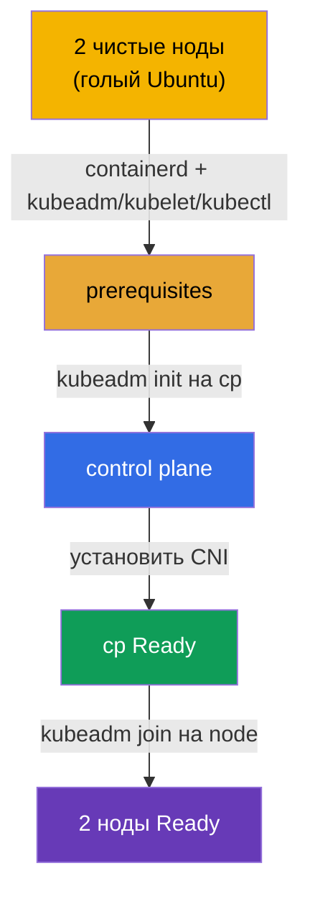

# Lab 116 — kubeadm: поднять кластер с нуля (init + join)

## Описание

Даны **две абсолютно чистые ноды** Ubuntu — без container runtime и без пакетов
Kubernetes. Полный сетап вы делаете **сами, с нуля**: ставите и настраиваете
**containerd**, prerequisites (swap, модули ядра, sysctl), пакеты
`kubeadm`/`kubelet`/`kubectl`, затем `kubeadm init` на control plane, устанавливаете
CNI и присоединяете worker через `kubeadm join`.

Все задания оформлены в экзаменационном стиле (как реальные вопросы CKA) с
автоматической проверкой командой `check_result`. Отличие от лабы 111 (там обновляют
готовый кластер) — здесь нет ни кластера, ни даже рантайма: вы собираете всё от голой
ОС.

## Цель

Закрепить материал глав курса:

- [Глава 35. Установка кластера с помощью kubeadm](../../course/35/ru.md) — prerequisites, container runtime, `kubeadm init`/`join`
- [Глава 30. Сетевая модель Kubernetes и CNI](../../course/30/ru.md) — установка CNI, без которого ноды не переходят в `Ready`

## Что мы делаем и зачем

В этой лабе мы проходим весь путь установки кластера от голой ОС до двух рабочих нод.
Каждый шаг — отдельный этап сетапа:

| Шаг | Что делаем | Зачем |
|-----|------------|-------|
| **Prerequisites + containerd** | swap off, модули ядра, sysctl, установка и настройка containerd (`SystemdCgroup=true`), пакеты `kubeadm`/`kubelet`/`kubectl` v1.35 на обеих нодах | без рантайма и prerequisites не пройдёт preflight `kubeadm` (глава 35) |
| **`kubeadm init`** | инициализация control plane на `cp`, настройка kubeconfig | поднимаем control plane и регистрируем первую ноду (глава 35) |
| **Установка CNI** | применяем сетевой плагин (например, Calico) | без CNI нода остаётся `NotReady` — сеть подов не работает (глава 30) |
| **`kubeadm join`** | присоединяем worker-ноду `node` к кластеру | получаем полноценный кластер из двух нод (глава 35) |

Итоговая картина того, что будет развёрнуто:



## Инфраструктура

Окружение разворачивается в AWS (`eu-central-1`) через Terragrunt и состоит из двух
чистых нод:

| Компонент | Описание                                                                 |
|-----------|--------------------------------------------------------------------------|
| `node-1`  | Чистая нода `cp` — будущий control plane; здесь запускается `check_result` |
| `node-2`  | Чистая нода `node` — будущий worker                                       |

Обе ноды — голый Ubuntu 22.04: **без container runtime и без пакетов Kubernetes**.
Подключение — по SSH к ноде `cp`; с неё доступна `node` командой `ssh node`.

## Развёртывание

```bash
TASK=116 make run_cka_task
```

После создания подключитесь по SSH к ноде `cp` (control plane) и выполняйте задания
оттуда; worker доступен командой `ssh node`. Автоматическая проверка `check_result`
запускается на `cp`.

Полезные команды на ноде `cp`:

```bash
time_left       # сколько осталось времени
check_result    # проверить решение
```

## Задания

Работа ведётся на ноде `cp` (control plane), worker доступен как `ssh node`.

> **Подготовка (на обеих нодах).** Перед `kubeadm init` установите и настройте всё
> сами: swap off, модули ядра (`overlay`, `br_netfilter`), sysctl, **containerd**
> (с `SystemdCgroup=true`), пакеты `kubeadm`/`kubelet`/`kubectl` v1.35. Без этого
> `kubeadm init`/`join` не пройдут preflight. Точные команды — в решении.

---
|        **1**        | **Инициализировать control plane**                          |
| :-----------------: | :----------------------------------------------------------- |
| Что делаем          | На ноде `cp` выполните `sudo kubeadm init --pod-network-cidr=192.168.0.0/16`. Настройте kubeconfig для работы `kubectl`: `mkdir -p $HOME/.kube`, скопируйте `/etc/kubernetes/admin.conf` в `$HOME/.kube/config` и смените владельца. Проверьте `kubectl get nodes` — нода `cp` появится в статусе `NotReady` (CNI ещё нет). |
| Критерии приёмки    | - файл `/etc/kubernetes/admin.conf` создан;<br/>- нода `cp` зарегистрирована в кластере. |
---
|        **2**        | **Установить CNI**                                          |
| :-----------------: | :----------------------------------------------------------- |
| Что делаем          | Установите сетевой плагин (например, Calico): `kubectl apply -f https://raw.githubusercontent.com/projectcalico/calico/v3.28.2/manifests/calico.yaml`. Дождитесь, пока Pods CNI поднимутся и нода `cp` перейдёт в `Ready` (`kubectl get nodes`). |
| Критерии приёмки    | - нода `cp` в статусе `Ready`. |
---
|        **3**        | **Присоединить worker**                                     |
| :-----------------: | :----------------------------------------------------------- |
| Что делаем          | На `cp` получите join-команду: `sudo kubeadm token create --print-join-command`. Зайдите на worker (`ssh node`) и выполните её под root (`sudo kubeadm join <cp-private-ip>:6443 --token ... --discovery-token-ca-cert-hash sha256:...`). Вернитесь на `cp` и убедитесь, что в кластере 2 ноды и обе `Ready` (`kubectl get nodes`). |
| Критерии приёмки    | - в кластере 2 ноды;<br/>- обе ноды в статусе `Ready`. |
---

## Проверка результата

На ноде `cp` запустите автоматическую проверку:

```bash
check_result
```

Скрипт прогонит тесты и покажет, сколько заданий выполнено.

## Решение

Эталонное решение: [node-1/files/solutions/1.MD](node-1/files/solutions/1.MD)

## Покрытие мок-экзаменов

Домен Cluster Architecture, Installation & Configuration (CKA) — установка кластера
kubeadm с нуля (init + CNI + join).

## Удаление кластера и ресурсов

```bash
TASK=116 make delete_cka_task
```
