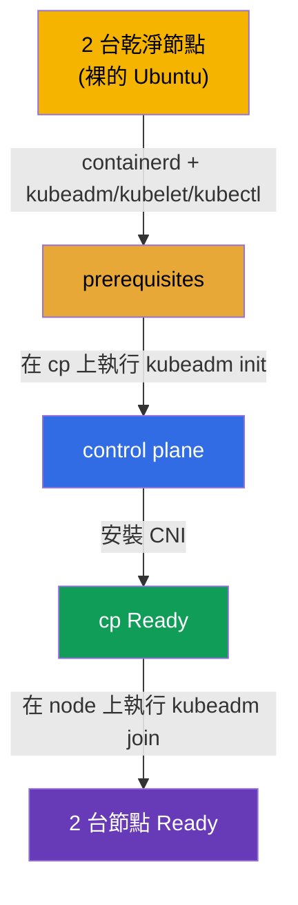

[Русская версия](README_RU.MD) · [Eng version](README.MD) · [Versión en español](README_ES.MD) · [Version française](README_FR.MD) · [Deutsche Version](README_DE.MD) · [ქართული ვერსია](README_GE.MD) · [日本語版](README_JP.MD)

# Lab 116 - kubeadm:從零建立叢集(init + join)

## 說明

你會拿到**兩台完全乾淨的** Ubuntu 節點 - 沒有 container runtime,也沒有
Kubernetes 套件。整個安裝過程都由**你自己從零開始**完成:安裝並設定
**containerd**、prerequisites(swap、核心模組、sysctl)、
`kubeadm`/`kubelet`/`kubectl` 套件,接著在 control plane 上執行 `kubeadm init`、安裝
CNI,並用 `kubeadm join` 把 worker 加入叢集。

所有任務都以考試風格撰寫(就像真正的 CKA 題目),並透過
`check_result` 指令自動驗證。與實驗 111(那裡是升級一個現成的叢集)的差別在於 -
這裡既沒有叢集,連 runtime 也沒有:你要從裸的作業系統
把一切組裝起來。

## 目標

鞏固以下課程章節的內容:

- [第 35 章。使用 kubeadm 安裝叢集](../../course/35/README.md) - prerequisites、container runtime、`kubeadm init`/`join`
- [第 30 章。Kubernetes 網路模型與 CNI](../../course/30/README.md) - 安裝 CNI,少了它節點永遠不會變成 `Ready`

## 我們要做什麼,以及為什麼

在這個實驗中,我們會走完從裸的作業系統到兩台可用節點的完整叢集安裝流程。
每一個步驟都是安裝過程中的一個獨立階段:

| 步驟 | 我們做什麼 | 為什麼 |
|-----|------------|-------|
| **Prerequisites + containerd** | swap off、核心模組、sysctl、安裝並設定 containerd(`SystemdCgroup=true`)、在兩台節點上安裝 `kubeadm`/`kubelet`/`kubectl` v1.35 套件 | 沒有 runtime 與 prerequisites,`kubeadm` 的 preflight 就無法通過(第 35 章) |
| **`kubeadm init`** | 在 `cp` 上初始化 control plane、設定 kubeconfig | 把 control plane 拉起來並註冊第一個節點(第 35 章) |
| **安裝 CNI** | 套用網路外掛(例如 Calico) | 沒有 CNI,節點會一直是 `NotReady` - Pod 網路無法運作(第 30 章) |
| **`kubeadm join`** | 把 worker 節點 `node` 加入叢集 | 得到一個完整的雙節點叢集(第 35 章) |

最終部署出來的整體樣貌:



## 基礎架構

環境透過 Terragrunt 部署在 AWS(`eu-central-1`),由兩台乾淨節點
組成:

| 元件 | 說明                                                                     |
|-----------|--------------------------------------------------------------------------|
| `node-1`  | 乾淨節點 `cp` - 未來的 control plane;`check_result` 在這裡執行             |
| `node-2`  | 乾淨節點 `node` - 未來的 worker                                           |

兩台節點都是裸的 Ubuntu 22.04:**沒有 container runtime,也沒有 Kubernetes 套件**。
連線方式 - 透過 SSH 連到節點 `cp`;從它可以用 `ssh node` 存取 `node`。

## 部署

```bash
TASK=116 make run_cka_task
```

在 `make run_cka_task` 之後的 Terragrunt output 中找到 `worker_pc_ssh` 這一行 - 這就是
連到節點 `cp`(control plane)的 SSH。旁邊的 `hosts_list` 列出了所有節點及其公有
IP。請透過 SSH 連到 `cp` 並在那裡工作;worker 在環境內部可用
`ssh node` 存取。

output 範例(關鍵幾行):

```
hosts_list = [
  "cp=3.76.118.135",
]
worker_pc_ssh = "   ssh ubuntu@3.76.118.135 password= mcwKw0ZlRu   "
```

這裡 `3.76.118.135` 是節點 `cp` 的公有 IP,`mcwKw0ZlRu` 是密碼。我們連線:

```bash
ssh ubuntu@3.76.118.135     # 輸入 output 中的密碼
```

從節點 `cp` 內部,可以用名稱存取 worker:

```bash
ssh node                    # 切換到 worker 節點
```

節點 `cp` 上的實用指令:

```bash
time_left       # 還剩多少時間
check_result    # 檢查解答
```

## 任務

工作在節點 `cp`(control plane)上進行,worker 可用 `ssh node` 存取。

> **準備工作(在兩台節點上)。** 在 `kubeadm init` 之前,請自己安裝並設定好
> 一切:swap off、核心模組(`overlay`、`br_netfilter`)、sysctl、**containerd**
> (帶 `SystemdCgroup=true`)、`kubeadm`/`kubelet`/`kubectl` v1.35 套件。少了這些,
> `kubeadm init`/`join` 無法通過 preflight。確切的指令 - 在解答中。

---
|        **1**        | **初始化 control plane**                                      |
| :-----------------: | :----------------------------------------------------------- |
| 要做什麼            | 在節點 `cp` 上執行 `sudo kubeadm init --pod-network-cidr=192.168.0.0/16`。設定 kubeconfig 讓 `kubectl` 能運作:`mkdir -p $HOME/.kube`,把 `/etc/kubernetes/admin.conf` 複製到 `$HOME/.kube/config` 並更換擁有者。檢查 `kubectl get nodes` - 節點 `cp` 會以 `NotReady` 狀態出現(還沒有 CNI)。 |
| 驗收標準            | - 檔案 `/etc/kubernetes/admin.conf` 已建立;<br/>- 節點 `cp` 已註冊到叢集中。 |
---
|        **2**        | **安裝 CNI**                                                 |
| :-----------------: | :----------------------------------------------------------- |
| 要做什麼            | 安裝網路外掛(例如 Calico):`kubectl apply -f https://raw.githubusercontent.com/projectcalico/calico/v3.28.2/manifests/calico.yaml`。等到 CNI 的 Pods 都起來,而且節點 `cp` 變成 `Ready`(`kubectl get nodes`)。 |
| 驗收標準            | - 節點 `cp` 處於 `Ready` 狀態。 |
---
|        **3**        | **加入 worker**                                              |
| :-----------------: | :----------------------------------------------------------- |
| 要做什麼            | 在 `cp` 上取得 join 指令:`sudo kubeadm token create --print-join-command`。登入 worker(`ssh node`)並以 root 執行它(`sudo kubeadm join <cp-private-ip>:6443 --token ... --discovery-token-ca-cert-hash sha256:...`)。回到 `cp`,確認叢集中有 2 台節點,而且兩台都是 `Ready`(`kubectl get nodes`)。 |
| 驗收標準            | - 叢集中有 2 台節點;<br/>- 兩台節點都處於 `Ready` 狀態。 |
---

## 檢查結果

在節點 `cp` 上執行自動檢查:

```bash
check_result
```

腳本會跑完測試,並顯示已完成多少任務。

## 解答

參考解答:[node-1/files/solutions/1_TW.MD](node-1/files/solutions/1_TW.MD)

## 模擬考涵蓋範圍

Cluster Architecture, Installation & Configuration 領域(CKA)- 從零安裝 kubeadm
叢集(init + CNI + join)。

## 刪除叢集與資源

```bash
TASK=116 make delete_cka_task
```
