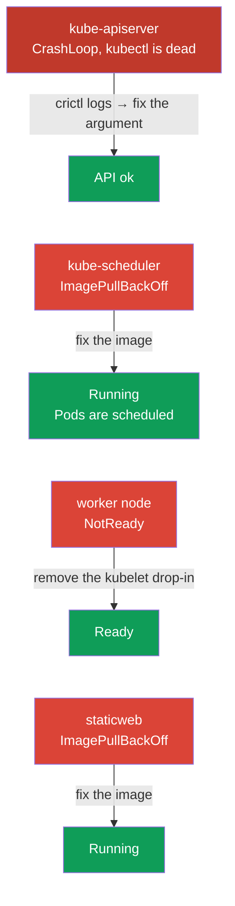

[Русская версия](README_RU.MD) · [Versión en español](README_ES.MD) · [Version française](README_FR.MD) · [Deutsche Version](README_DE.MD) · [ქართული ვერსია](README_GE.MD) · [繁體中文版](README_TW.MD) · [日本語版](README_JP.MD)

# Lab 117 — Troubleshooting: control plane and nodes

## Description

A hands-on lab for the Troubleshooting domain (30% of CKA) — the heaviest one on the exam.
Unlike lab 114 (application-level failures), here the **cluster infrastructure** is broken:
kube-apiserver, kube-scheduler, **kubelet** on the worker node and a static pod. The work is
done over SSH on the nodes: static pods live in `/etc/kubernetes/manifests/`, kubelet
failures are hunted down with `systemctl`/`journalctl`.

The first task is a **broken kube-apiserver**: `kubectl` does not work, and the only way to
figure things out is to use `crictl` at the container-runtime level (list containers, read
the logs of the crashed process). This is the most important skill for a real incident when
the control plane is "dead".

All tasks are written in exam style (like real CKA questions) with automatic validation via
the `check_result` command. **Note:** until the apiserver is fixed, `check_result` cannot
validate any task — fix it first.

## Goal

Reinforce the material from the course chapters:

- [Chapter 15. Static Pods, PriorityClass, multiple schedulers](../../course/15/README.md) — static pods in `/etc/kubernetes/manifests/`, control plane components as static pods
- [Chapter 45. Debugging the control plane and worker nodes](../../course/45/README.md) — kubelet diagnostics via `systemctl`/`journalctl`, container debugging via `crictl`

## What We Fix and Why

This lab contains four independent infrastructure-level failures. Each one trains its own
diagnostic skill:

| Failure | Symptom | Where to look | What it teaches |
|---------|---------|---------------|-----------------|
| **kube-apiserver** (broken argument) | `connection refused` on :6443, kubectl does not work | `crictl ps -a` + `crictl logs` on the control plane | debugging at the container-runtime level when the API is unavailable (chapter 45) |
| **kube-scheduler** (broken image) | new Pods stuck in Pending | `/etc/kubernetes/manifests/kube-scheduler.yaml` | control plane components as static pods (chapter 15) |
| **kubelet on the worker** (broken drop-in) | node NotReady | `journalctl -u kubelet` on the node | node and kubelet systemd unit diagnostics (chapter 45) |
| **broken static pod** (nonexistent image) | mirror Pod in ImagePullBackOff | `/etc/kubernetes/manifests/staticweb.yaml` | how a static pod and its mirror work (chapter 15) |

The final picture of what will be deployed:



## Infrastructure

The environment is deployed in AWS (`eu-central-1`) via Terragrunt and consists of:

| Component  | Description                                                          |
|------------|----------------------------------------------------------------------|
| `vpc`      | VPC `10.10.0.0/16` with public subnets                                |
| `ssh-keys` | SSH keys for node access                                              |
| `k8s-1`    | Kubernetes `1.35.2` (kubeadm), Calico, metrics-server, **master + 1 worker**; on startup it injects cluster-level failures |
| `worker`   | Work machine with `kubectl` and `check_result`; SSH access to the cluster nodes |

Instances: `t3.medium`, Ubuntu `22.04`. The cluster has two nodes — the master
(control-plane) and one worker.

## Deployment

```bash
TASK=117 make run_cka_task
```

Once it is created, connect to the work machine (worker) over SSH and do the tasks from
there. `kubectl` is pointed at the `cluster1-admin@cluster1` context, but it **will not
work** until kube-apiserver is fixed. Part of the work requires SSH to the cluster nodes —
from the work machine you can reach `ssh k8s1_controlPlane_1` (control plane) and
`ssh k8s1_node_node_1` (worker).

> **When to start.** Wait until the file `~/.kube/config` shows up on the work machine
> (usually ~2 min after creation). Its presence means the infrastructure is ready and the
> failures have been injected. At that point `kubectl get nodes` will already be
> returning an error (`connection refused`) — that is expected, this is exactly what you
> are going to fix.

Handy commands on the work machine:

```bash
time_left       # how much time is left
check_result    # check your solution (works only after the apiserver is fixed)
```

## Tasks

> **Order matters.** Until the apiserver is fixed, `kubectl` does not work — start with
> task 1.

---
|        **1**        | **Fix kube-apiserver (debugging via crictl)**                |
| :-----------------: | :----------------------------------------------------------- |
| What to do          | The API server does not respond (`connection refused`), `kubectl` does not work. Over SSH on the control plane (`ssh k8s1_controlPlane_1`) use `crictl` for diagnostics: `sudo crictl ps -a` (find the crashed kube-apiserver container), `sudo crictl logs <container-id>` (the logs show a startup error caused by the unknown flag `--invalid-nonexistent-flag`). Open the manifest `/etc/kubernetes/manifests/kube-apiserver.yaml` and delete the line with the broken flag. kubelet will recreate the static pod. Wait until `kubectl get --raw='/healthz'` returns `ok`. |
| Acceptance criteria | - kube-apiserver responds: `kubectl get --raw='/healthz'` → `ok`. |
---
|        **2**        | **Fix kube-scheduler**                                       |
| :-----------------: | :----------------------------------------------------------- |
| What to do          | New Pods are not scheduled: the canary Pod `sched-check` (namespace `default`) hangs in Pending, while `kube-scheduler` in `kube-system` is in ImagePullBackOff because of a broken image tag in the static pod. Over SSH on the control plane fix `image:` in `/etc/kubernetes/manifests/kube-scheduler.yaml` to the cluster version (`registry.k8s.io/kube-scheduler:v1.35.2`). kubelet will recreate the static pod on its own. |
| Acceptance criteria | - Pod `kube-scheduler` in `kube-system` is Running and Ready;<br/>- Pod `sched-check` (namespace `default`) has been scheduled and moved to Running. |
---
|        **3**        | **Bring the worker node back to Ready**                      |
| :-----------------: | :----------------------------------------------------------- |
| What to do          | The worker node is NotReady, kubelet does not report status. Over SSH on the node (`ssh k8s1_node_node_1`) use `systemctl status kubelet` and `journalctl -u kubelet` to find the cause — a broken drop-in `/etc/systemd/system/kubelet.service.d/99-broken.conf` replaces the configuration path with a nonexistent file. Delete the drop-in, run `systemctl daemon-reload` and restart kubelet. |
| Acceptance criteria | - All cluster nodes (≥2) are in `Ready` status. |
---
|        **4**        | **Fix the static pod on the control plane**                  |
| :-----------------: | :----------------------------------------------------------- |
| What to do          | The mirror Pod `staticweb-<cp>` (namespace `default`) is in ImagePullBackOff because of the nonexistent image `viktoruj/ping_pong:doesnotexist999`. Over SSH on the control plane fix `image:` in the static pod manifest `/etc/kubernetes/manifests/staticweb.yaml` to a working image (`viktoruj/ping_pong:latest`). kubelet will recreate the static pod. |
| Acceptance criteria | - Mirror Pod `staticweb-<cp>` (namespace `default`) is in Running status. |
---

## Checking the Result

On the work machine run the automatic validation:

```bash
check_result
```

The script runs the tests and shows how many tasks are complete. **Important:**
`check_result` uses `kubectl` — until the apiserver is fixed, all tests will be Failed.

## Solution

Reference solution: [worker/files/solutions/1.MD](worker/files/solutions/1.MD)

## Mock Exam Coverage

The lab covers the control plane and node level troubleshooting section from CKA mock 01/02:
components as static pods, debugging via crictl when the API is unavailable, NotReady nodes
and kubelet diagnostics.

## Deleting the Cluster and Resources

```bash
TASK=117 make delete_cka_task
```
