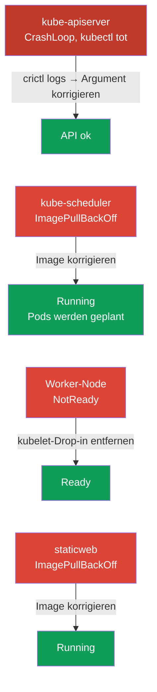

[Русская версия](README_RU.MD) · [Eng version](README.MD) · [Versión en español](README_ES.MD) · [Version française](README_FR.MD) · [ქართული ვერსია](README_GE.MD) · [繁體中文版](README_TW.MD) · [日本語版](README_JP.MD)

# Lab 117 — Troubleshooting: Control Plane und Nodes

## Beschreibung

Praxisübung zur Domäne Troubleshooting (30 % des CKA) — der gewichtigsten in der Prüfung.
Anders als in Lab 114 (Anwendungsfehler) geht hier die **Cluster-Infrastruktur** kaputt:
kube-apiserver, kube-scheduler, **kubelet** auf der Worker-Node und ein Static Pod.
Gearbeitet wird per SSH auf den Nodes: Static Pods liegen in
`/etc/kubernetes/manifests/`, kubelet-Störungen werden mit `systemctl`/`journalctl` gesucht.

Die erste Aufgabe ist ein **kaputter kube-apiserver**: `kubectl` funktioniert nicht, und die
einzige Möglichkeit zur Analyse ist `crictl` auf Ebene der Container-Runtime (Container
ansehen, die Logs des abgestürzten Prozesses lesen). Das ist die wichtigste Fähigkeit für
einen echten Vorfall, wenn das Control Plane „tot“ ist.

Alle Aufgaben sind im Prüfungsstil formuliert (wie echte CKA-Fragen) mit automatischer
Prüfung über den Befehl `check_result`. **Achtung:** Solange der apiserver nicht repariert
ist, kann `check_result` keine einzige Aufgabe prüfen — reparieren Sie ihn zuerst.

## Ziel

Den Stoff der Kurskapitel festigen:

- [Kapitel 15. Static Pods, PriorityClass, mehrere Scheduler](../../course/15/de.md) — Static Pods in `/etc/kubernetes/manifests/`, Control-Plane-Komponenten als Static Pods
- [Kapitel 45. Debugging von Control Plane und Worker-Nodes](../../course/45/de.md) — kubelet-Diagnose über `systemctl`/`journalctl`, Container-Debugging über `crictl`

## Was wir reparieren und warum

In diesem Lab gibt es vier unabhängige Störungen auf Infrastrukturebene. Jede trainiert eine
eigene Diagnosefähigkeit:

| Störung | Symptom | Wo suchen | Was sie lehrt |
|---------|---------|-----------|---------------|
| **kube-apiserver** (kaputtes Argument) | `connection refused` auf :6443, kubectl funktioniert nicht | `crictl ps -a` + `crictl logs` auf dem Control Plane | Debugging auf Ebene der Container-Runtime, wenn die API nicht verfügbar ist (Kapitel 45) |
| **kube-scheduler** (kaputtes Image) | neue Pods in Pending | `/etc/kubernetes/manifests/kube-scheduler.yaml` | Control-Plane-Komponenten als Static Pods (Kapitel 15) |
| **kubelet auf dem Worker** (kaputtes Drop-in) | Node NotReady | `journalctl -u kubelet` auf der Node | Diagnose der Node und der systemd-Unit von kubelet (Kapitel 45) |
| **kaputter Static Pod** (nicht existierendes Image) | Mirror-Pod in ImagePullBackOff | `/etc/kubernetes/manifests/staticweb.yaml` | wie ein Static Pod und sein Mirror funktionieren (Kapitel 15) |

Das Gesamtbild dessen, was ausgerollt wird:



## Infrastruktur

Die Umgebung wird in AWS (`eu-central-1`) über Terragrunt ausgerollt und besteht aus:

| Komponente | Beschreibung                                                         |
|------------|----------------------------------------------------------------------|
| `vpc`      | VPC `10.10.0.0/16` mit öffentlichen Subnetzen                          |
| `ssh-keys` | SSH-Schlüssel für den Zugriff auf die Nodes                            |
| `k8s-1`    | Kubernetes `1.35.2` (kubeadm), Calico, metrics-server, **Master + 1 Worker**; beim Start werden Störungen auf Cluster-Ebene eingebaut |
| `worker`   | Arbeitsmaschine mit `kubectl` und `check_result`; SSH-Zugriff auf die Cluster-Nodes |

Instanzen: `t4g.medium`, Ubuntu `22.04`. Der Cluster hat zwei Nodes — Master
(Control-Plane) und einen Worker.

## Deployment

```bash
TASK=117 make run_cka_task
```

Verbinden Sie sich nach der Erstellung per SSH mit der Arbeitsmaschine (worker) und lösen
Sie die Aufgaben von dort. `kubectl` ist auf den Kontext `cluster1-admin@cluster1`
eingestellt, **funktioniert aber nicht**, solange kube-apiserver nicht repariert ist. Ein
Teil der Arbeit erfordert SSH auf die Cluster-Nodes — von der Arbeitsmaschine sind
`ssh k8s1_controlPlane_1` (Control Plane) und `ssh k8s1_node_node_1` (Worker) erreichbar.

> **Wann anfangen.** Warten Sie, bis auf der Arbeitsmaschine die Datei `~/.kube/config`
> erscheint (üblicherweise ~2 min nach der Erstellung). Ihr Vorhandensein bedeutet, dass die
> Infrastruktur fertig ist und die Störungen eingebaut wurden. Dabei wird
> `kubectl get nodes` bereits einen Fehler (`connection refused`) zurückgeben — das ist zu
> erwarten, genau das werden Sie reparieren.

Nützliche Befehle auf der Arbeitsmaschine:

```bash
time_left       # wie viel Zeit übrig ist
check_result    # Lösung prüfen (funktioniert erst nach der Reparatur des apiserver)
```

## Aufgaben

> **Die Reihenfolge ist wichtig.** Solange der apiserver nicht repariert ist, funktioniert
> `kubectl` nicht — beginnen Sie mit Aufgabe 1.

---
|        **1**        | **kube-apiserver reparieren (Debugging über crictl)**         |
| :-----------------: | :----------------------------------------------------------- |
| Was wir tun         | Der API-Server antwortet nicht (`connection refused`), `kubectl` funktioniert nicht. Nutzen Sie per SSH auf dem Control Plane (`ssh k8s1_controlPlane_1`) `crictl` zur Diagnose: `sudo crictl ps -a` (finden Sie den abgestürzten kube-apiserver-Container), `sudo crictl logs <container-id>` (in den Logs steht ein Startfehler wegen des unbekannten Flags `--invalid-nonexistent-flag`). Öffnen Sie das Manifest `/etc/kubernetes/manifests/kube-apiserver.yaml` und löschen Sie die Zeile mit dem kaputten Flag. kubelet erstellt den Static Pod neu. Warten Sie, bis `kubectl get --raw='/healthz'` `ok` zurückgibt. |
| Akzeptanzkriterien  | - kube-apiserver antwortet: `kubectl get --raw='/healthz'` → `ok`. |
---
|        **2**        | **kube-scheduler reparieren**                                |
| :-----------------: | :----------------------------------------------------------- |
| Was wir tun         | Neue Pods werden nicht geplant: der Canary-Pod `sched-check` (Namespace `default`) hängt in Pending, und `kube-scheduler` in `kube-system` ist in ImagePullBackOff wegen eines kaputten Image-Tags im Static Pod. Korrigieren Sie per SSH auf dem Control Plane `image:` in `/etc/kubernetes/manifests/kube-scheduler.yaml` auf die Cluster-Version (`registry.k8s.io/kube-scheduler:v1.35.2`). kubelet erstellt den Static Pod selbst neu. |
| Akzeptanzkriterien  | - Pod `kube-scheduler` in `kube-system` ist Running und Ready;<br/>- Pod `sched-check` (Namespace `default`) wurde geplant und ist in Running übergegangen. |
---
|        **3**        | **Worker-Node zurück auf Ready bringen**                     |
| :-----------------: | :----------------------------------------------------------- |
| Was wir tun         | Die Worker-Node ist NotReady, kubelet meldet keinen Status. Finden Sie per SSH auf der Node (`ssh k8s1_node_node_1`) mit `systemctl status kubelet` und `journalctl -u kubelet` die Ursache — ein kaputtes Drop-in `/etc/systemd/system/kubelet.service.d/99-broken.conf` ersetzt den Pfad zur Konfiguration durch eine nicht existierende Datei. Löschen Sie das Drop-in, führen Sie `systemctl daemon-reload` aus und starten Sie kubelet neu. |
| Akzeptanzkriterien  | - alle Cluster-Nodes (≥2) sind im Status `Ready`. |
---
|        **4**        | **Static Pod auf dem Control Plane reparieren**              |
| :-----------------: | :----------------------------------------------------------- |
| Was wir tun         | Der Mirror-Pod `staticweb-<cp>` (Namespace `default`) ist in ImagePullBackOff wegen des nicht existierenden Images `viktoruj/ping_pong:doesnotexist999`. Korrigieren Sie per SSH auf dem Control Plane `image:` im Static-Pod-Manifest `/etc/kubernetes/manifests/staticweb.yaml` auf ein funktionierendes Image (`viktoruj/ping_pong:latest`). kubelet erstellt den Static Pod neu. |
| Akzeptanzkriterien  | - Mirror-Pod `staticweb-<cp>` (Namespace `default`) ist im Status Running. |
---

## Prüfung des Ergebnisses

Starten Sie auf der Arbeitsmaschine die automatische Prüfung:

```bash
check_result
```

Das Skript führt die Tests aus und zeigt, wie viele Aufgaben erledigt sind. **Wichtig:**
`check_result` verwendet `kubectl` — solange der apiserver nicht repariert ist, sind alle
Tests Failed.

## Lösung

Referenzlösung: [worker/files/solutions/1_DE.MD](worker/files/solutions/1_DE.MD)

## Abdeckung der Mock-Prüfungen

Das Lab deckt den Troubleshooting-Bereich auf Ebene von Control Plane und Nodes aus CKA
Mock 01/02 ab: Komponenten als Static Pods, Debugging über crictl bei nicht verfügbarer API,
NotReady-Nodes und kubelet-Diagnose.

## Löschen des Clusters und der Ressourcen

```bash
TASK=117 make delete_cka_task
```
