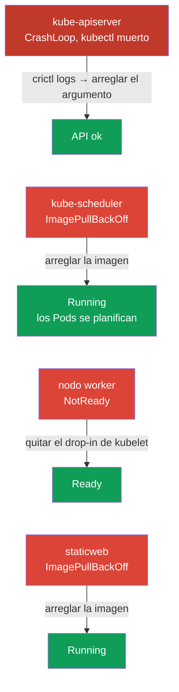

[Русская версия](README_RU.MD) · [Eng version](README.MD) · [Version française](README_FR.MD) · [Deutsche Version](README_DE.MD) · [ქართული ვერსია](README_GE.MD) · [繁體中文版](README_TW.MD) · [日本語版](README_JP.MD)

# Lab 117 — Troubleshooting: control plane y nodos

## Descripción

Práctica del dominio Troubleshooting (30% del CKA), el de mayor peso en el examen.
A diferencia del laboratorio 114 (fallos de aplicación), aquí se rompe la
**infraestructura del clúster**: kube-apiserver, kube-scheduler, **kubelet** en el nodo
worker y un static pod. El trabajo se hace por SSH en los nodos: los static pods viven en
`/etc/kubernetes/manifests/` y los fallos de kubelet se buscan con `systemctl`/`journalctl`.

La primera tarea es un **kube-apiserver roto**: `kubectl` no funciona y la única forma de
averiguar qué pasa es usar `crictl` al nivel del runtime de contenedores (ver los
contenedores, leer los logs del proceso caído). Esta es la habilidad más importante para un
incidente real, cuando el control plane está «muerto».

Todas las tareas están redactadas en estilo de examen (como las preguntas reales de CKA) con
verificación automática mediante el comando `check_result`. **Atención:** mientras el
apiserver no esté reparado, `check_result` no podrá verificar ninguna tarea; arréglalo
primero.

## Objetivo

Consolidar el material de los capítulos del curso:

- [Capítulo 15. Static Pods, PriorityClass, varios planificadores](../../course/15/es.md) — static pods en `/etc/kubernetes/manifests/`, los componentes del control plane como static pods
- [Capítulo 45. Depuración del control plane y de los nodos worker](../../course/45/es.md) — diagnóstico de kubelet con `systemctl`/`journalctl`, depuración de contenedores con `crictl`

## Qué arreglamos y para qué

En este laboratorio hay cuatro fallos independientes a nivel de infraestructura. Cada uno
entrena su propia habilidad de diagnóstico:

| Fallo | Síntoma | Dónde buscar | Qué enseña |
|-------|---------|--------------|------------|
| **kube-apiserver** (argumento roto) | `connection refused` en :6443, kubectl no funciona | `crictl ps -a` + `crictl logs` en el control plane | depuración al nivel del runtime de contenedores cuando la API no está disponible (capítulo 45) |
| **kube-scheduler** (imagen rota) | los Pods nuevos en Pending | `/etc/kubernetes/manifests/kube-scheduler.yaml` | los componentes del control plane como static pods (capítulo 15) |
| **kubelet en el worker** (drop-in roto) | nodo NotReady | `journalctl -u kubelet` en el nodo | diagnóstico del nodo y de la unidad systemd de kubelet (capítulo 45) |
| **static pod roto** (imagen inexistente) | mirror Pod en ImagePullBackOff | `/etc/kubernetes/manifests/staticweb.yaml` | cómo funciona un static pod y su mirror (capítulo 15) |

Panorama final de lo que quedará desplegado:



## Infraestructura

El entorno se despliega en AWS (`eu-central-1`) mediante Terragrunt y consta de:

| Componente | Descripción                                                          |
|------------|----------------------------------------------------------------------|
| `vpc`      | VPC `10.10.0.0/16` con subredes públicas                              |
| `ssh-keys` | Claves SSH para acceder a los nodos                                   |
| `k8s-1`    | Kubernetes `1.35.2` (kubeadm), Calico, metrics-server, **master + 1 worker**; al arrancar introduce los fallos a nivel de clúster |
| `worker`   | Máquina de trabajo con `kubectl` y `check_result`; acceso SSH a los nodos del clúster |

Instancias: `t3.medium`, Ubuntu `22.04`. El clúster tiene dos nodos: el master
(control-plane) y un worker.

## Despliegue

```bash
TASK=117 make run_cka_task
```

Tras la creación, conéctate por SSH a la máquina de trabajo (worker) y realiza las tareas
desde allí. `kubectl` está configurado en el contexto `cluster1-admin@cluster1`, pero **no
funcionará** hasta que kube-apiserver esté reparado. Parte del trabajo requiere SSH a los
nodos del clúster: desde la máquina de trabajo están disponibles
`ssh k8s1_controlPlane_1` (control plane) y `ssh k8s1_node_node_1` (worker).

> **Cuándo empezar.** Espera a que en la máquina de trabajo aparezca el fichero
> `~/.kube/config` (normalmente ~2 min después de la creación). Su presencia significa que
> la infraestructura está lista y que los fallos ya se han introducido. En ese momento
> `kubectl get nodes` ya devolverá un error (`connection refused`): es lo esperado, eso es
> precisamente lo que vas a arreglar.

Comandos útiles en la máquina de trabajo:

```bash
time_left       # cuánto tiempo queda
check_result    # verificar la solución (funciona solo tras reparar el apiserver)
```

## Tareas

> **El orden importa.** Mientras el apiserver no esté reparado, `kubectl` no funciona:
> empieza por la tarea 1.

---
|        **1**        | **Reparar kube-apiserver (depuración con crictl)**            |
| :-----------------: | :----------------------------------------------------------- |
| Qué hacemos         | El servidor de la API no responde (`connection refused`), `kubectl` no funciona. Por SSH en el control plane (`ssh k8s1_controlPlane_1`) usa `crictl` para el diagnóstico: `sudo crictl ps -a` (localiza el contenedor kube-apiserver caído), `sudo crictl logs <container-id>` (en los logs verás un error de arranque por el flag desconocido `--invalid-nonexistent-flag`). Abre el manifiesto `/etc/kubernetes/manifests/kube-apiserver.yaml` y elimina la línea con el flag roto. kubelet recreará el static pod. Espera hasta que `kubectl get --raw='/healthz'` devuelva `ok`. |
| Criterios de aceptación | - kube-apiserver responde: `kubectl get --raw='/healthz'` → `ok`. |
---
|        **2**        | **Reparar kube-scheduler**                                   |
| :-----------------: | :----------------------------------------------------------- |
| Qué hacemos         | Los Pods nuevos no se planifican: el Pod canario `sched-check` (namespace `default`) se queda en Pending y `kube-scheduler` en `kube-system` está en ImagePullBackOff por un tag de imagen roto en el static pod. Por SSH en el control plane corrige `image:` en `/etc/kubernetes/manifests/kube-scheduler.yaml` a la versión del clúster (`registry.k8s.io/kube-scheduler:v1.35.2`). kubelet recreará el static pod por sí mismo. |
| Criterios de aceptación | - el Pod `kube-scheduler` en `kube-system` está en estado Running y Ready;<br/>- el Pod `sched-check` (namespace `default`) se ha planificado y ha pasado a Running. |
---
|        **3**        | **Devolver el nodo worker a Ready**                          |
| :-----------------: | :----------------------------------------------------------- |
| Qué hacemos         | El nodo worker está en NotReady, kubelet no reporta su estado. Por SSH en el nodo (`ssh k8s1_node_node_1`), con `systemctl status kubelet` y `journalctl -u kubelet`, encuentra la causa: un drop-in roto `/etc/systemd/system/kubelet.service.d/99-broken.conf` sustituye la ruta de la configuración por un fichero inexistente. Elimina el drop-in, ejecuta `systemctl daemon-reload` y reinicia kubelet. |
| Criterios de aceptación | - todos los nodos del clúster (≥2) están en estado `Ready`. |
---
|        **4**        | **Reparar el static pod en el control plane**                |
| :-----------------: | :----------------------------------------------------------- |
| Qué hacemos         | El mirror Pod `staticweb-<cp>` (namespace `default`) está en ImagePullBackOff por la imagen inexistente `viktoruj/ping_pong:doesnotexist999`. Por SSH en el control plane corrige `image:` en el manifiesto del static pod `/etc/kubernetes/manifests/staticweb.yaml` a una imagen que funcione (`viktoruj/ping_pong:latest`). kubelet recreará el static pod. |
| Criterios de aceptación | - el mirror Pod `staticweb-<cp>` (namespace `default`) está en estado Running. |
---

## Verificación del resultado

En la máquina de trabajo lanza la verificación automática:

```bash
check_result
```

El script ejecuta las pruebas y muestra cuántas tareas están completas. **Importante:**
`check_result` usa `kubectl`; mientras el apiserver no esté reparado, todas las pruebas
fallarán (Failed).

## Solución

Solución de referencia: [worker/files/solutions/1_ES.MD](worker/files/solutions/1_ES.MD)

## Cobertura de exámenes simulados

El laboratorio cubre la sección de troubleshooting a nivel de control plane y nodos de los
simulados CKA 01/02: componentes como static pods, depuración con crictl cuando la API no
está disponible, nodos NotReady y diagnóstico de kubelet.

## Eliminación del clúster y de los recursos

```bash
TASK=117 make delete_cka_task
```
