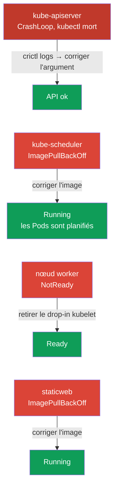

[Русская версия](README_RU.MD) · [Eng version](README.MD) · [Versión en español](README_ES.MD) · [Deutsche Version](README_DE.MD) · [ქართული ვერსია](README_GE.MD) · [繁體中文版](README_TW.MD) · [日本語版](README_JP.MD)

# Lab 117 — Troubleshooting : control plane et nœuds

## Description

Travail pratique du domaine Troubleshooting (30 % du CKA), le plus lourd de l'examen.
Contrairement au lab 114 (pannes applicatives), ici c'est l'**infrastructure du cluster**
qui casse : kube-apiserver, kube-scheduler, **kubelet** sur le nœud worker et un static pod.
Le travail se fait en SSH sur les nœuds : les static pods vivent dans
`/etc/kubernetes/manifests/`, les défaillances de kubelet se cherchent avec
`systemctl`/`journalctl`.

La première tâche est un **kube-apiserver cassé** : `kubectl` ne fonctionne pas et le seul
moyen de comprendre est d'utiliser `crictl` au niveau du runtime de conteneurs (lister les
conteneurs, lire les logs du processus tombé). C'est la compétence la plus importante lors
d'un incident réel, quand le control plane est « mort ».

Toutes les tâches sont rédigées dans le style de l'examen (comme les vraies questions CKA)
avec une vérification automatique via la commande `check_result`. **Attention :** tant que
l'apiserver n'est pas réparé, `check_result` ne pourra vérifier aucune tâche — réparez-le en
premier.

## Objectif

Consolider le contenu des chapitres du cours :

- [Chapitre 15. Static Pods, PriorityClass, plusieurs planificateurs](../../course/15/fr.md) — static pods dans `/etc/kubernetes/manifests/`, composants du control plane en tant que static pods
- [Chapitre 45. Débogage du control plane et des nœuds worker](../../course/45/fr.md) — diagnostic de kubelet via `systemctl`/`journalctl`, débogage des conteneurs via `crictl`

## Ce que nous réparons et pourquoi

Ce lab contient quatre pannes indépendantes au niveau de l'infrastructure. Chacune travaille
sa propre compétence de diagnostic :

| Panne | Symptôme | Où chercher | Ce qu'elle apprend |
|-------|----------|-------------|--------------------|
| **kube-apiserver** (argument cassé) | `connection refused` sur :6443, kubectl ne fonctionne pas | `crictl ps -a` + `crictl logs` sur le control plane | débogage au niveau du runtime de conteneurs quand l'API est indisponible (chapitre 45) |
| **kube-scheduler** (image cassée) | nouveaux Pods en Pending | `/etc/kubernetes/manifests/kube-scheduler.yaml` | composants du control plane en tant que static pods (chapitre 15) |
| **kubelet sur le worker** (drop-in cassé) | nœud NotReady | `journalctl -u kubelet` sur le nœud | diagnostic du nœud et de l'unité systemd kubelet (chapitre 45) |
| **static pod cassé** (image inexistante) | mirror Pod en ImagePullBackOff | `/etc/kubernetes/manifests/staticweb.yaml` | comment fonctionne un static pod et son mirror (chapitre 15) |

Vue d'ensemble de ce qui sera déployé :



## Infrastructure

L'environnement est déployé dans AWS (`eu-central-1`) via Terragrunt et se compose de :

| Composant  | Description                                                          |
|------------|----------------------------------------------------------------------|
| `vpc`      | VPC `10.10.0.0/16` avec des sous-réseaux publics                       |
| `ssh-keys` | Clés SSH pour l'accès aux nœuds                                       |
| `k8s-1`    | Kubernetes `1.35.2` (kubeadm), Calico, metrics-server, **master + 1 worker** ; au démarrage, il introduit les pannes au niveau du cluster |
| `worker`   | Machine de travail avec `kubectl` et `check_result` ; accès SSH aux nœuds du cluster |

Instances : `t4g.medium`, Ubuntu `22.04`. Le cluster a deux nœuds — le master
(control-plane) et un worker.

## Déploiement

```bash
TASK=117 make run_cka_task
```

Après la création, connectez-vous en SSH à la machine de travail (worker) et réalisez les
tâches depuis celle-ci. `kubectl` est configuré sur le contexte `cluster1-admin@cluster1`,
mais il **ne fonctionnera pas** tant que kube-apiserver n'est pas réparé. Une partie du
travail nécessite un accès SSH aux nœuds du cluster : depuis la machine de travail sont
disponibles `ssh k8s1_controlPlane_1` (control plane) et `ssh k8s1_node_node_1` (worker).

> **Quand commencer.** Attendez que le fichier `~/.kube/config` apparaisse sur la machine
> de travail (généralement ~2 min après la création). Sa présence signifie que
> l'infrastructure est prête et que les pannes ont été introduites. À ce moment-là,
> `kubectl get nodes` renverra déjà une erreur (`connection refused`) — c'est attendu,
> c'est précisément ce que vous allez réparer.

Commandes utiles sur la machine de travail :

```bash
time_left       # combien de temps il reste
check_result    # vérifier la solution (fonctionne uniquement après la réparation de l'apiserver)
```

## Tâches

> **L'ordre compte.** Tant que l'apiserver n'est pas réparé, `kubectl` ne fonctionne pas —
> commencez par la tâche 1.

---
|        **1**        | **Réparer kube-apiserver (débogage via crictl)**              |
| :-----------------: | :----------------------------------------------------------- |
| Ce que nous faisons | Le serveur d'API ne répond pas (`connection refused`), `kubectl` ne fonctionne pas. En SSH sur le control plane (`ssh k8s1_controlPlane_1`), utilisez `crictl` pour le diagnostic : `sudo crictl ps -a` (trouvez le conteneur kube-apiserver tombé), `sudo crictl logs <container-id>` (les logs montrent une erreur de démarrage due au flag inconnu `--invalid-nonexistent-flag`). Ouvrez le manifeste `/etc/kubernetes/manifests/kube-apiserver.yaml` et supprimez la ligne contenant le flag cassé. kubelet recréera le static pod. Attendez que `kubectl get --raw='/healthz'` renvoie `ok`. |
| Critères d'acceptation | - kube-apiserver répond : `kubectl get --raw='/healthz'` → `ok`. |
---
|        **2**        | **Réparer kube-scheduler**                                   |
| :-----------------: | :----------------------------------------------------------- |
| Ce que nous faisons | Les nouveaux Pods ne sont pas planifiés : le Pod canari `sched-check` (namespace `default`) reste en Pending, tandis que `kube-scheduler` dans `kube-system` est en ImagePullBackOff à cause d'un tag d'image cassé dans le static pod. En SSH sur le control plane, corrigez `image:` dans `/etc/kubernetes/manifests/kube-scheduler.yaml` vers la version du cluster (`registry.k8s.io/kube-scheduler:v1.35.2`). kubelet recréera lui-même le static pod. |
| Critères d'acceptation | - le Pod `kube-scheduler` dans `kube-system` est Running et Ready ;<br/>- le Pod `sched-check` (namespace `default`) est planifié et passé en Running. |
---
|        **3**        | **Remettre le nœud worker en Ready**                         |
| :-----------------: | :----------------------------------------------------------- |
| Ce que nous faisons | Le nœud worker est en NotReady, kubelet ne remonte pas son statut. En SSH sur le nœud (`ssh k8s1_node_node_1`), trouvez la cause avec `systemctl status kubelet` et `journalctl -u kubelet` — un drop-in cassé `/etc/systemd/system/kubelet.service.d/99-broken.conf` remplace le chemin de la configuration par un fichier inexistant. Supprimez le drop-in, exécutez `systemctl daemon-reload` et redémarrez kubelet. |
| Critères d'acceptation | - tous les nœuds du cluster (≥2) sont au statut `Ready`. |
---
|        **4**        | **Réparer le static pod sur le control plane**               |
| :-----------------: | :----------------------------------------------------------- |
| Ce que nous faisons | Le mirror Pod `staticweb-<cp>` (namespace `default`) est en ImagePullBackOff à cause de l'image inexistante `viktoruj/ping_pong:doesnotexist999`. En SSH sur le control plane, corrigez `image:` dans le manifeste du static pod `/etc/kubernetes/manifests/staticweb.yaml` vers une image fonctionnelle (`viktoruj/ping_pong:latest`). kubelet recréera le static pod. |
| Critères d'acceptation | - le mirror Pod `staticweb-<cp>` (namespace `default`) est au statut Running. |
---

## Vérification du résultat

Sur la machine de travail, lancez la vérification automatique :

```bash
check_result
```

Le script exécute les tests et montre combien de tâches sont terminées. **Important :**
`check_result` utilise `kubectl` — tant que l'apiserver n'est pas réparé, tous les tests
seront en Failed.

## Solution

Solution de référence : [worker/files/solutions/1_FR.MD](worker/files/solutions/1_FR.MD)

## Couverture des examens blancs

Le lab couvre la partie troubleshooting au niveau du control plane et des nœuds des examens
blancs CKA 01/02 : composants en tant que static pods, débogage via crictl quand l'API est
indisponible, nœuds NotReady et diagnostic de kubelet.

## Suppression du cluster et des ressources

```bash
TASK=117 make delete_cka_task
```
