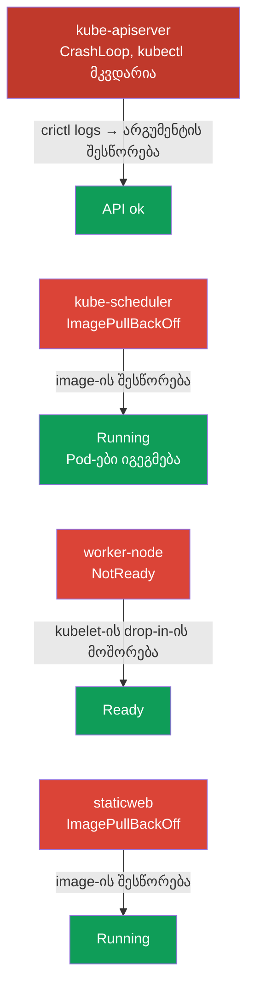

[Русская версия](README_RU.MD) · [Eng version](README.MD) · [Versión en español](README_ES.MD) · [Version française](README_FR.MD) · [Deutsche Version](README_DE.MD) · [繁體中文版](README_TW.MD) · [日本語版](README_JP.MD)

# Lab 117 — Troubleshooting: control plane და node-ები

## აღწერა

პრაქტიკული სამუშაო Troubleshooting-ის დომენზე (CKA-ის 30%) — გამოცდაზე ყველაზე
წონიანზე. 114-ე ლაბორატორიისგან განსხვავებით (აპლიკაციური შეფერხებები), აქ ფუჭდება
**კლასტერის ინფრასტრუქტურა**: kube-apiserver, kube-scheduler, **kubelet** worker-node-ზე
და static pod. მუშაობა მიმდინარეობს SSH-ით node-ებზე: static pod-ები ცხოვრობს
`/etc/kubernetes/manifests/`-ში, kubelet-ის ხარვეზებს ვეძებთ `systemctl`/`journalctl`-ით.

პირველი დავალება — **გატეხილი kube-apiserver**: `kubectl` არ მუშაობს და გარკვევის ერთადერთი
გზა კონტეინერიზაციის დონეზე `crictl`-ის გამოყენებაა (კონტეინერების ნახვა, ჩავარდნილი
პროცესის ლოგების წაკითხვა). ეს ყველაზე მნიშვნელოვანი უნარია რეალური ინციდენტისთვის, როცა
control plane „მკვდარია“.

ყველა დავალება გამოცდის სტილშია გაფორმებული (როგორც რეალური CKA კითხვები) და მათი შემოწმება
ავტომატურად ხდება ბრძანებით `check_result`. **ყურადღება:** სანამ apiserver არ არის
შეკეთებული, `check_result` ვერ შეამოწმებს ვერც ერთ დავალებას — შეაკეთეთ ის პირველ რიგში.

## მიზანი

განამტკიცოთ კურსის თავების მასალა:

- [თავი 15. Static Pods, PriorityClass, რამდენიმე დამგეგმავი](../../course/15/ge.md) — static pod-ები `/etc/kubernetes/manifests/`-ში, control plane-ის კომპონენტები static pod-ების სახით
- [თავი 45. Control plane-ისა და worker-node-ების გამართვა](../../course/45/ge.md) — kubelet-ის დიაგნოსტიკა `systemctl`/`journalctl`-ით, კონტეინერების დებაგი `crictl`-ით

## რას ვაკეთებთ და რისთვის

ამ ლაბორატორიაში ოთხი დამოუკიდებელი ინფრასტრუქტურული დონის შეფერხებაა. თითოეული თავის
დიაგნოსტიკურ უნარს ამუშავებს:

| შეფერხება | სიმპტომი | სად ვეძებოთ | რას გვასწავლის |
|-----------|----------|-------------|----------------|
| **kube-apiserver** (გატეხილი არგუმენტი) | `connection refused` :6443-ზე, kubectl არ მუშაობს | `crictl ps -a` + `crictl logs` control plane-ზე | დებაგი კონტეინერიზაციის დონეზე, როცა API მიუწვდომელია (თავი 45) |
| **kube-scheduler** (გატეხილი image) | ახალი Pods Pending-ში | `/etc/kubernetes/manifests/kube-scheduler.yaml` | control plane-ის კომპონენტები static pod-ების სახით (თავი 15) |
| **kubelet worker-ზე** (გატეხილი drop-in) | node NotReady | `journalctl -u kubelet` node-ზე | node-ისა და kubelet-ის systemd-იუნიტის დიაგნოსტიკა (თავი 45) |
| **გატეხილი static pod** (არარსებული image) | mirror-Pod ImagePullBackOff-ში | `/etc/kubernetes/manifests/staticweb.yaml` | როგორ მუშაობს static pod და მისი mirror (თავი 15) |

საბოლოო სურათი იმისა, რაც განთავსდება:



## ინფრასტრუქტურა

გარემო იშლება AWS-ში (`eu-central-1`) Terragrunt-ის მეშვეობით და შედგება:

| კომპონენტი | აღწერა                                                            |
|------------|-------------------------------------------------------------------|
| `vpc`      | VPC `10.10.0.0/16` საჯარო ქვექსელებით                              |
| `ssh-keys` | SSH-გასაღებები node-ებზე წვდომისთვის                                |
| `k8s-1`    | Kubernetes `1.35.2` (kubeadm), Calico, metrics-server, **master + 1 worker**; გაშვებისას შეიტანს კლასტერის დონის შეფერხებებს |
| `worker`   | სამუშაო მანქანა `kubectl`-ითა და `check_result`-ით; SSH-წვდომა კლასტერის node-ებზე |

ინსტანსები: `t3.medium`, Ubuntu `22.04`. კლასტერი ორკვანძიანია — master (control-plane) და
ერთი worker.

## განთავსება

```bash
TASK=117 make run_cka_task
```

შექმნის შემდეგ დაუკავშირდით სამუშაო მანქანას (worker) SSH-ით და დავალებები შეასრულეთ
იქიდან. `kubectl` კონფიგურირებულია კონტექსტზე `cluster1-admin@cluster1`, მაგრამ **არ
იმუშავებს**, სანამ kube-apiserver არ იქნება შეკეთებული. სამუშაოს ნაწილი მოითხოვს SSH-ს
კლასტერის node-ებზე — სამუშაო მანქანიდან ხელმისაწვდომია `ssh k8s1_controlPlane_1`
(control plane) და `ssh k8s1_node_node_1` (worker).

> **როდის დავიწყოთ.** დაელოდეთ, სანამ სამუშაო მანქანაზე გამოჩნდება ფაილი
> `~/.kube/config` (ჩვეულებრივ ~2 წთ შექმნის შემდეგ). მისი არსებობა ნიშნავს, რომ
> ინფრასტრუქტურა მზადაა და შეფერხებები შეტანილია. ამავე დროს `kubectl get nodes` უკვე
> დააბრუნებს შეცდომას (`connection refused`) — ეს მოსალოდნელია, სწორედ ამას შეაკეთებთ.

სასარგებლო ბრძანებები სამუშაო მანქანაზე:

```bash
time_left       # რამდენი დრო დარჩა
check_result    # ამოხსნის შემოწმება (მუშაობს მხოლოდ apiserver-ის შეკეთების შემდეგ)
```

## დავალებები

> **რიგითობა მნიშვნელოვანია.** სანამ apiserver არ არის შეკეთებული, `kubectl` არ მუშაობს —
> დაიწყეთ დავალება 1-დან.

---
|        **1**        | **kube-apiserver-ის შეკეთება (დებაგი crictl-ით)**            |
| :-----------------: | :----------------------------------------------------------- |
| რას ვაკეთებთ        | API-სერვერი არ პასუხობს (`connection refused`), `kubectl` არ მუშაობს. SSH-ით control plane-ზე (`ssh k8s1_controlPlane_1`) გამოიყენეთ `crictl` დიაგნოსტიკისთვის: `sudo crictl ps -a` (მოძებნეთ ჩავარდნილი kube-apiserver კონტეინერი), `sudo crictl logs <container-id>` (ლოგებში — გაშვების შეცდომა უცნობი ფლაგის `--invalid-nonexistent-flag` გამო). გახსენით მანიფესტი `/etc/kubernetes/manifests/kube-apiserver.yaml` და წაშალეთ ხაზი გატეხილი ფლაგით. kubelet ხელახლა შექმნის static pod-ს. დაელოდეთ, სანამ `kubectl get --raw='/healthz'` დააბრუნებს `ok`-ს. |
| მიღების კრიტერიუმები | - kube-apiserver პასუხობს: `kubectl get --raw='/healthz'` → `ok`. |
---
|        **2**        | **kube-scheduler-ის შეკეთება**                               |
| :-----------------: | :----------------------------------------------------------- |
| რას ვაკეთებთ        | ახალი Pods არ იგეგმება: საკონტროლო Pod `sched-check` (namespace `default`) ჩარჩენილია Pending-ში, ხოლო `kube-scheduler` `kube-system`-ში — ImagePullBackOff-ში static pod-ში image-ის გატეხილი tag-ის გამო. SSH-ით control plane-ზე შეასწორეთ `image:` ფაილში `/etc/kubernetes/manifests/kube-scheduler.yaml` კლასტერის ვერსიაზე (`registry.k8s.io/kube-scheduler:v1.35.2`). kubelet თავად შექმნის static pod-ს ხელახლა. |
| მიღების კრიტერიუმები | - Pod `kube-scheduler` `kube-system`-ში სტატუსით Running და Ready;<br/>- Pod `sched-check` (namespace `default`) დაიგეგმა და გადავიდა Running-ში. |
---
|        **3**        | **worker-node-ის Ready-ში დაბრუნება**                        |
| :-----------------: | :----------------------------------------------------------- |
| რას ვაკეთებთ        | Worker-node არის NotReady, kubelet არ ატყობინებს სტატუსს. SSH-ით node-ზე (`ssh k8s1_node_node_1`) `systemctl status kubelet`-ითა და `journalctl -u kubelet`-ით მოძებნეთ მიზეზი — გატეხილი drop-in `/etc/systemd/system/kubelet.service.d/99-broken.conf` კონფიგურაციის გზას არარსებული ფაილით ცვლის. წაშალეთ drop-in, შეასრულეთ `systemctl daemon-reload` და გადატვირთეთ kubelet. |
| მიღების კრიტერიუმები | - კლასტერის ყველა node (≥2) სტატუსით `Ready`. |
---
|        **4**        | **static pod-ის შეკეთება control plane-ზე**                  |
| :-----------------: | :----------------------------------------------------------- |
| რას ვაკეთებთ        | Mirror-Pod `staticweb-<cp>` (namespace `default`) არის ImagePullBackOff-ში არარსებული image-ის `viktoruj/ping_pong:doesnotexist999` გამო. SSH-ით control plane-ზე შეასწორეთ `image:` static pod-ის მანიფესტში `/etc/kubernetes/manifests/staticweb.yaml` მუშა image-ზე (`viktoruj/ping_pong:latest`). kubelet ხელახლა შექმნის static pod-ს. |
| მიღების კრიტერიუმები | - Mirror-Pod `staticweb-<cp>` (namespace `default`) სტატუსით Running. |
---

## შედეგის შემოწმება

სამუშაო მანქანაზე გაუშვით ავტომატური შემოწმება:

```bash
check_result
```

სკრიპტი გაატარებს ტესტებს და აჩვენებს, რამდენი დავალებაა შესრულებული. **მნიშვნელოვანია:**
`check_result` იყენებს `kubectl`-ს — სანამ apiserver არ არის შეკეთებული, ყველა ტესტი იქნება
Failed.

## ამოხსნა

ეტალონური ამოხსნა: [worker/files/solutions/1_GE.MD](worker/files/solutions/1_GE.MD)

## Mock-გამოცდების დაფარვა

ლაბორატორია ფარავს control plane-ისა და node-ების დონის troubleshooting-ის ნაწილს CKA
mock 01/02-დან: კომპონენტები static pod-ების სახით, დებაგი crictl-ით როცა API მიუწვდომელია,
NotReady-node-ები და kubelet-ის დიაგნოსტიკა.

## კლასტერისა და რესურსების წაშლა

```bash
TASK=117 make delete_cka_task
```
