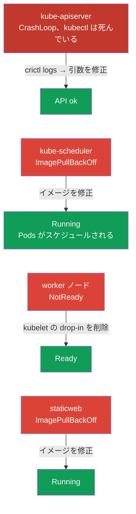

[Русская версия](README_RU.MD) · [Eng version](README.MD) · [Versión en español](README_ES.MD) · [Version française](README_FR.MD) · [Deutsche Version](README_DE.MD) · [ქართული ვერსია](README_GE.MD) · [繁體中文版](README_TW.MD)

# Lab 117 - Troubleshooting：control plane とノード

## 概要

Troubleshooting ドメイン（CKA の 30%）の実習であり、試験でもっとも比重の大きい領域です。
実習 114（アプリケーション層の障害）とは違い、ここで壊れているのは**クラスタのインフラ**です：
kube-apiserver、kube-scheduler、worker ノード上の **kubelet**、そして static pod。作業は
ノードへ SSH して行います：static pods は `/etc/kubernetes/manifests/` にあり、kubelet の
不具合は `systemctl`/`journalctl` で追跡します。

最初の課題は**壊れた kube-apiserver** です：`kubectl` が動かず、状況を把握する唯一の
手段はコンテナランタイムのレベルで `crictl` を使うことです（コンテナ一覧を見て、
落ちたプロセスのログを読む）。これは control plane が「死んでいる」実際のインシデントで
もっとも重要なスキルです。

すべての課題は試験形式（実際の CKA の問題と同じスタイル）で書かれており、
`check_result` コマンドで自動的に検証されます。**注意：**apiserver が直るまで
`check_result` はどの課題も検証できません - まずそれを直してください。

## 目的

次のコース章の内容を定着させます：

- [第 15 章。Static Pods、PriorityClass、複数のスケジューラー](../../course/15/README.md) - `/etc/kubernetes/manifests/` の static pods、static pods としての control plane コンポーネント
- [第 45 章。control plane と worker ノードのデバッグ](../../course/45/README.md) - `systemctl`/`journalctl` による kubelet の診断、`crictl` によるコンテナのデバッグ

## 何を直し、なぜ直すのか

この実習には、インフラ層の独立した障害が 4 つあります。それぞれが
別々の診断スキルを鍛えます：

| 障害 | 症状 | どこを見るか | 何を学べるか |
|---------|---------|-----------|-----------|
| **kube-apiserver**（引数が壊れている） | :6443 で `connection refused`、kubectl が動かない | control plane 上の `crictl ps -a` + `crictl logs` | API が使えないときのコンテナランタイムレベルのデバッグ（第 45 章） |
| **kube-scheduler**（イメージが壊れている） | 新しい Pods が Pending のまま | `/etc/kubernetes/manifests/kube-scheduler.yaml` | static pods としての control plane コンポーネント（第 15 章） |
| **worker 上の kubelet**（drop-in が壊れている） | ノードが NotReady | ノード上の `journalctl -u kubelet` | ノードと kubelet の systemd ユニットの診断（第 45 章） |
| **壊れた static pod**（存在しないイメージ） | mirror Pod が ImagePullBackOff | `/etc/kubernetes/manifests/staticweb.yaml` | static pod とその mirror の仕組み（第 15 章） |

最終的にデプロイされる全体像：



## インフラ

環境は Terragrunt により AWS（`eu-central-1`）に展開され、次の要素で構成されます：

| コンポーネント | 説明                                                             |
|------------|----------------------------------------------------------------------|
| `vpc`      | パブリックサブネットを持つ VPC `10.10.0.0/16`                          |
| `ssh-keys` | ノードへアクセスするための SSH キー                                      |
| `k8s-1`    | Kubernetes `1.35.2`（kubeadm）、Calico、metrics-server、**master + 1 worker**；起動時にクラスタ層の障害を注入します |
| `worker`   | `kubectl` と `check_result` を備えた作業マシン；クラスタのノードへ SSH でアクセス可能 |

インスタンス：`t4g.medium`、Ubuntu `22.04`。クラスタは 2 ノード構成で、master（control-plane）と
worker が 1 台です。

## デプロイ

```bash
TASK=117 make run_cka_task
```

作成が完了したら、SSH で作業マシン（worker）に接続し、そこから課題を進めてください。
`kubectl` は `cluster1-admin@cluster1` コンテキストに設定されていますが、kube-apiserver が
直るまでは**動きません**。作業の一部はクラスタのノードへの SSH が必要です -
作業マシンからは `ssh k8s1_controlPlane_1`（control plane）と
`ssh k8s1_node_node_1`（worker）が使えます。

> **いつ始めるか。**作業マシンに `~/.kube/config` というファイルが現れるまで
> 待ってください（通常は作成から約 2 分）。それが存在すれば、インフラの準備が
> 完了し、障害が注入されたということです。その時点で `kubectl get nodes` はすでに
> エラー（`connection refused`）を返しますが - これは想定どおりで、まさにこれが
> あなたが直すものです。

作業マシンで使える便利なコマンド：

```bash
time_left       # 残り時間
check_result    # 解答をチェックする（apiserver が直ってからのみ動作）
```

## 課題

> **順序が重要です。**apiserver が直るまで `kubectl` は動きません - 課題 1 から
> 始めてください。

---
|        **1**        | **kube-apiserver を直す（crictl によるデバッグ）**            |
| :-----------------: | :----------------------------------------------------------- |
| やること            | API サーバーが応答しません（`connection refused`）、`kubectl` も動きません。SSH で control plane に入り（`ssh k8s1_controlPlane_1`）、`crictl` で診断してください：`sudo crictl ps -a`（落ちた kube-apiserver のコンテナを見つける）、`sudo crictl logs <container-id>`（ログには未知のフラグ `--invalid-nonexistent-flag` による起動エラーが出ています）。マニフェスト `/etc/kubernetes/manifests/kube-apiserver.yaml` を開き、壊れたフラグの行を削除します。kubelet が static pod を再作成します。`kubectl get --raw='/healthz'` が `ok` を返すまで待ってください。 |
| 受け入れ基準        | - kube-apiserver が応答する：`kubectl get --raw='/healthz'` → `ok`。 |
---
|        **2**        | **kube-scheduler を直す**                                    |
| :-----------------: | :----------------------------------------------------------- |
| やること            | 新しい Pods がスケジュールされません：カナリア Pod `sched-check`（namespace `default`）が Pending のままで、`kube-system` の `kube-scheduler` は static pod のイメージタグが壊れているため ImagePullBackOff です。SSH で control plane に入り、`/etc/kubernetes/manifests/kube-scheduler.yaml` の `image:` をクラスタのバージョン（`registry.k8s.io/kube-scheduler:v1.35.2`）に直してください。kubelet が自分で static pod を再作成します。 |
| 受け入れ基準        | - `kube-system` の Pod `kube-scheduler` が Running かつ Ready；<br/>- Pod `sched-check`（namespace `default`）がスケジュールされ、Running に移行した。 |
---
|        **3**        | **worker ノードを Ready に戻す**                            |
| :-----------------: | :----------------------------------------------------------- |
| やること            | worker ノードが NotReady で、kubelet がステータスを報告していません。SSH でそのノードに入り（`ssh k8s1_node_node_1`）、`systemctl status kubelet` と `journalctl -u kubelet` で原因を見つけてください - 壊れた drop-in `/etc/systemd/system/kubelet.service.d/99-broken.conf` が設定ファイルのパスを存在しないファイルに置き換えています。その drop-in を削除し、`systemctl daemon-reload` を実行して kubelet を再起動します。 |
| 受け入れ基準        | - クラスタのすべてのノード（≥2）が `Ready` 状態である。 |
---
|        **4**        | **control plane 上の static pod を直す**                    |
| :-----------------: | :----------------------------------------------------------- |
| やること            | mirror Pod `staticweb-<cp>`（namespace `default`）が、存在しないイメージ `viktoruj/ping_pong:doesnotexist999` のため ImagePullBackOff です。SSH で control plane に入り、static pod のマニフェスト `/etc/kubernetes/manifests/staticweb.yaml` の `image:` を動作するイメージ（`viktoruj/ping_pong:latest`）に直してください。kubelet が static pod を再作成します。 |
| 受け入れ基準        | - mirror Pod `staticweb-<cp>`（namespace `default`）が Running 状態である。 |
---

## 結果のチェック

作業マシンで自動チェックを実行します：

```bash
check_result
```

スクリプトがテストを実行し、いくつの課題が完了したかを表示します。**重要：**`check_result`
は `kubectl` を使います - apiserver が直るまで、すべてのテストは Failed になります。

## 解答

参考解答：[worker/files/solutions/1_JP.MD](worker/files/solutions/1_JP.MD)

## 模擬試験のカバー範囲

この実習は CKA mock 01/02 の control plane とノードレベルの troubleshooting 部分をカバーします：
static pods としてのコンポーネント、API が使えないときの crictl によるデバッグ、NotReady のノード、
そして kubelet の診断です。

## クラスタとリソースの削除

```bash
TASK=117 make delete_cka_task
```
