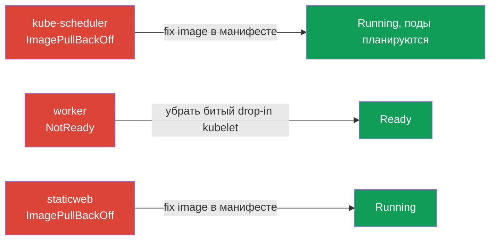

# Lab 117 — Troubleshooting: control plane и ноды

## Описание

Практическая работа по домену Troubleshooting (30% CKA) — самому весомому на экзамене.
В отличие от лабы 114 (прикладные сбои), здесь ломается **инфраструктура кластера**:
компонент control plane (kube-scheduler), **kubelet** на worker-ноде и статик-под.
Работа ведётся по SSH на нодах: статик-поды живут в `/etc/kubernetes/manifests/`,
неисправности kubelet ищем в `systemctl`/`journalctl`.

API-сервер и etcd намеренно оставлены рабочими, поэтому `kubectl` и `check_result`
доступны на протяжении всей работы. Все задания независимы.

## Цель

Закрепить главы курса:

- [Глава 15. Static Pods, PriorityClass, несколько планировщиков](../../course/15/ru.md)
- [Глава 45. Отладка control plane и worker-нод](../../course/45/ru.md)

## Что мы чиним и зачем

| Поломка | Симптом | Где искать | Чему учит |
|---------|---------|-----------|-----------|
| **kube-scheduler** (битый образ статик-пода) | новые поды в Pending | `/etc/kubernetes/manifests/kube-scheduler.yaml` | компоненты control plane как статик-поды |
| **kubelet на worker** (битый drop-in) | нода NotReady | `journalctl -u kubelet` на ноде | диагностика ноды и systemd-юнита kubelet |
| **битый статик-под** (несуществующий образ) | mirror-под в ImagePullBackOff | `/etc/kubernetes/manifests/staticweb.yaml` | как работает статик-под и его mirror |



## Инфраструктура

| Компонент  | Описание                                                             |
|------------|----------------------------------------------------------------------|
| `k8s-1`    | Kubernetes `1.35.2` (kubeadm), Calico, metrics-server, **master + 1 worker**; при старте вносит поломки уровня кластера |
| `worker`   | Рабочая машина с `kubectl` и `check_result`; SSH-доступ к нодам кластера |

## Развёртывание

```bash
TASK=117 make run_cka_task
```

## Задания

---
|        **1**        | **Починить kube-scheduler**                                  |
| :-----------------: | :----------------------------------------------------------- |
| Что делаем          | Находим причину (битый образ статик-пода) и восстанавливаем планировщик |
| Критерии приёмки    | - Под `kube-scheduler` в `kube-system` Running и Ready<br>- Под `sched-check` (ns `default`) перешёл в Running (запланирован) |
---
|        **2**        | **Вернуть worker-ноду в Ready**                             |
| :-----------------: | :----------------------------------------------------------- |
| Что делаем          | Диагностируем kubelet на ноде (`journalctl -u kubelet`) и убираем причину сбоя |
| Критерии приёмки    | - Все ноды кластера (≥2) в статусе `Ready` |
---
|        **3**        | **Починить статик-под на control plane**                    |
| :-----------------: | :----------------------------------------------------------- |
| Что делаем          | Правим манифест статик-пода `staticweb` в `/etc/kubernetes/manifests/` |
| Критерии приёмки    | - Mirror-под `staticweb-<cp>` (ns `default`) в статусе Running |
---

## Проверка результата

```bash
check_result
```

## Решение

[worker/files/solutions/1.MD](worker/files/solutions/1.MD)

## Покрытие мок-экзаменов

CKA mock 01/02 — раздел troubleshooting уровня control plane/нод (компоненты как
статик-поды, NotReady-ноды, диагностика kubelet).

## Удаление

```bash
TASK=117 make delete_cka_task
```
