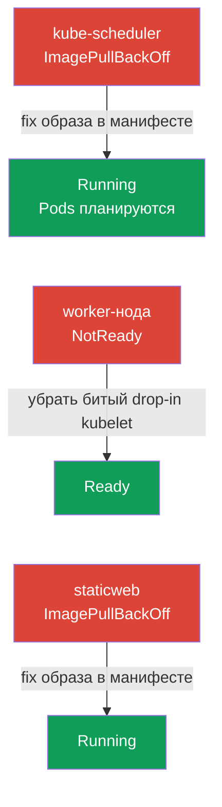

# Lab 117 — Troubleshooting: control plane и ноды

## Описание

Практическая работа по домену Troubleshooting (30% CKA) — самому весомому на экзамене.
В отличие от лабы 114 (прикладные сбои), здесь ломается **инфраструктура кластера**:
компонент control plane (kube-scheduler), **kubelet** на worker-ноде и static pod
(статик-под). Работа ведётся по SSH на нодах: static pods живут в
`/etc/kubernetes/manifests/`, неисправности kubelet ищем в `systemctl`/`journalctl`.

API-сервер и etcd намеренно оставлены рабочими, поэтому `kubectl` и `check_result`
доступны на протяжении всей работы.

Все задания оформлены в экзаменационном стиле (как реальные вопросы CKA) с
автоматической проверкой командой `check_result`. Задания независимы — их можно решать
в любом порядке.

## Цель

Закрепить материал глав курса:

- [Глава 15. Static Pods, PriorityClass, несколько планировщиков](../../course/15/ru.md) — static pods в `/etc/kubernetes/manifests/`, компоненты control plane как static pods
- [Глава 45. Отладка control plane и worker-нод](../../course/45/ru.md) — диагностика kubelet через `systemctl`/`journalctl`, разбор статусов нод

## Что мы чиним и зачем

В этой лабе три независимые поломки инфраструктурного уровня — по одной на компонент.
Каждая отрабатывает свой навык диагностики:

| Поломка | Симптом | Где искать | Чему учит |
|---------|---------|-----------|-----------|
| **kube-scheduler** (битый образ static pod) | новые Pods в Pending | `/etc/kubernetes/manifests/kube-scheduler.yaml` | компоненты control plane как static pods (глава 15) |
| **kubelet на worker** (битый drop-in) | нода NotReady | `journalctl -u kubelet` на ноде | диагностика ноды и systemd-юнита kubelet (глава 45) |
| **битый static pod** (несуществующий образ) | mirror-Pod в ImagePullBackOff | `/etc/kubernetes/manifests/staticweb.yaml` | как работает static pod и его mirror (глава 15) |

Итоговая картина того, что будет развёрнуто:



## Инфраструктура

Окружение разворачивается в AWS (`eu-central-1`) через Terragrunt и состоит из:

| Компонент  | Описание                                                             |
|------------|----------------------------------------------------------------------|
| `vpc`      | VPC `10.10.0.0/16` с публичными подсетями                             |
| `ssh-keys` | SSH-ключи для доступа к нодам                                         |
| `k8s-1`    | Kubernetes `1.35.2` (kubeadm), Calico, metrics-server, **master + 1 worker**; при старте вносит поломки уровня кластера |
| `worker`   | Рабочая машина с `kubectl` и `check_result`; SSH-доступ к нодам кластера |

Инстансы: `t3.medium` Ubuntu `22.04`. Кластер двухнодовый — master (control-plane) и
один worker.

## Развёртывание

```bash
TASK=117 make run_cka_task
```

После создания подключитесь к рабочей машине (worker) по SSH и выполняйте задания
оттуда. `kubectl` уже настроен на контекст `cluster1-admin@cluster1`. Часть работы
требует SSH на ноды кластера — с рабочей машины доступны `ssh k8s1_controlPlane_1`
(control plane) и `ssh k8s1_node_node_1` (worker).

Полезные команды на рабочей машине:

```bash
time_left       # сколько осталось времени
check_result    # проверить решение
```

## Задания

---
|        **1**        | **Починить kube-scheduler**                                  |
| :-----------------: | :----------------------------------------------------------- |
| Что делаем          | Новые Pods не планируются: канареечный Pod `sched-check` (namespace `default`) висит в Pending, а `kube-scheduler` в `kube-system` — в ImagePullBackOff из-за битого тега образа в static pod. По SSH на control plane (`ssh k8s1_controlPlane_1`) поправьте `image:` в `/etc/kubernetes/manifests/kube-scheduler.yaml` на версию кластера (`registry.k8s.io/kube-scheduler:v1.35.2`). kubelet сам пересоздаст static pod — применять ничего не нужно. |
| Критерии приёмки    | - Pod `kube-scheduler` в `kube-system` в статусе Running и Ready;<br/>- Pod `sched-check` (namespace `default`) запланирован и перешёл в Running. |
---
|        **2**        | **Вернуть worker-ноду в Ready**                             |
| :-----------------: | :----------------------------------------------------------- |
| Что делаем          | Worker-нода в NotReady, kubelet не докладывает статус. По SSH на ноду (`ssh k8s1_node_node_1`) через `systemctl status kubelet` и `journalctl -u kubelet` найдите причину — битый drop-in `/etc/systemd/system/kubelet.service.d/99-broken.conf` с несуществующим флагом. Удалите drop-in, выполните `systemctl daemon-reload` и перезапустите kubelet. |
| Критерии приёмки    | - Все ноды кластера (≥2) в статусе `Ready`. |
---
|        **3**        | **Починить static pod на control plane**                    |
| :-----------------: | :----------------------------------------------------------- |
| Что делаем          | Mirror-Pod `staticweb-<cp>` (namespace `default`) в ImagePullBackOff из-за несуществующего образа `viktoruj/ping_pong:doesnotexist999`. По SSH на control plane поправьте `image:` в манифесте static pod `/etc/kubernetes/manifests/staticweb.yaml` на рабочий образ (`viktoruj/ping_pong:latest`). kubelet пересоздаст static pod. |
| Критерии приёмки    | - Mirror-Pod `staticweb-<cp>` (namespace `default`) в статусе Running. |
---

## Проверка результата

На рабочей машине запустите автоматическую проверку:

```bash
check_result
```

Скрипт прогонит тесты и покажет, сколько заданий выполнено.

## Решение

Эталонное решение: [worker/files/solutions/1.MD](worker/files/solutions/1.MD)

## Покрытие мок-экзаменов

Лаба закрывает раздел troubleshooting уровня control plane и нод из CKA mock 01/02:
компоненты как static pods, NotReady-ноды и диагностика kubelet.

## Удаление кластера и ресурсов

```bash
TASK=117 make delete_cka_task
```
