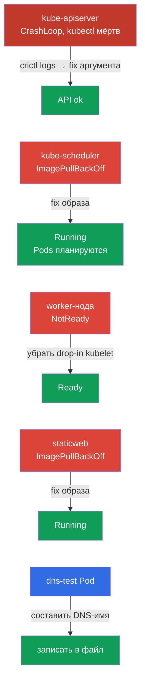

# Lab 117 — Troubleshooting: control plane и ноды

## Описание

Практическая работа по домену Troubleshooting (30% CKA) — самому весомому на экзамене.
В отличие от лабы 114 (прикладные сбои), здесь ломается **инфраструктура кластера**:
kube-apiserver, kube-scheduler, **kubelet** на worker-ноде и static pod. Работа ведётся
по SSH на нодах: static pods живут в `/etc/kubernetes/manifests/`, неисправности kubelet
ищем в `systemctl`/`journalctl`.

Первое задание — **сломанный kube-apiserver**: `kubectl` не работает, единственный способ
разобраться — использовать `crictl` на уровне контейнеризации (посмотреть контейнеры,
прочитать логи упавшего процесса). Это самый важный навык для реального инцидента,
когда control plane «мёртв».

Все задания оформлены в экзаменационном стиле (как реальные вопросы CKA) с
автоматической проверкой командой `check_result`. **Внимание:** пока apiserver не починен,
`check_result` не сможет проверить ни одно задание — чините его первым.

## Цель

Закрепить материал глав курса:

- [Глава 15. Static Pods, PriorityClass, несколько планировщиков](../../course/15/ru.md) — static pods в `/etc/kubernetes/manifests/`, компоненты control plane как static pods
- [Глава 45. Отладка control plane и worker-нод](../../course/45/ru.md) — диагностика kubelet через `systemctl`/`journalctl`, дебаг контейнеров через `crictl`

## Что мы чиним и зачем

В этой лабе четыре независимые поломки инфраструктурного уровня. Каждая отрабатывает
свой навык диагностики:

| Поломка | Симптом | Где искать | Чему учит |
|---------|---------|-----------|-----------|
| **kube-apiserver** (битый аргумент) | `connection refused` на :6443, kubectl не работает | `crictl ps -a` + `crictl logs` на control plane | дебаг на уровне контейнеризации когда API недоступен (глава 45) |
| **kube-scheduler** (битый образ) | новые Pods в Pending | `/etc/kubernetes/manifests/kube-scheduler.yaml` | компоненты control plane как static pods (глава 15) |
| **kubelet на worker** (битый drop-in) | нода NotReady | `journalctl -u kubelet` на ноде | диагностика ноды и systemd-юнита kubelet (глава 45) |
| **битый static pod** (несуществующий образ) | mirror-Pod в ImagePullBackOff | `/etc/kubernetes/manifests/staticweb.yaml` | как работает static pod и его mirror (глава 15) |
| **DNS-имя пода** | — | `kubectl get pod -o wide` + формула DNS | понимание DNS-записей подов в кластере |

Итоговая картина того, что будет развёрнуто:


```mermaid
flowchart TB
    api["kube-apiserver<br>CrashLoop, kubectl мёртв"] -->|"crictl logs → fix аргумента"| api2["API ok"]
    a["kube-scheduler<br>ImagePullBackOff"] -->|"fix образа"| a2["Running<br>Pods планируются"]
    b["worker-нода<br>NotReady"] -->|"убрать drop-in kubelet"| b2["Ready"]
    c["staticweb<br>ImagePullBackOff"] -->|"fix образа"| c2["Running"]
    d["dns-test Pod"] -->|"составить DNS-имя"| d2["записать в файл"]
    api2 ~~~ a
    a2 ~~~ b
    b2 ~~~ c
    c2 ~~~ d
    style api fill:#c0392b,color:#fff
    style a fill:#db4437,color:#fff
    style b fill:#db4437,color:#fff
    style c fill:#db4437,color:#fff
    style d fill:#326ce5,color:#fff
    style api2 fill:#0f9d58,color:#fff
    style a2 fill:#0f9d58,color:#fff
    style b2 fill:#0f9d58,color:#fff
    style c2 fill:#0f9d58,color:#fff
    style d2 fill:#0f9d58,color:#fff
```

## Инфраструктура

Окружение разворачивается в AWS (`eu-central-1`) через Terragrunt и состоит из:

| Компонент  | Описание                                                             |
|------------|----------------------------------------------------------------------|
| `vpc`      | VPC `10.10.0.0/16` с публичными подсетями                             |
| `ssh-keys` | SSH-ключи для доступа к нодам                                         |
| `k8s-1`    | Kubernetes `1.35.2` (kubeadm), Calico, metrics-server, **master + 1 worker**; при старте вносит поломки уровня кластера |
| `worker`   | Рабочая машина с `kubectl` и `check_result`; SSH-доступ к нодам кластера |

Инстансы: `t3.medium` Ubuntu `22.04`. Кластер двухнодовый — master (control-plane) и
один worker.

## Развёртывание

```bash
TASK=117 make run_cka_task
```

После создания подключитесь к рабочей машине (worker) по SSH и выполняйте задания
оттуда. `kubectl` настроен на контекст `cluster1-admin@cluster1`, но **не будет
работать**, пока не починен kube-apiserver. Часть работы требует SSH на ноды кластера —
с рабочей машины доступны `ssh k8s1_controlPlane_1` (control plane) и
`ssh k8s1_node_node_1` (worker).

> **Когда начинать.** Дождитесь, пока на рабочей машине появится файл
> `~/.kube/config` (обычно ~2 мин после создания). Его наличие означает, что
> инфраструктура готова и поломки внесены. При этом `kubectl get nodes` уже будет
> возвращать ошибку (`connection refused`) — это ожидаемо, именно это вы и будете
> чинить.

Полезные команды на рабочей машине:

```bash
time_left       # сколько осталось времени
check_result    # проверить решение (работает только после починки apiserver)
```

## Задания

> **Порядок важен.** Пока apiserver не починен, `kubectl` не работает — начинайте
> с задания 1.

---
|        **1**        | **Починить kube-apiserver (дебаг через crictl)**            |
| :-----------------: | :----------------------------------------------------------- |
| Что делаем          | API-сервер не отвечает (`connection refused`), `kubectl` не работает. По SSH на control plane (`ssh k8s1_controlPlane_1`) используйте `crictl` для диагностики: `sudo crictl ps -a` (найдите упавший контейнер kube-apiserver), `sudo crictl logs <container-id>` (в логах — ошибка запуска из-за неизвестного флага `--invalid-nonexistent-flag`). Откройте манифест `/etc/kubernetes/manifests/kube-apiserver.yaml`, удалите строку с битым флагом. kubelet пересоздаст статик-под. Дождитесь, пока `kubectl get --raw='/healthz'` вернёт `ok`. |
| Критерии приёмки    | - kube-apiserver отвечает: `kubectl get --raw='/healthz'` → `ok`. |
---
|        **2**        | **Починить kube-scheduler**                                  |
| :-----------------: | :----------------------------------------------------------- |
| Что делаем          | Новые Pods не планируются: канареечный Pod `sched-check` (namespace `default`) висит в Pending, а `kube-scheduler` в `kube-system` — в ImagePullBackOff из-за битого тега образа в static pod. По SSH на control plane поправьте `image:` в `/etc/kubernetes/manifests/kube-scheduler.yaml` на версию кластера (`registry.k8s.io/kube-scheduler:v1.35.2`). kubelet сам пересоздаст static pod. |
| Критерии приёмки    | - Pod `kube-scheduler` в `kube-system` в статусе Running и Ready;<br/>- Pod `sched-check` (namespace `default`) запланирован и перешёл в Running. |
---
|        **3**        | **Вернуть worker-ноду в Ready**                             |
| :-----------------: | :----------------------------------------------------------- |
| Что делаем          | Worker-нода в NotReady, kubelet не докладывает статус. По SSH на ноду (`ssh k8s1_node_node_1`) через `systemctl status kubelet` и `journalctl -u kubelet` найдите причину — битый drop-in `/etc/systemd/system/kubelet.service.d/99-broken.conf` подменяет путь к конфигурации на несуществующий файл. Удалите drop-in, выполните `systemctl daemon-reload` и перезапустите kubelet. |
| Критерии приёмки    | - Все ноды кластера (≥2) в статусе `Ready`. |
---
|        **4**        | **Починить static pod на control plane**                    |
| :-----------------: | :----------------------------------------------------------- |
| Что делаем          | Mirror-Pod `staticweb-<cp>` (namespace `default`) в ImagePullBackOff из-за несуществующего образа `viktoruj/ping_pong:doesnotexist999`. По SSH на control plane поправьте `image:` в манифесте static pod `/etc/kubernetes/manifests/staticweb.yaml` на рабочий образ (`viktoruj/ping_pong:latest`). kubelet пересоздаст static pod. |
| Критерии приёмки    | - Mirror-Pod `staticweb-<cp>` (namespace `default`) в статусе Running. |
---
|        **5**        | **Найти DNS-имя пода**                                      |
| :-----------------: | :----------------------------------------------------------- |
| Что делаем          | Pod `dns-test` (namespace `dns-lab`) запущен. Узнайте его IP (`kubectl get pod dns-test -n dns-lab -o wide`) и составьте полное DNS-имя пода по формуле: `<ip-с-дефисами-вместо-точек>.<namespace>.pod.cluster.local` (например, для IP `10.0.1.5` → `10-0-1-5.dns-lab.pod.cluster.local`). Проверьте резолв из любого пода (`nslookup <dns-имя>`) и запишите DNS-имя пода в файл `/var/work/tests/artifacts/pod-dns-name.txt` на рабочей машине. |
| Критерии приёмки    | - файл `/var/work/tests/artifacts/pod-dns-name.txt` содержит корректное DNS-имя пода `dns-test` в формате `<ip-dashed>.dns-lab.pod.cluster.local`. |
---

## Проверка результата

На рабочей машине запустите автоматическую проверку:

```bash
check_result
```

Скрипт прогонит тесты и покажет, сколько заданий выполнено. **Важно:** `check_result`
использует `kubectl` — пока apiserver не починен, все тесты будут Failed.

## Решение

Эталонное решение: [worker/files/solutions/1.MD](worker/files/solutions/1.MD)

## Покрытие мок-экзаменов

Лаба закрывает раздел troubleshooting уровня control plane и нод из CKA mock 01/02:
компоненты как static pods, дебаг через crictl когда API недоступен, NotReady-ноды и
диагностика kubelet.

## Удаление кластера и ресурсов

```bash
TASK=117 make delete_cka_task
```
