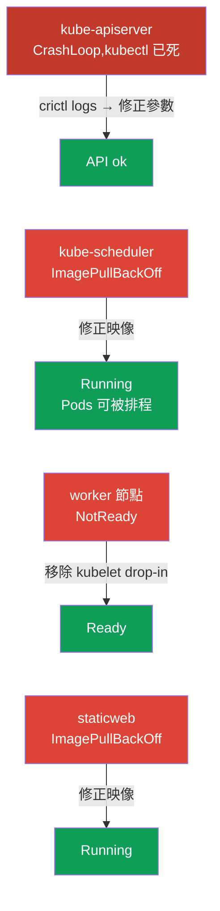

[Русская версия](README_RU.MD) · [Eng version](README.MD) · [Versión en español](README_ES.MD) · [Version française](README_FR.MD) · [Deutsche Version](README_DE.MD) · [ქართული ვერსია](README_GE.MD) · [日本語版](README_JP.MD)

# Lab 117 - Troubleshooting:control plane 與節點

## 說明

Troubleshooting 領域(CKA 的 30%)的實作練習 - 這是考試中比重最大的一塊。
與實驗 114(應用層級的故障)不同,這裡壞掉的是**叢集的基礎架構**:
kube-apiserver、kube-scheduler、worker 節點上的 **kubelet** 以及一個 static pod。作業要
透過 SSH 在節點上進行:static pods 位於 `/etc/kubernetes/manifests/`,kubelet 的故障
則要用 `systemctl`/`journalctl` 追查。

第一個任務是**壞掉的 kube-apiserver**:`kubectl` 無法使用,唯一能夠
釐清狀況的辦法,就是在容器執行層級使用 `crictl`(列出容器、
讀取崩潰行程的日誌)。當 control plane「死掉」時,
這是真實事故中最重要的技能。

所有任務都以考試風格撰寫(就像真正的 CKA 題目),並透過
`check_result` 指令自動驗證。**注意:**在 apiserver 修好之前,
`check_result` 無法驗證任何任務 - 請先把它修好。

## 目標

鞏固以下課程章節的內容:

- [第 15 章。Static Pods、PriorityClass、多個排程器](../../course/15/README.md) - 位於 `/etc/kubernetes/manifests/` 的 static pods、以 static pods 形式執行的 control plane 元件
- [第 45 章。除錯 control plane 與 worker 節點](../../course/45/README.md) - 透過 `systemctl`/`journalctl` 診斷 kubelet、透過 `crictl` 除錯容器

## 我們要修什麼,以及為什麼

這個實驗包含四個彼此獨立的基礎架構層級故障。每一個都訓練
各自的診斷技能:

| 故障 | 症狀 | 該去哪裡找 | 教會你什麼 |
|---------|---------|-----------|-----------|
| **kube-apiserver**(參數壞掉) | :6443 上出現 `connection refused`,kubectl 無法使用 | control plane 上的 `crictl ps -a` + `crictl logs` | 當 API 不可用時,在容器執行層級除錯(第 45 章) |
| **kube-scheduler**(映像壞掉) | 新的 Pods 卡在 Pending | `/etc/kubernetes/manifests/kube-scheduler.yaml` | 以 static pods 形式執行的 control plane 元件(第 15 章) |
| **worker 上的 kubelet**(drop-in 壞掉) | 節點 NotReady | 節點上的 `journalctl -u kubelet` | 節點與 kubelet systemd unit 的診斷(第 45 章) |
| **壞掉的 static pod**(不存在的映像) | mirror Pod 處於 ImagePullBackOff | `/etc/kubernetes/manifests/staticweb.yaml` | static pod 及其 mirror 的運作方式(第 15 章) |

最終部署出來的整體樣貌:



## 基礎架構

環境透過 Terragrunt 部署在 AWS(`eu-central-1`),由以下部分組成:

| 元件       | 說明                                                                 |
|------------|----------------------------------------------------------------------|
| `vpc`      | VPC `10.10.0.0/16`,含公有子網路                                       |
| `ssh-keys` | 用於存取節點的 SSH 金鑰                                                |
| `k8s-1`    | Kubernetes `1.35.2`(kubeadm),Calico,metrics-server,**master + 1 worker**;啟動時會注入叢集層級的故障 |
| `worker`   | 工作機,具備 `kubectl` 與 `check_result`;可 SSH 存取叢集節點            |

執行個體:`t4g.medium`,Ubuntu `22.04`。叢集有兩個節點 - master(control-plane)與
一個 worker。

## 部署

```bash
TASK=117 make run_cka_task
```

建立完成後,請透過 SSH 連線到工作機(worker),並在那裡完成任務。
`kubectl` 已經指向 `cluster1-admin@cluster1` context,但在 kube-apiserver 修好之前
它**無法運作**。部分作業需要 SSH 到叢集節點 -
從工作機可以使用 `ssh k8s1_controlPlane_1`(control plane)與
`ssh k8s1_node_node_1`(worker)。

> **何時開始。**請等到工作機上出現 `~/.kube/config` 這個檔案
> (通常在建立後約 2 分鐘)。它的出現表示基礎架構已就緒,且
> 故障已經注入。此時 `kubectl get nodes` 就已經會
> 回傳錯誤(`connection refused`)- 這是預期行為,正是你接下來
> 要修的東西。

工作機上的實用指令:

```bash
time_left       # 還剩多少時間
check_result    # 檢查解答(僅在 apiserver 修好之後才有效)
```

## 任務

> **順序很重要。**在 apiserver 修好之前,`kubectl` 無法使用 - 請從
> 任務 1 開始。

---
|        **1**        | **修好 kube-apiserver(透過 crictl 除錯)**                   |
| :-----------------: | :----------------------------------------------------------- |
| 要做什麼            | API 伺服器沒有回應(`connection refused`),`kubectl` 無法使用。透過 SSH 連到 control plane(`ssh k8s1_controlPlane_1`)並使用 `crictl` 進行診斷:`sudo crictl ps -a`(找出崩潰的 kube-apiserver 容器)、`sudo crictl logs <container-id>`(日誌中顯示因未知旗標 `--invalid-nonexistent-flag` 造成的啟動錯誤)。打開清單檔 `/etc/kubernetes/manifests/kube-apiserver.yaml`,刪除含有壞掉旗標的那一行。kubelet 會重新建立 static pod。等到 `kubectl get --raw='/healthz'` 回傳 `ok`。 |
| 驗收標準            | - kube-apiserver 有回應:`kubectl get --raw='/healthz'` → `ok`。 |
---
|        **2**        | **修好 kube-scheduler**                                      |
| :-----------------: | :----------------------------------------------------------- |
| 要做什麼            | 新的 Pods 無法被排程:金絲雀 Pod `sched-check`(namespace `default`)卡在 Pending,而 `kube-system` 中的 `kube-scheduler` 因為 static pod 裡的映像標籤壞掉而處於 ImagePullBackOff。透過 SSH 連到 control plane,把 `/etc/kubernetes/manifests/kube-scheduler.yaml` 中的 `image:` 改成叢集的版本(`registry.k8s.io/kube-scheduler:v1.35.2`)。kubelet 會自行重新建立 static pod。 |
| 驗收標準            | - `kube-system` 中的 Pod `kube-scheduler` 處於 Running 且 Ready;<br/>- Pod `sched-check`(namespace `default`)已被排程並轉為 Running。 |
---
|        **3**        | **讓 worker 節點回到 Ready**                                 |
| :-----------------: | :----------------------------------------------------------- |
| 要做什麼            | worker 節點處於 NotReady,kubelet 沒有回報狀態。透過 SSH 連到該節點(`ssh k8s1_node_node_1`),用 `systemctl status kubelet` 與 `journalctl -u kubelet` 找出原因 - 壞掉的 drop-in `/etc/systemd/system/kubelet.service.d/99-broken.conf` 把設定檔路徑換成了一個不存在的檔案。刪除該 drop-in,執行 `systemctl daemon-reload` 並重啟 kubelet。 |
| 驗收標準            | - 叢集所有節點(≥2)都處於 `Ready` 狀態。 |
---
|        **4**        | **修好 control plane 上的 static pod**                       |
| :-----------------: | :----------------------------------------------------------- |
| 要做什麼            | mirror Pod `staticweb-<cp>`(namespace `default`)因為映像 `viktoruj/ping_pong:doesnotexist999` 不存在而處於 ImagePullBackOff。透過 SSH 連到 control plane,把 static pod 清單檔 `/etc/kubernetes/manifests/staticweb.yaml` 中的 `image:` 改成可用的映像(`viktoruj/ping_pong:latest`)。kubelet 會重新建立 static pod。 |
| 驗收標準            | - mirror Pod `staticweb-<cp>`(namespace `default`)處於 Running 狀態。 |
---

## 檢查結果

在工作機上執行自動檢查:

```bash
check_result
```

腳本會跑完測試,並顯示已完成多少任務。**重要:**`check_result`
會使用 `kubectl` - 在 apiserver 修好之前,所有測試都會是 Failed。

## 解答

參考解答:[worker/files/solutions/1_TW.MD](worker/files/solutions/1_TW.MD)

## 模擬考涵蓋範圍

本實驗涵蓋 CKA mock 01/02 中 control plane 與節點層級的 troubleshooting 部分:
以 static pods 形式執行的元件、當 API 不可用時透過 crictl 除錯、NotReady 節點與
kubelet 診斷。

## 刪除叢集與資源

```bash
TASK=117 make delete_cka_task
```
