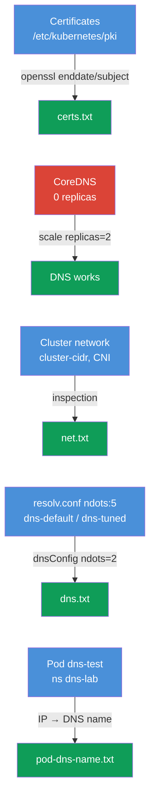

[Русская версия](README_RU.MD) · [Versión en español](README_ES.MD) · [Version française](README_FR.MD) · [Deutsche Version](README_DE.MD) · [ქართული ვერსია](README_GE.MD) · [繁體中文版](README_TW.MD) · [日本語版](README_JP.MD)

# Lab 118 — Troubleshooting: Certificates, CoreDNS and Cluster Networking

## Description

A hands-on lab on low-level cluster troubleshooting: reading and checking control plane
**TLS certificates** (`openssl`, `kubeadm certs`), fixing **CoreDNS** and inspecting the
**network/CNI** (Pod CIDR, CNI agent). Some tasks follow the "find it and write it into a
report" format (like separate sub-tasks on the exam), others are real repairs. The work is
done with `kubectl` and over SSH on the control plane. Reports are saved on the work
machine under `/home/ubuntu/answers/`.

All tasks are written in exam style (like real CKA questions) with automatic validation
via the `check_result` command.

## Goal

Reinforce the material from the course chapters:

- [Chapter 31. Service internals, DNS and CoreDNS](../../course/31/README.md) — how cluster DNS works, the role of CoreDNS, `ndots` and resolv.conf
- [Chapter 39. TLS certificates, kubeconfig and the CSR API](../../course/39/README.md) — reading control plane certificates, expiration and CN
- [Chapter 40. Extension interfaces: CNI, CSI, CRI](../../course/40/README.md) — CNI, Pod CIDR and the network agent
- [Chapter 46. Debugging services and networking](../../course/46/README.md) — DNS and network connectivity troubleshooting

## What We Do and Why

This lab has four independent sub-tasks: two are "find a fact and write it into a report",
one is a real DNS repair, one is DNS tuning for a Pod. Each one drills its own skill:

| Task | Skill | What it teaches |
|------|-------|-----------------|
| **Certificate health check** | `openssl x509`, `kubeadm certs check-expiration` | reading cluster certificates, finding expiration and CN (chapter 39) |
| **Fix CoreDNS** | `kubectl -n kube-system scale/rollout` | diagnosing and restoring cluster DNS (chapter 31) |
| **Network facts** | `--cluster-cidr`, `calico-node` DaemonSet | understanding Pod CIDR and the CNI agent (chapter 40) |
| **ndots and resolv.conf** | `cat /etc/resolv.conf`, `dnsConfig.options` | why `ndots:5` slows down external names and how to lower the threshold (chapter 31) |
| **Pod DNS name** | `kubectl get pod -o wide` + the DNS formula | understanding Pod A records (chapter 31) |

The final picture of what will be deployed:



## Infrastructure

The environment is deployed in AWS (`eu-central-1`) via Terragrunt and consists of:

| Component  | Description                                                          |
|------------|----------------------------------------------------------------------|
| `vpc`      | VPC `10.10.0.0/16` with public subnets                                |
| `ssh-keys` | SSH keys for node access                                              |
| `k8s-1`    | Kubernetes `1.35.2` (kubeadm), Calico, **master + 1 worker**; shuts CoreDNS down at start |
| `worker`   | Work machine with `kubectl` and `check_result`; SSH access to the control plane |

Instances: `t3.medium`, Ubuntu `22.04`. The cluster has two nodes — the master
(control-plane) and one worker.

## Deployment

```bash
TASK=118 make run_cka_task
```

Once it is created, connect to the work machine (worker) over SSH and do the tasks from
there. `kubectl` is already pointed at the `cluster1-admin@cluster1` context. Some tasks
require SSH to the control plane (`ssh k8s1_controlPlane_1`) — that is where the
certificates in `/etc/kubernetes/pki/` and the component manifests live.

Handy commands on the work machine:

```bash
time_left       # how much time is left
check_result    # check your solution
```

## Tasks

---
|        **1**        | **Certificate health check**                                 |
| :-----------------: | :----------------------------------------------------------- |
| What to do          | Over SSH on the control plane read the certificates in `/etc/kubernetes/pki/`: `openssl x509 -in apiserver.crt -noout -enddate` (the API server expiration date) and `openssl x509 -in ca.crt -noout -subject` (the CN of the certificate authority). On the work machine write the report `/home/ubuntu/answers/certs.txt` in the format `apiserver_notafter=<...>` (exactly the string after `notAfter=`) and `ca_cn=<...>`. |
| Acceptance criteria | - `apiserver_notafter` matches the `notAfter` date from `apiserver.crt`;<br/>- `ca_cn=kubernetes`. |
---
|        **2**        | **Fix CoreDNS**                                             |
| :-----------------: | :----------------------------------------------------------- |
| What to do          | DNS in the cluster is broken: the `coredns` Deployment in `kube-system` has its replicas zeroed out (0). Restore it — `kubectl -n kube-system scale deployment coredns --replicas=2` and wait for `rollout status`. You can verify resolution with a temporary Pod running `nslookup kubernetes.default`. |
| Acceptance criteria | - Deployment `coredns` in `kube-system`: `readyReplicas ≥ 1`. |
---
|        **3**        | **Cluster network facts**                                    |
| :-----------------: | :----------------------------------------------------------- |
| What to do          | Find out the Pod CIDR (the `--cluster-cidr` flag of kube-controller-manager in the manifest `/etc/kubernetes/manifests/kube-controller-manager.yaml` on the control plane) and the name of the CNI agent DaemonSet in `kube-system` (`calico-node`). Write `/home/ubuntu/answers/net.txt` in the format `pod_cidr=<...>` and `cni_daemonset=<...>`. |
| Acceptance criteria | - `pod_cidr` matches `--cluster-cidr` of kube-controller-manager;<br/>- `cni_daemonset=calico-node`. |
---
|        **4**        | **Lower ndots for a Pod (dnsConfig)**                      |
| :-----------------: | :----------------------------------------------------------- |
| What to do          | kubelet writes `options ndots:5` into Pods — for external names that means extra queries with search suffixes. Create Pod `dns-default` (image `viktoruj/ping_pong:alpine`) with the default DNS and Pod `dns-tuned` (same image) with `dnsConfig.options` `ndots=2` (declaratively — `--dry-run` cannot do dnsConfig). Compare the `/etc/resolv.conf` of both. |
| Acceptance criteria | - Pod `dns-default` (image `viktoruj/ping_pong:alpine`) is Running with the default DNS (`ndots:5` in resolv.conf);<br/>- Pod `dns-tuned` (image `viktoruj/ping_pong:alpine`) with `dnsConfig.options` `ndots=2`. |
---
|        **5**        | **ndots report**                                            |
| :-----------------: | :----------------------------------------------------------- |
| What to do          | Read the `ndots` value from `/etc/resolv.conf` of Pod `dns-default` (`kubectl exec dns-default -- cat /etc/resolv.conf`) and write `/home/ubuntu/answers/dns.txt` in the format `default_ndots=<...>` and `tuned_ndots=<...>`. |
| Acceptance criteria | - `default_ndots` matches `ndots` from `/etc/resolv.conf` of Pod `dns-default`;<br/>- `tuned_ndots=2`. |
---
|        **6**        | **Find the Pod DNS name**                                   |
| :-----------------: | :----------------------------------------------------------- |
| What to do          | Pod `dns-test` (namespace `dns-lab`) is started together with the cluster. Find its IP (`kubectl get pod dns-test -n dns-lab -o wide`) and build the full Pod DNS name using the formula: `<ip-with-dashes-instead-of-dots>.<namespace>.pod.cluster.local` (for example, for IP `10.0.1.5` → `10-0-1-5.dns-lab.pod.cluster.local`). Check resolution from any Pod (`nslookup <dns-name>`) and write the Pod DNS name into the file `/home/ubuntu/answers/pod-dns-name.txt`. |
| Acceptance criteria | - the file `/home/ubuntu/answers/pod-dns-name.txt` contains the correct DNS name of Pod `dns-test` in the format `<ip-dashed>.dns-lab.pod.cluster.local`. |
---

## Checking the Result

On the work machine run the automatic validation:

```bash
check_result
```

The script runs the tests and shows how many tasks are complete.

## Solution

Reference solution: [worker/files/solutions/1.MD](worker/files/solutions/1.MD)

## Mock Exam Coverage

The lab drills CKA skills: working with certificates (Cluster Architecture domain), DNS
and networking (Services & Networking), troubleshooting (Troubleshooting).

## Deleting the Cluster and Resources

```bash
TASK=118 make delete_cka_task
```
