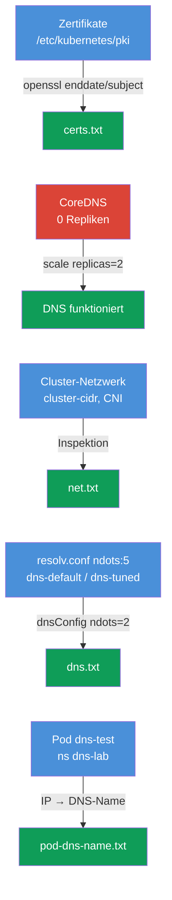

[Русская версия](README_RU.MD) · [Eng version](README.MD) · [Versión en español](README_ES.MD) · [Version française](README_FR.MD) · [ქართული ვერსია](README_GE.MD) · [繁體中文版](README_TW.MD) · [日本語版](README_JP.MD)

# Lab 118 — Diagnose: Zertifikate, CoreDNS und Cluster-Netzwerk

## Beschreibung

Praxisübung zur Low-Level-Diagnose des Clusters: Lesen und Prüfen der **TLS-Zertifikate**
der Control Plane (`openssl`, `kubeadm certs`), Reparatur von **CoreDNS** und Inspektion
von **Netzwerk/CNI** (Pod CIDR, CNI-Agent). Ein Teil der Aufgaben ist im Format „finde die
Information und schreibe sie in den Bericht“ (wie einzelne Teilaufgaben in der Prüfung),
ein anderer Teil ist eine echte Reparatur. Gearbeitet wird mit `kubectl` und per SSH auf
der Control Plane. Die Berichte werden auf der Arbeitsmaschine in `/home/ubuntu/answers/`
gespeichert.

Alle Aufgaben sind im Prüfungsstil formuliert (wie echte CKA-Fragen) mit automatischer
Prüfung über den Befehl `check_result`.

## Ziel

Den Stoff der Kurskapitel festigen:

- [Kapitel 31. Service von innen, DNS und CoreDNS](../../course/31/de.md) — wie das Cluster-DNS funktioniert, die Rolle von CoreDNS, `ndots` und resolv.conf
- [Kapitel 39. TLS-Zertifikate, kubeconfig und die CSR-API](../../course/39/de.md) — Lesen der Control-Plane-Zertifikate, Gültigkeit und CN
- [Kapitel 40. Erweiterungsschnittstellen: CNI, CSI, CRI](../../course/40/de.md) — CNI, Pod CIDR und der Netzwerk-Agent
- [Kapitel 46. Debugging von Services und Netzwerk](../../course/46/de.md) — Diagnose von DNS und Netzwerkverbindungen

## Was wir tun und warum

In diesem Lab gibt es vier unabhängige Teilaufgaben: zwei nach dem Muster „finde die
Information und schreibe sie in den Bericht“, eine echte DNS-Reparatur und eine
DNS-Konfiguration für einen Pod. Jede trainiert eine eigene Fähigkeit:

| Aufgabe | Fähigkeit | Was sie lehrt |
|---------|-----------|---------------|
| **Health-Check der Zertifikate** | `openssl x509`, `kubeadm certs check-expiration` | Cluster-Zertifikate lesen, Gültigkeit und CN finden (Kapitel 39) |
| **CoreDNS reparieren** | `kubectl -n kube-system scale/rollout` | Diagnose und Wiederherstellung des Cluster-DNS (Kapitel 31) |
| **Fakten zum Netzwerk** | `--cluster-cidr`, DaemonSet `calico-node` | Pod CIDR und CNI-Agent verstehen (Kapitel 40) |
| **ndots und resolv.conf** | `cat /etc/resolv.conf`, `dnsConfig.options` | warum `ndots:5` externe Namen verlangsamt und wie man die Schwelle senkt (Kapitel 31) |
| **DNS-Name des Pods** | `kubectl get pod -o wide` + DNS-Formel | Verständnis der A-Records von Pods (Kapitel 31) |

Das Gesamtbild dessen, was ausgerollt wird:



## Infrastruktur

Die Umgebung wird in AWS (`eu-central-1`) über Terragrunt ausgerollt und besteht aus:

| Komponente | Beschreibung                                                         |
|------------|----------------------------------------------------------------------|
| `vpc`      | VPC `10.10.0.0/16` mit öffentlichen Subnetzen                         |
| `ssh-keys` | SSH-Schlüssel für den Zugriff auf die Nodes                           |
| `k8s-1`    | Kubernetes `1.35.2` (kubeadm), Calico, **Master + 1 Worker**; schaltet CoreDNS beim Start ab |
| `worker`   | Arbeitsmaschine mit `kubectl` und `check_result`; SSH-Zugriff auf die Control Plane |

Instanzen: `t4g.medium` Ubuntu `22.04`. Der Cluster hat zwei Nodes — den Master
(Control-Plane) und einen Worker.

## Ausrollen

```bash
TASK=118 make run_cka_task
```

Verbinden Sie sich nach dem Erstellen per SSH mit der Arbeitsmaschine (worker) und lösen
Sie die Aufgaben von dort. `kubectl` ist bereits auf den Kontext `cluster1-admin@cluster1`
eingestellt. Ein Teil der Aufgaben erfordert SSH auf die Control Plane
(`ssh k8s1_controlPlane_1`) — dort liegen die Zertifikate in `/etc/kubernetes/pki/` und die
Manifeste der Komponenten.

Nützliche Befehle auf der Arbeitsmaschine:

```bash
time_left       # wie viel Zeit übrig ist
check_result    # Lösung prüfen
```

## Aufgaben

---
|        **1**        | **Health-Check der Zertifikate**                             |
| :-----------------: | :----------------------------------------------------------- |
| Was wir tun         | Per SSH auf der Control Plane lesen wir die Zertifikate in `/etc/kubernetes/pki/`: `openssl x509 -in apiserver.crt -noout -enddate` (Gültigkeit des API-Servers) und `openssl x509 -in ca.crt -noout -subject` (CN der Zertifizierungsstelle). Auf der Arbeitsmaschine schreiben wir den Bericht `/home/ubuntu/answers/certs.txt` im Format `apiserver_notafter=<...>` (der Wert genau als die Zeichenkette nach `notAfter=`) und `ca_cn=<...>`. |
| Abnahmekriterien    | - `apiserver_notafter` stimmt mit dem `notAfter`-Datum aus `apiserver.crt` überein;<br/>- `ca_cn=kubernetes`. |
---
|        **2**        | **CoreDNS reparieren**                                      |
| :-----------------: | :----------------------------------------------------------- |
| Was wir tun         | Das DNS im Cluster funktioniert nicht: beim Deployment `coredns` in `kube-system` sind die Repliken auf null (0) gesetzt. Wir stellen es wieder her — `kubectl -n kube-system scale deployment coredns --replicas=2` — und warten auf `rollout status`. Die Auflösung lässt sich mit einem temporären Pod und `nslookup kubernetes.default` prüfen. |
| Abnahmekriterien    | - Deployment `coredns` in `kube-system`: `readyReplicas ≥ 1`. |
---
|        **3**        | **Fakten zum Cluster-Netzwerk**                              |
| :-----------------: | :----------------------------------------------------------- |
| Was wir tun         | Wir ermitteln das Pod CIDR (das Flag `--cluster-cidr` des kube-controller-manager im Manifest `/etc/kubernetes/manifests/kube-controller-manager.yaml` auf der Control Plane) und den Namen des DaemonSets des CNI-Agents in `kube-system` (`calico-node`). Wir schreiben `/home/ubuntu/answers/net.txt` im Format `pod_cidr=<...>` und `cni_daemonset=<...>`. |
| Abnahmekriterien    | - `pod_cidr` stimmt mit `--cluster-cidr` des kube-controller-manager überein;<br/>- `cni_daemonset=calico-node`. |
---
|        **4**        | **ndots für einen Pod senken (dnsConfig)**                 |
| :-----------------: | :----------------------------------------------------------- |
| Was wir tun         | kubelet schreibt in Pods `options ndots:5` — für externe Namen bedeutet das unnötige Anfragen mit Search-Suffixen. Wir erstellen den Pod `dns-default` (Image `viktoruj/ping_pong:alpine`) mit Standard-DNS und den Pod `dns-tuned` (dasselbe Image) mit `dnsConfig.options` `ndots=2` (deklarativ, da `--dry-run` dnsConfig nicht kann). Wir vergleichen die `/etc/resolv.conf` beider. |
| Abnahmekriterien    | - Pod `dns-default` (Image `viktoruj/ping_pong:alpine`) in Running, Standard-DNS (`ndots:5` in resolv.conf);<br/>- Pod `dns-tuned` (Image `viktoruj/ping_pong:alpine`) mit `dnsConfig.options` `ndots=2`. |
---
|        **5**        | **Bericht zu ndots**                                        |
| :-----------------: | :----------------------------------------------------------- |
| Was wir tun         | Wir lesen den Wert `ndots` aus `/etc/resolv.conf` des Pods `dns-default` (`kubectl exec dns-default -- cat /etc/resolv.conf`) und schreiben `/home/ubuntu/answers/dns.txt` im Format `default_ndots=<...>` und `tuned_ndots=<...>`. |
| Abnahmekriterien    | - `default_ndots` stimmt mit `ndots` aus `/etc/resolv.conf` des Pods `dns-default` überein;<br/>- `tuned_ndots=2`. |
---
|        **6**        | **Den DNS-Namen des Pods finden**                           |
| :-----------------: | :----------------------------------------------------------- |
| Was wir tun         | Der Pod `dns-test` (Namespace `dns-lab`) wird beim Start des Clusters ausgeführt. Ermitteln Sie seine IP (`kubectl get pod dns-test -n dns-lab -o wide`) und bilden Sie den vollständigen DNS-Namen des Pods nach der Formel: `<ip-mit-bindestrichen-statt-punkten>.<namespace>.pod.cluster.local` (zum Beispiel für die IP `10.0.1.5` → `10-0-1-5.dns-lab.pod.cluster.local`). Prüfen Sie die Auflösung aus einem beliebigen Pod (`nslookup <dns-name>`) und schreiben Sie den DNS-Namen des Pods in die Datei `/home/ubuntu/answers/pod-dns-name.txt`. |
| Abnahmekriterien    | - die Datei `/home/ubuntu/answers/pod-dns-name.txt` enthält den korrekten DNS-Namen des Pods `dns-test` im Format `<ip-dashed>.dns-lab.pod.cluster.local`. |
---

## Ergebnis prüfen

Starten Sie auf der Arbeitsmaschine die automatische Prüfung:

```bash
check_result
```

Das Skript führt die Tests aus und zeigt, wie viele Aufgaben erledigt sind.

## Lösung

Referenzlösung: [worker/files/solutions/1_DE.MD](worker/files/solutions/1_DE.MD)

## Abdeckung der Mock-Prüfungen

Das Lab trainiert CKA-Fähigkeiten: Arbeit mit Zertifikaten (Domäne Cluster Architecture),
DNS und Netzwerk (Services & Networking), Diagnose (Troubleshooting).

## Cluster und Ressourcen löschen

```bash
TASK=118 make delete_cka_task
```
