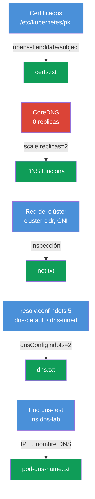

[Русская версия](README_RU.MD) · [Eng version](README.MD) · [Version française](README_FR.MD) · [Deutsche Version](README_DE.MD) · [ქართული ვერსია](README_GE.MD) · [繁體中文版](README_TW.MD) · [日本語版](README_JP.MD)

# Lab 118 — Diagnóstico: certificados, CoreDNS y red del clúster

## Descripción

Práctica de diagnóstico de bajo nivel del clúster: lectura y comprobación de los
**certificados TLS** del control plane (`openssl`, `kubeadm certs`), reparación de
**CoreDNS** e inspección de la **red/CNI** (Pod CIDR, agente de CNI). Parte de las tareas
tiene el formato «encuentra el dato y anótalo en el informe» (como subtareas
independientes en el examen), y parte es una reparación real. El trabajo se hace con
`kubectl` y por SSH en el control plane. Los informes se guardan en la máquina de trabajo
en `/home/ubuntu/answers/`.

Todas las tareas están redactadas en estilo de examen (como preguntas reales de CKA) con
verificación automática mediante el comando `check_result`.

## Objetivo

Consolidar el material de los capítulos del curso:

- [Capítulo 31. Service por dentro, DNS y CoreDNS](../../course/31/es.md) — cómo funciona el DNS del clúster, el papel de CoreDNS, `ndots` y resolv.conf
- [Capítulo 39. Certificados TLS, kubeconfig y la API CSR](../../course/39/es.md) — lectura de los certificados del control plane, vigencia y CN
- [Capítulo 40. Interfaces de extensión: CNI, CSI, CRI](../../course/40/es.md) — CNI, Pod CIDR y el agente de red
- [Capítulo 46. Depuración de servicios y red](../../course/46/es.md) — diagnóstico de DNS y de la conectividad de red

## Qué hacemos y para qué

En esta lab hay cuatro subtareas independientes: dos de tipo «encuentra el dato y anótalo
en el informe», una es una reparación real del DNS y otra es la configuración del DNS de
un Pod. Cada una entrena su propia habilidad:

| Tarea | Habilidad | Qué enseña |
|-------|-----------|------------|
| **Health-check de certificados** | `openssl x509`, `kubeadm certs check-expiration` | leer los certificados del clúster, encontrar la vigencia y el CN (capítulo 39) |
| **Reparar CoreDNS** | `kubectl -n kube-system scale/rollout` | diagnóstico y restauración del DNS del clúster (capítulo 31) |
| **Datos de la red** | `--cluster-cidr`, DaemonSet `calico-node` | entender el Pod CIDR y el agente de CNI (capítulo 40) |
| **ndots y resolv.conf** | `cat /etc/resolv.conf`, `dnsConfig.options` | por qué `ndots:5` ralentiza los nombres externos y cómo bajar el umbral (capítulo 31) |
| **Nombre DNS del pod** | `kubectl get pod -o wide` + la fórmula DNS | comprender los registros A de los pods (capítulo 31) |

Imagen final de lo que se despliega:



## Infraestructura

El entorno se despliega en AWS (`eu-central-1`) con Terragrunt y consta de:

| Componente | Descripción                                                          |
|------------|----------------------------------------------------------------------|
| `vpc`      | VPC `10.10.0.0/16` con subredes públicas                              |
| `ssh-keys` | Claves SSH para acceder a los nodos                                   |
| `k8s-1`    | Kubernetes `1.35.2` (kubeadm), Calico, **master + 1 worker**; al arrancar apaga CoreDNS |
| `worker`   | Máquina de trabajo con `kubectl` y `check_result`; acceso SSH al control plane |

Instancias: `t3.medium` Ubuntu `22.04`. El clúster tiene dos nodos: el master
(control-plane) y un worker.

## Despliegue

```bash
TASK=118 make run_cka_task
```

Tras la creación, conéctate por SSH a la máquina de trabajo (worker) y resuelve las tareas
desde allí. `kubectl` ya está configurado con el contexto `cluster1-admin@cluster1`. Parte
de las tareas requiere SSH al control plane (`ssh k8s1_controlPlane_1`): allí están los
certificados en `/etc/kubernetes/pki/` y los manifiestos de los componentes.

Comandos útiles en la máquina de trabajo:

```bash
time_left       # cuánto tiempo queda
check_result    # comprobar la solución
```

## Tareas

---
|        **1**        | **Health-check de certificados**                             |
| :-----------------: | :----------------------------------------------------------- |
| Qué hacemos         | Por SSH en el control plane leemos los certificados de `/etc/kubernetes/pki/`: `openssl x509 -in apiserver.crt -noout -enddate` (vigencia del API server) y `openssl x509 -in ca.crt -noout -subject` (CN de la autoridad de certificación). En la máquina de trabajo escribimos el informe `/home/ubuntu/answers/certs.txt` con el formato `apiserver_notafter=<...>` (el valor exactamente como la cadena tras `notAfter=`) y `ca_cn=<...>`. |
| Criterios de aceptación | - `apiserver_notafter` coincide con la fecha `notAfter` de `apiserver.crt`;<br/>- `ca_cn=kubernetes`. |
---
|        **2**        | **Reparar CoreDNS**                                         |
| :-----------------: | :----------------------------------------------------------- |
| Qué hacemos         | El DNS del clúster no funciona: el Deployment `coredns` en `kube-system` tiene las réplicas a cero (0). Lo restauramos con `kubectl -n kube-system scale deployment coredns --replicas=2` y esperamos el `rollout status`. La resolución se puede comprobar con un Pod temporal que ejecute `nslookup kubernetes.default`. |
| Criterios de aceptación | - Deployment `coredns` en `kube-system`: `readyReplicas ≥ 1`. |
---
|        **3**        | **Datos de la red del clúster**                              |
| :-----------------: | :----------------------------------------------------------- |
| Qué hacemos         | Averiguamos el Pod CIDR (el flag `--cluster-cidr` de kube-controller-manager en el manifiesto `/etc/kubernetes/manifests/kube-controller-manager.yaml` del control plane) y el nombre del DaemonSet del agente de CNI en `kube-system` (`calico-node`). Escribimos `/home/ubuntu/answers/net.txt` con el formato `pod_cidr=<...>` y `cni_daemonset=<...>`. |
| Criterios de aceptación | - `pod_cidr` coincide con `--cluster-cidr` de kube-controller-manager;<br/>- `cni_daemonset=calico-node`. |
---
|        **4**        | **Bajar ndots para un Pod (dnsConfig)**                    |
| :-----------------: | :----------------------------------------------------------- |
| Qué hacemos         | kubelet escribe en los Pods `options ndots:5`: para los nombres externos eso supone consultas de más con sufijos de search. Creamos el Pod `dns-default` (imagen `viktoruj/ping_pong:alpine`) con el DNS por defecto y el Pod `dns-tuned` (la misma imagen) con `dnsConfig.options` `ndots=2` (de forma declarativa, ya que `--dry-run` no soporta dnsConfig). Comparamos el `/etc/resolv.conf` de ambos. |
| Criterios de aceptación | - Pod `dns-default` (imagen `viktoruj/ping_pong:alpine`) en Running, DNS por defecto (`ndots:5` en resolv.conf);<br/>- Pod `dns-tuned` (imagen `viktoruj/ping_pong:alpine`) con `dnsConfig.options` `ndots=2`. |
---
|        **5**        | **Informe sobre ndots**                                     |
| :-----------------: | :----------------------------------------------------------- |
| Qué hacemos         | Leemos el valor de `ndots` en `/etc/resolv.conf` del Pod `dns-default` (`kubectl exec dns-default -- cat /etc/resolv.conf`) y escribimos `/home/ubuntu/answers/dns.txt` con el formato `default_ndots=<...>` y `tuned_ndots=<...>`. |
| Criterios de aceptación | - `default_ndots` coincide con el `ndots` de `/etc/resolv.conf` del Pod `dns-default`;<br/>- `tuned_ndots=2`. |
---
|        **6**        | **Encontrar el nombre DNS del pod**                         |
| :-----------------: | :----------------------------------------------------------- |
| Qué hacemos         | El Pod `dns-test` (namespace `dns-lab`) se lanza al arrancar el clúster. Averigua su IP (`kubectl get pod dns-test -n dns-lab -o wide`) y forma el nombre DNS completo del pod según la fórmula: `<ip-con-guiones-en-lugar-de-puntos>.<namespace>.pod.cluster.local` (por ejemplo, para la IP `10.0.1.5` → `10-0-1-5.dns-lab.pod.cluster.local`). Comprueba la resolución desde cualquier pod (`nslookup <nombre-dns>`) y escribe el nombre DNS del pod en el archivo `/home/ubuntu/answers/pod-dns-name.txt`. |
| Criterios de aceptación | - el archivo `/home/ubuntu/answers/pod-dns-name.txt` contiene el nombre DNS correcto del pod `dns-test` con el formato `<ip-dashed>.dns-lab.pod.cluster.local`. |
---

## Comprobación del resultado

En la máquina de trabajo ejecuta la verificación automática:

```bash
check_result
```

El script pasa los tests y muestra cuántas tareas están completadas.

## Solución

Solución de referencia: [worker/files/solutions/1_ES.MD](worker/files/solutions/1_ES.MD)

## Cobertura de los exámenes de práctica

La lab entrena habilidades de CKA: trabajo con certificados (dominio Cluster
Architecture), DNS y red (Services & Networking), diagnóstico (Troubleshooting).

## Eliminación del clúster y de los recursos

```bash
TASK=118 make delete_cka_task
```
