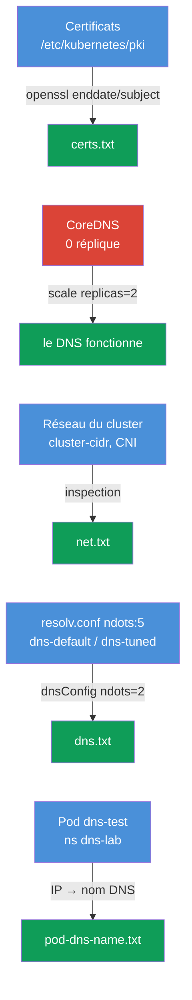

[Русская версия](README_RU.MD) · [Eng version](README.MD) · [Versión en español](README_ES.MD) · [Deutsche Version](README_DE.MD) · [ქართული ვერსია](README_GE.MD) · [繁體中文版](README_TW.MD) · [日本語版](README_JP.MD)

# Lab 118 — Diagnostic : certificats, CoreDNS et réseau du cluster

## Description

Travail pratique de diagnostic bas niveau du cluster : lecture et vérification des
**certificats TLS** du control plane (`openssl`, `kubeadm certs`), réparation de
**CoreDNS** et inspection du **réseau/CNI** (Pod CIDR, agent CNI). Une partie des tâches
suit le format « trouve l'information et note-la dans le rapport » (comme des sous-tâches
distinctes à l'examen), une autre partie est une véritable réparation. Le travail se fait
avec `kubectl` et en SSH sur le control plane. Les rapports sont enregistrés sur la machine
de travail dans `/home/ubuntu/answers/`.

Toutes les tâches sont rédigées dans le style de l'examen (comme de vraies questions CKA)
avec une vérification automatique par la commande `check_result`.

## Objectif

Consolider le contenu des chapitres du cours :

- [Chapitre 31. Service de l'intérieur, DNS et CoreDNS](../../course/31/fr.md) — comment fonctionne le DNS du cluster, le rôle de CoreDNS, `ndots` et resolv.conf
- [Chapitre 39. Certificats TLS, kubeconfig et l'API CSR](../../course/39/fr.md) — lecture des certificats du control plane, validité et CN
- [Chapitre 40. Interfaces d'extension : CNI, CSI, CRI](../../course/40/fr.md) — CNI, Pod CIDR et l'agent réseau
- [Chapitre 46. Débogage des services et du réseau](../../course/46/fr.md) — diagnostic du DNS et de la connectivité réseau

## Ce que nous faisons et pourquoi

Ce lab contient quatre sous-tâches indépendantes : deux du type « trouve l'information et
note-la dans le rapport », une véritable réparation du DNS et une configuration du DNS d'un
Pod. Chacune entraîne une compétence particulière :

| Tâche | Compétence | Ce qu'elle apprend |
|-------|------------|--------------------|
| **Health-check des certificats** | `openssl x509`, `kubeadm certs check-expiration` | lire les certificats du cluster, trouver la validité et le CN (chapitre 39) |
| **Réparer CoreDNS** | `kubectl -n kube-system scale/rollout` | diagnostic et restauration du DNS du cluster (chapitre 31) |
| **Informations sur le réseau** | `--cluster-cidr`, DaemonSet `calico-node` | comprendre le Pod CIDR et l'agent CNI (chapitre 40) |
| **ndots et resolv.conf** | `cat /etc/resolv.conf`, `dnsConfig.options` | pourquoi `ndots:5` ralentit les noms externes et comment abaisser le seuil (chapitre 31) |
| **Nom DNS du pod** | `kubectl get pod -o wide` + la formule DNS | comprendre les enregistrements A des pods (chapitre 31) |

Voici le tableau final de ce qui sera déployé :



## Infrastructure

L'environnement est déployé dans AWS (`eu-central-1`) via Terragrunt et se compose de :

| Composant  | Description                                                          |
|------------|----------------------------------------------------------------------|
| `vpc`      | VPC `10.10.0.0/16` avec des sous-réseaux publics                      |
| `ssh-keys` | Clés SSH pour l'accès aux nœuds                                       |
| `k8s-1`    | Kubernetes `1.35.2` (kubeadm), Calico, **master + 1 worker** ; éteint CoreDNS au démarrage |
| `worker`   | Machine de travail avec `kubectl` et `check_result` ; accès SSH au control plane |

Instances : `t3.medium` Ubuntu `22.04`. Le cluster comporte deux nœuds — le master
(control-plane) et un worker.

## Déploiement

```bash
TASK=118 make run_cka_task
```

Après la création, connectez-vous en SSH à la machine de travail (worker) et effectuez les
tâches depuis celle-ci. `kubectl` est déjà configuré sur le contexte
`cluster1-admin@cluster1`. Une partie des tâches nécessite un accès SSH au control plane
(`ssh k8s1_controlPlane_1`) — c'est là que se trouvent les certificats dans
`/etc/kubernetes/pki/` et les manifestes des composants.

Commandes utiles sur la machine de travail :

```bash
time_left       # temps restant
check_result    # vérifier la solution
```

## Tâches

---
|        **1**        | **Health-check des certificats**                             |
| :-----------------: | :----------------------------------------------------------- |
| Ce que nous faisons | En SSH sur le control plane, nous lisons les certificats dans `/etc/kubernetes/pki/` : `openssl x509 -in apiserver.crt -noout -enddate` (validité de l'API server) et `openssl x509 -in ca.crt -noout -subject` (CN de l'autorité de certification). Sur la machine de travail, nous écrivons le rapport `/home/ubuntu/answers/certs.txt` au format `apiserver_notafter=<...>` (la valeur exactement telle que la chaîne après `notAfter=`) et `ca_cn=<...>`. |
| Critères d'acceptation | - `apiserver_notafter` correspond à la date `notAfter` de `apiserver.crt` ;<br/>- `ca_cn=kubernetes`. |
---
|        **2**        | **Réparer CoreDNS**                                         |
| :-----------------: | :----------------------------------------------------------- |
| Ce que nous faisons | Le DNS du cluster ne fonctionne pas : le Deployment `coredns` dans `kube-system` a ses répliques mises à zéro (0). Nous le restaurons — `kubectl -n kube-system scale deployment coredns --replicas=2` — et attendons le `rollout status`. La résolution peut être vérifiée avec un Pod temporaire exécutant `nslookup kubernetes.default`. |
| Critères d'acceptation | - Deployment `coredns` dans `kube-system` : `readyReplicas ≥ 1`. |
---
|        **3**        | **Informations sur le réseau du cluster**                    |
| :-----------------: | :----------------------------------------------------------- |
| Ce que nous faisons | Nous déterminons le Pod CIDR (le flag `--cluster-cidr` de kube-controller-manager dans le manifeste `/etc/kubernetes/manifests/kube-controller-manager.yaml` sur le control plane) et le nom du DaemonSet de l'agent CNI dans `kube-system` (`calico-node`). Nous écrivons `/home/ubuntu/answers/net.txt` au format `pod_cidr=<...>` et `cni_daemonset=<...>`. |
| Critères d'acceptation | - `pod_cidr` correspond au `--cluster-cidr` de kube-controller-manager ;<br/>- `cni_daemonset=calico-node`. |
---
|        **4**        | **Abaisser ndots pour un Pod (dnsConfig)**                 |
| :-----------------: | :----------------------------------------------------------- |
| Ce que nous faisons | kubelet inscrit dans les Pods `options ndots:5` — pour les noms externes, cela génère des requêtes inutiles avec les suffixes de search. Nous créons le Pod `dns-default` (image `viktoruj/ping_pong:alpine`) avec le DNS par défaut et le Pod `dns-tuned` (même image) avec `dnsConfig.options` `ndots=2` (de façon déclarative, car `--dry-run` ne gère pas dnsConfig). Nous comparons le `/etc/resolv.conf` des deux. |
| Critères d'acceptation | - Pod `dns-default` (image `viktoruj/ping_pong:alpine`) en Running, DNS par défaut (`ndots:5` dans resolv.conf) ;<br/>- Pod `dns-tuned` (image `viktoruj/ping_pong:alpine`) avec `dnsConfig.options` `ndots=2`. |
---
|        **5**        | **Rapport sur ndots**                                       |
| :-----------------: | :----------------------------------------------------------- |
| Ce que nous faisons | Nous lisons la valeur de `ndots` dans `/etc/resolv.conf` du Pod `dns-default` (`kubectl exec dns-default -- cat /etc/resolv.conf`) et écrivons `/home/ubuntu/answers/dns.txt` au format `default_ndots=<...>` et `tuned_ndots=<...>`. |
| Critères d'acceptation | - `default_ndots` correspond au `ndots` de `/etc/resolv.conf` du Pod `dns-default` ;<br/>- `tuned_ndots=2`. |
---
|        **6**        | **Trouver le nom DNS du pod**                               |
| :-----------------: | :----------------------------------------------------------- |
| Ce que nous faisons | Le Pod `dns-test` (namespace `dns-lab`) est lancé au démarrage du cluster. Déterminez son IP (`kubectl get pod dns-test -n dns-lab -o wide`) et composez le nom DNS complet du pod selon la formule : `<ip-avec-tirets-au-lieu-des-points>.<namespace>.pod.cluster.local` (par exemple, pour l'IP `10.0.1.5` → `10-0-1-5.dns-lab.pod.cluster.local`). Vérifiez la résolution depuis n'importe quel pod (`nslookup <nom-dns>`) et écrivez le nom DNS du pod dans le fichier `/home/ubuntu/answers/pod-dns-name.txt`. |
| Critères d'acceptation | - le fichier `/home/ubuntu/answers/pod-dns-name.txt` contient le nom DNS correct du pod `dns-test` au format `<ip-dashed>.dns-lab.pod.cluster.local`. |
---

## Vérification du résultat

Sur la machine de travail, lancez la vérification automatique :

```bash
check_result
```

Le script exécute les tests et indique combien de tâches sont accomplies.

## Solution

Solution de référence : [worker/files/solutions/1_FR.MD](worker/files/solutions/1_FR.MD)

## Couverture des examens blancs

Le lab entraîne des compétences CKA : travail avec les certificats (domaine Cluster
Architecture), DNS et réseau (Services & Networking), diagnostic (Troubleshooting).

## Suppression du cluster et des ressources

```bash
TASK=118 make delete_cka_task
```
