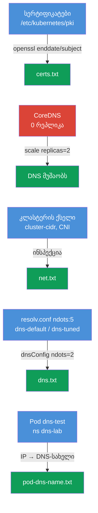

[Русская версия](README_RU.MD) · [Eng version](README.MD) · [Versión en español](README_ES.MD) · [Version française](README_FR.MD) · [Deutsche Version](README_DE.MD)

# Lab 118 — დიაგნოსტიკა: სერტიფიკატები, CoreDNS და კლასტერის ქსელი

## აღწერა

პრაქტიკული სამუშაო კლასტერის დაბალი დონის დიაგნოსტიკაზე: control plane-ის **TLS-სერტიფიკატების**
წაკითხვა და შემოწმება (`openssl`, `kubeadm certs`), **CoreDNS**-ის შეკეთება და
**ქსელის/CNI**-ს ინსპექცია (Pod CIDR, CNI-ს აგენტი). დავალებების ნაწილი ფორმატშია „მოძებნე
და ჩაწერე ანგარიშში“ (როგორც ცალკეული ქვე-ამოცანები გამოცდაზე), ნაწილი — რეალური შეკეთება.
მუშაობა მიმდინარეობს `kubectl`-ით და SSH-ით control plane-ზე. ანგარიშები ინახება სამუშაო
მანქანაზე კატალოგში `/home/ubuntu/answers/`.

ყველა დავალება გამოცდის სტილშია გაფორმებული (როგორც რეალური CKA კითხვები) და მათი შემოწმება
ავტომატურად ხდება ბრძანებით `check_result`.

## მიზანი

განამტკიცოთ კურსის თავების მასალა:

- [თავი 31. Service შიგნიდან, DNS და CoreDNS](../../course/31/ru.md) — როგორ მუშაობს კლასტერის DNS, CoreDNS-ის როლი, `ndots` და resolv.conf
- [თავი 39. TLS-სერტიფიკატები, kubeconfig და CSR API](../../course/39/ru.md) — control plane-ის სერტიფიკატების წაკითხვა, ვადა და CN
- [თავი 40. გაფართოების ინტერფეისები: CNI, CSI, CRI](../../course/40/ru.md) — CNI, Pod CIDR და ქსელის აგენტი
- [თავი 46. სერვისებისა და ქსელის გამართვა](../../course/46/ru.md) — DNS-ისა და ქსელური კავშირის დიაგნოსტიკა

## რას ვაკეთებთ და რისთვის

ამ ლაბორატორიაში ოთხი დამოუკიდებელი ქვე-ამოცანაა: ორი — „მოძებნე ფაქტი და ჩაწერე ანგარიშში“,
ერთი — DNS-ის რეალური შეკეთება, ერთი — Pod-ისთვის DNS-ის კონფიგურაცია. თითოეული საკუთარ
უნარს ავარჯიშებს:

| ამოცანა | უნარი | რას ასწავლის |
|---------|-------|--------------|
| **სერტიფიკატების health-check** | `openssl x509`, `kubeadm certs check-expiration` | კლასტერის სერტიფიკატების წაკითხვა, ვადისა და CN-ის მოძებნა (თავი 39) |
| **CoreDNS-ის შეკეთება** | `kubectl -n kube-system scale/rollout` | კლასტერის DNS-ის დიაგნოსტიკა და აღდგენა (თავი 31) |
| **ფაქტები ქსელის შესახებ** | `--cluster-cidr`, `calico-node` DaemonSet | Pod CIDR-ისა და CNI-ს აგენტის გაგება (თავი 40) |
| **ndots და resolv.conf** | `cat /etc/resolv.conf`, `dnsConfig.options` | რატომ ანელებს `ndots:5` გარე სახელებს და როგორ დავწიოთ ზღვარი (თავი 31) |
| **Pod-ის DNS-სახელი** | `kubectl get pod -o wide` + DNS-ის ფორმულა | pod-ების A-ჩანაწერების გაგება (თავი 31) |

საბოლოო სურათი იმისა, რაც განთავსდება:



## ინფრასტრუქტურა

გარემო იშლება AWS-ში (`eu-central-1`) Terragrunt-ის მეშვეობით და შედგება:

| კომპონენტი | აღწერა                                                            |
|------------|-------------------------------------------------------------------|
| `vpc`      | VPC `10.10.0.0/16` საჯარო ქვექსელებით                              |
| `ssh-keys` | SSH-გასაღებები node-ებზე წვდომისთვის                                |
| `k8s-1`    | Kubernetes `1.35.2` (kubeadm), Calico, **master + 1 worker**; გაშვებისას აქრობს CoreDNS-ს |
| `worker`   | სამუშაო მანქანა `kubectl`-ით და `check_result`-ით; SSH-წვდომა control plane-ზე |

ინსტანსები: `t3.medium` Ubuntu `22.04`. კლასტერი ორკვანძიანია — master (control-plane) და
ერთი worker.

## განთავსება

```bash
TASK=118 make run_cka_task
```

შექმნის შემდეგ დაუკავშირდით სამუშაო მანქანას (worker) SSH-ით და დავალებები შეასრულეთ იქიდან.
`kubectl` უკვე კონფიგურირებულია კონტექსტზე `cluster1-admin@cluster1`. დავალებების ნაწილი
მოითხოვს SSH-ს control plane-ზე (`ssh k8s1_controlPlane_1`) — იქ არის სერტიფიკატები
`/etc/kubernetes/pki/`-ში და კომპონენტების მანიფესტები.

სასარგებლო ბრძანებები სამუშაო მანქანაზე:

```bash
time_left       # რამდენი დრო დარჩა
check_result    # ამოხსნის შემოწმება
```

## დავალებები

---
|        **1**        | **სერტიფიკატების health-check**                               |
| :-----------------: | :----------------------------------------------------------- |
| რას ვაკეთებთ        | SSH-ით control plane-ზე ვკითხულობთ სერტიფიკატებს `/etc/kubernetes/pki/`-ში: `openssl x509 -in apiserver.crt -noout -enddate` (API-სერვერის ვადა) და `openssl x509 -in ca.crt -noout -subject` (სერტიფიკაციის ცენტრის CN). სამუშაო მანქანაზე ვწერთ ანგარიშს `/home/ubuntu/answers/certs.txt` ფორმატში `apiserver_notafter=<...>` (მნიშვნელობა ზუსტად ისე, როგორც სტრიქონი `notAfter=`-ის შემდეგ) და `ca_cn=<...>`. |
| მიღების კრიტერიუმები | - `apiserver_notafter` ემთხვევა `notAfter` ვადას `apiserver.crt`-იდან;<br/>- `ca_cn=kubernetes`. |
---
|        **2**        | **CoreDNS-ის შეკეთება**                                     |
| :-----------------: | :----------------------------------------------------------- |
| რას ვაკეთებთ        | DNS კლასტერში არ მუშაობს: `kube-system`-ში Deployment `coredns`-ს რეპლიკები განულებულია (0). ვაღდგენთ — `kubectl -n kube-system scale deployment coredns --replicas=2` და ველოდებით `rollout status`-ს. რეზოლვინგი შეიძლება შემოწმდეს დროებითი Pod-ით და `nslookup kubernetes.default`-ით. |
| მიღების კრიტერიუმები | - Deployment `coredns` `kube-system`-ში: `readyReplicas ≥ 1`. |
---
|        **3**        | **ფაქტები კლასტერის ქსელის შესახებ**                         |
| :-----------------: | :----------------------------------------------------------- |
| რას ვაკეთებთ        | ვიგებთ Pod CIDR-ს (kube-controller-manager-ის ფლაგი `--cluster-cidr` მანიფესტში `/etc/kubernetes/manifests/kube-controller-manager.yaml` control plane-ზე) და CNI-ს აგენტის DaemonSet-ის სახელს `kube-system`-ში (`calico-node`). ვწერთ `/home/ubuntu/answers/net.txt`-ს ფორმატში `pod_cidr=<...>` და `cni_daemonset=<...>`. |
| მიღების კრიტერიუმები | - `pod_cidr` ემთხვევა kube-controller-manager-ის `--cluster-cidr`-ს;<br/>- `cni_daemonset=calico-node`. |
---
|        **4**        | **ndots-ის დაწევა Pod-ისთვის (dnsConfig)**                 |
| :-----------------: | :----------------------------------------------------------- |
| რას ვაკეთებთ        | kubelet Pod-ებს უწერს `options ndots:5` — გარე სახელებისთვის ეს ზედმეტი მოთხოვნებია search-სუფიქსებით. ვქმნით Pod `dns-default`-ს (image `viktoruj/ping_pong:alpine`) დეფოლტური DNS-ით და Pod `dns-tuned`-ს (იმავე image-ით) `dnsConfig.options` `ndots=2`-ით (დეკლარაციულად — `--dry-run` dnsConfig-ს ვერ აკეთებს). ვადარებთ ორივეს `/etc/resolv.conf`-ს. |
| მიღების კრიტერიუმები | - Pod `dns-default` (image `viktoruj/ping_pong:alpine`) Running-ში, დეფოლტური DNS (`ndots:5` resolv.conf-ში);<br/>- Pod `dns-tuned` (image `viktoruj/ping_pong:alpine`) `dnsConfig.options` `ndots=2`-ით. |
---
|        **5**        | **ანგარიში ndots-ზე**                                       |
| :-----------------: | :----------------------------------------------------------- |
| რას ვაკეთებთ        | ვკითხულობთ `ndots`-ის მნიშვნელობას Pod `dns-default`-ის `/etc/resolv.conf`-იდან (`kubectl exec dns-default -- cat /etc/resolv.conf`) და ვწერთ `/home/ubuntu/answers/dns.txt`-ს ფორმატში `default_ndots=<...>` და `tuned_ndots=<...>`. |
| მიღების კრიტერიუმები | - `default_ndots` ემთხვევა `ndots`-ს Pod `dns-default`-ის `/etc/resolv.conf`-იდან;<br/>- `tuned_ndots=2`. |
---
|        **6**        | **Pod-ის DNS-სახელის მოძებნა**                              |
| :-----------------: | :----------------------------------------------------------- |
| რას ვაკეთებთ        | Pod `dns-test` (namespace `dns-lab`) გაშვებულია კლასტერის სტარტზე. გაიგეთ მისი IP (`kubectl get pod dns-test -n dns-lab -o wide`) და შეადგინეთ pod-ის სრული DNS-სახელი ფორმულით: `<ip-დეფისებით-წერტილების-ნაცვლად>.<namespace>.pod.cluster.local` (მაგალითად, IP `10.0.1.5`-სთვის → `10-0-1-5.dns-lab.pod.cluster.local`). შეამოწმეთ რეზოლვი ნებისმიერი pod-იდან (`nslookup <dns-სახელი>`) და ჩაწერეთ pod-ის DNS-სახელი ფაილში `/home/ubuntu/answers/pod-dns-name.txt`. |
| მიღების კრიტერიუმები | - ფაილი `/home/ubuntu/answers/pod-dns-name.txt` შეიცავს pod `dns-test`-ის კორექტულ DNS-სახელს ფორმატში `<ip-dashed>.dns-lab.pod.cluster.local`. |
---

## შედეგის შემოწმება

სამუშაო მანქანაზე გაუშვით ავტომატური შემოწმება:

```bash
check_result
```

სკრიპტი გაატარებს ტესტებს და აჩვენებს, რამდენი დავალებაა შესრულებული.

## ამოხსნა

ეტალონური ამოხსნა: [worker/files/solutions/1_GE.MD](worker/files/solutions/1_GE.MD)

## Mock-გამოცდების დაფარვა

ლაბორატორია ავარჯიშებს CKA-ს უნარებს: მუშაობა სერტიფიკატებთან (დომენი Cluster
Architecture), DNS და ქსელი (Services & Networking), დიაგნოსტიკა (Troubleshooting).

## კლასტერისა და რესურსების წაშლა

```bash
TASK=118 make delete_cka_task
```
