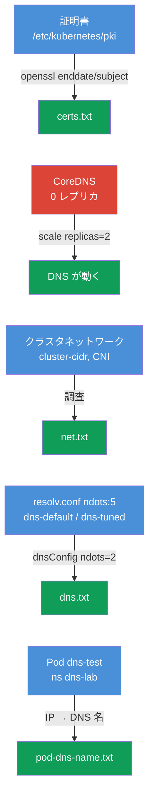

[Русская версия](README_RU.MD) · [Eng version](README.MD) · [Versión en español](README_ES.MD) · [Version française](README_FR.MD) · [Deutsche Version](README_DE.MD) · [ქართული ვერსია](README_GE.MD) · [繁體中文版](README_TW.MD)

# Lab 118 - トラブルシューティング：証明書、CoreDNS、クラスタネットワーク

## 概要

クラスタの低レベルなトラブルシューティングの実習です：control plane の
**TLS 証明書** の読み取りと確認（`openssl`、`kubeadm certs`）、**CoreDNS** の修復、
**ネットワーク/CNI**（Pod CIDR、CNI エージェント）の調査を行います。課題の一部は
「事実を見つけてレポートに書く」形式（試験の独立した小問と同じ）で、残りは実際の修復です。
作業は `kubectl` と control plane への SSH で進めます。レポートは作業マシンの
`/home/ubuntu/answers/` に保存します。

すべての課題は試験形式（実際の CKA の問題と同じスタイル）で書かれており、
`check_result` コマンドで自動的に検証されます。

## 目的

次のコース章の内容を定着させます：

- [第 31 章。Service の内部、DNS と CoreDNS](../../course/31/README.md) - クラスタ DNS の仕組み、CoreDNS の役割、`ndots` と resolv.conf
- [第 39 章。TLS 証明書、kubeconfig と CSR API](../../course/39/README.md) - control plane 証明書の読み取り、有効期限と CN
- [第 40 章。拡張インターフェース：CNI、CSI、CRI](../../course/40/README.md) - CNI、Pod CIDR とネットワークエージェント
- [第 46 章。Service とネットワークのデバッグ](../../course/46/README.md) - DNS とネットワーク接続性の診断

## 何をするのか、なぜするのか

この実習には 4 つの独立した小課題があります：2 つは「事実を見つけてレポートに書く」、
1 つは実際の DNS 修復、1 つは Pod 向けの DNS 設定です。それぞれが別のスキルを鍛えます：

| 課題 | スキル | 学べること |
|--------|-------|-----------|
| **証明書のヘルスチェック** | `openssl x509`、`kubeadm certs check-expiration` | クラスタの証明書を読み、有効期限と CN を見つける（第 39 章） |
| **CoreDNS を修復する** | `kubectl -n kube-system scale/rollout` | クラスタ DNS の診断と復旧（第 31 章） |
| **ネットワークに関する事実** | `--cluster-cidr`、`calico-node` DaemonSet | Pod CIDR と CNI エージェントを理解する（第 40 章） |
| **ndots と resolv.conf** | `cat /etc/resolv.conf`、`dnsConfig.options` | なぜ `ndots:5` が外部名の解決を遅くするのか、しきい値をどう下げるのか（第 31 章） |
| **Pod の DNS 名** | `kubectl get pod -o wide` + DNS の組み立て式 | Pod の A レコードを理解する（第 31 章） |

最終的にデプロイされる全体像：



## インフラ

環境は Terragrunt により AWS（`eu-central-1`）に展開され、次の要素で構成されます：

| コンポーネント | 説明                                                          |
|------------|----------------------------------------------------------------------|
| `vpc`      | パブリックサブネットを持つ VPC `10.10.0.0/16`                          |
| `ssh-keys` | ノードへアクセスするための SSH キー                                     |
| `k8s-1`    | Kubernetes `1.35.2`（kubeadm）、Calico、**master + worker 1 台**；起動時に CoreDNS を停止させる |
| `worker`   | `kubectl` と `check_result` を備えた作業マシン；control plane へ SSH 可能 |

インスタンス：`t4g.medium`、Ubuntu `22.04`。クラスタは 2 ノード構成で、master（control-plane）
と 1 つの worker です。

## デプロイ

```bash
TASK=118 make run_cka_task
```

作成が完了したら、SSH で作業マシン（worker）に接続し、そこから課題を進めてください。
`kubectl` はすでに `cluster1-admin@cluster1` コンテキストに設定されています。一部の課題は
control plane への SSH（`ssh k8s1_controlPlane_1`）が必要です - 証明書は
`/etc/kubernetes/pki/` にあり、コンポーネントの manifest もそこにあります。

作業マシンで使える便利なコマンド：

```bash
time_left       # 残り時間
check_result    # 解答をチェックする
```

## 課題

---
|        **1**        | **証明書のヘルスチェック**                                    |
| :-----------------: | :----------------------------------------------------------- |
| やること            | SSH で control plane に入り、`/etc/kubernetes/pki/` の証明書を読みます：`openssl x509 -in apiserver.crt -noout -enddate`（API サーバーの有効期限）と `openssl x509 -in ca.crt -noout -subject`（証明機関の CN）。作業マシンでレポート `/home/ubuntu/answers/certs.txt` を `apiserver_notafter=<...>`（値は `notAfter=` のあとの文字列そのまま）と `ca_cn=<...>` の形式で書いてください。 |
| 受け入れ基準        | - `apiserver_notafter` が `apiserver.crt` の `notAfter` の期限と一致する；<br/>- `ca_cn=kubernetes`。 |
---
|        **2**        | **CoreDNS を修復する**                                      |
| :-----------------: | :----------------------------------------------------------- |
| やること            | クラスタの DNS が動いていません：`kube-system` の Deployment `coredns` はレプリカがゼロ（0）にされています。復旧してください - `kubectl -n kube-system scale deployment coredns --replicas=2` を実行し、`rollout status` を待ちます。名前解決は `nslookup kubernetes.default` を実行する一時的な Pod で確認できます。 |
| 受け入れ基準        | - `kube-system` の Deployment `coredns`：`readyReplicas ≥ 1`。 |
---
|        **3**        | **クラスタネットワークに関する事実**                          |
| :-----------------: | :----------------------------------------------------------- |
| やること            | Pod CIDR（control plane の manifest `/etc/kubernetes/manifests/kube-controller-manager.yaml` にある kube-controller-manager の `--cluster-cidr` フラグ）と、`kube-system` にある CNI エージェントの DaemonSet 名（`calico-node`）を調べます。`/home/ubuntu/answers/net.txt` を `pod_cidr=<...>` と `cni_daemonset=<...>` の形式で書いてください。 |
| 受け入れ基準        | - `pod_cidr` が kube-controller-manager の `--cluster-cidr` と一致する；<br/>- `cni_daemonset=calico-node`。 |
---
|        **4**        | **Pod の ndots を下げる（dnsConfig）**                     |
| :-----------------: | :----------------------------------------------------------- |
| やること            | kubelet は Pods に `options ndots:5` を書き込みます - 外部名にとっては search サフィックス付きの余分なクエリになります。デフォルトの DNS を使う Pod `dns-default`（イメージ `viktoruj/ping_pong:alpine`）と、`dnsConfig.options` で `ndots=2` を設定した Pod `dns-tuned`（同じイメージ）を作成してください（宣言的に - `--dry-run` は dnsConfig を扱えません）。両方の `/etc/resolv.conf` を比べます。 |
| 受け入れ基準        | - Pod `dns-default`（イメージ `viktoruj/ping_pong:alpine`）が Running で、デフォルトの DNS（resolv.conf に `ndots:5`）；<br/>- Pod `dns-tuned`（イメージ `viktoruj/ping_pong:alpine`）に `dnsConfig.options` の `ndots=2` がある。 |
---
|        **5**        | **ndots のレポート**                                        |
| :-----------------: | :----------------------------------------------------------- |
| やること            | Pod `dns-default` の `/etc/resolv.conf` から `ndots` の値を読み（`kubectl exec dns-default -- cat /etc/resolv.conf`）、`/home/ubuntu/answers/dns.txt` を `default_ndots=<...>` と `tuned_ndots=<...>` の形式で書いてください。 |
| 受け入れ基準        | - `default_ndots` が Pod `dns-default` の `/etc/resolv.conf` の `ndots` と一致する；<br/>- `tuned_ndots=2`。 |
---
|        **6**        | **Pod の DNS 名を見つける**                                  |
| :-----------------: | :----------------------------------------------------------- |
| やること            | Pod `dns-test`（namespace `dns-lab`）はクラスタ起動時に実行されています。その IP を調べ（`kubectl get pod dns-test -n dns-lab -o wide`）、次の式で Pod の完全な DNS 名を組み立ててください：`<ドットをハイフンに置き換えた-ip>.<namespace>.pod.cluster.local`（例えば IP `10.0.1.5` なら → `10-0-1-5.dns-lab.pod.cluster.local`）。任意の Pod から名前解決を確認し（`nslookup <dns-名>`）、Pod の DNS 名をファイル `/home/ubuntu/answers/pod-dns-name.txt` に書き込んでください。 |
| 受け入れ基準        | - ファイル `/home/ubuntu/answers/pod-dns-name.txt` に Pod `dns-test` の正しい DNS 名が `<ip-dashed>.dns-lab.pod.cluster.local` の形式で入っている。 |
---

## 結果のチェック

作業マシンで自動チェックを実行します：

```bash
check_result
```

スクリプトがテストを実行し、いくつの課題が完了したかを表示します。

## 解答

参考解答：[worker/files/solutions/1_JP.MD](worker/files/solutions/1_JP.MD)

## 模擬試験のカバー範囲

この実習は CKA のスキルを鍛えます：証明書の操作（Cluster Architecture ドメイン）、DNS
とネットワーク（Services & Networking）、トラブルシューティング（Troubleshooting）。

## クラスタとリソースの削除

```bash
TASK=118 make delete_cka_task
```
