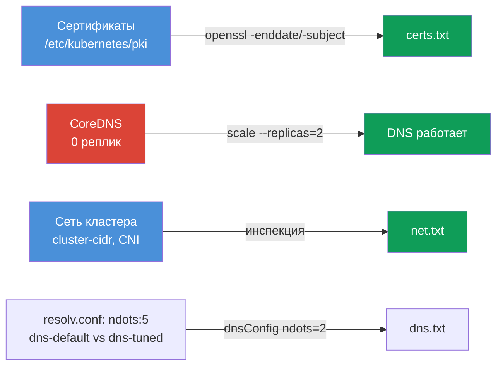

# Lab 118 — Диагностика: сертификаты, CoreDNS и сеть кластера

## Описание

Практическая работа по низкоуровневой диагностике кластера: чтение и проверка
**TLS-сертификатов** control plane (`openssl`, `kubeadm certs`), починка **CoreDNS** и
инспекция **сети/CNI** (Pod CIDR, агент CNI). Часть заданий — в формате «найди и
запиши в отчёт» (как отдельные под-задачи на экзамене), часть — реальная починка.
Работа ведётся `kubectl`-ом и по SSH на control plane.

Отчёты сохраняются на рабочей машине в `/home/ubuntu/answers/`.

## Цель

Закрепить главы курса:

- [Глава 31. Service изнутри, DNS и CoreDNS](../../course/31/ru.md)
- [Глава 39. TLS-сертификаты, kubeconfig и CSR API](../../course/39/ru.md)
- [Глава 40. Интерфейсы расширения: CNI, CSI, CRI](../../course/40/ru.md)
- [Глава 46. Отладка сервисов и сети](../../course/46/ru.md)

## Что мы делаем и зачем

| Задача | Навык | Чему учит |
|--------|-------|-----------|
| **Health-check сертификатов** | `openssl x509`, `kubeadm certs check-expiration` | читать чужие сертификаты кластера, находить срок и CN |
| **Починить CoreDNS** | `kubectl -n kube-system scale/rollout` | диагностика и восстановление DNS кластера |
| **Факты о сети** | `--cluster-cidr`, `calico-node` DaemonSet | понимать Pod CIDR и агент CNI |
| **ndots и resolv.conf** | `cat /etc/resolv.conf`, `dnsConfig.options` | почему `ndots:5` замедляет внешние имена и как понизить порог |



## Инфраструктура

| Компонент  | Описание                                                             |
|------------|----------------------------------------------------------------------|
| `k8s-1`    | Kubernetes `1.35.2` (kubeadm), Calico, **master + 1 worker**; при старте гасит CoreDNS |
| `worker`   | Рабочая машина с `kubectl` и `check_result`; SSH-доступ к control plane |

## Развёртывание

```bash
TASK=118 make run_cka_task
```

## Задания

---
|        **1**        | **Health-check сертификатов**                                |
| :-----------------: | :----------------------------------------------------------- |
| Что делаем          | Читаем сертификаты control plane и сохраняем отчёт в `/home/ubuntu/answers/certs.txt` в формате `apiserver_notafter=<...>` и `ca_cn=<...>` |
| Критерии приёмки    | - `apiserver_notafter` совпадает со сроком из `apiserver.crt`<br>- `ca_cn=kubernetes` |
---
|        **2**        | **Починить CoreDNS**                                        |
| :-----------------: | :----------------------------------------------------------- |
| Что делаем          | Находим, что у CoreDNS 0 реплик, и восстанавливаем DNS |
| Критерии приёмки    | - Deployment `coredns` в `kube-system`: `readyReplicas ≥ 1` |
---
|        **3**        | **Факты о сети кластера**                                    |
| :-----------------: | :----------------------------------------------------------- |
| Что делаем          | Записываем `/home/ubuntu/answers/net.txt` в формате `pod_cidr=<...>` и `cni_daemonset=<...>` |
| Критерии приёмки    | - `pod_cidr` совпадает с `--cluster-cidr` kube-controller-manager<br>- `cni_daemonset=calico-node` |
---
|        **4**        | **Понизить ndots для пода (dnsConfig)**                     |
| :-----------------: | :----------------------------------------------------------- |
| Что делаем          | Создаём под с дефолтным DNS и под с настроенным `ndots`, чтобы увидеть разницу |
| Критерии приёмки    | - Под `dns-default` (image `viktoruj/ping_pong:alpine`) — дефолтный DNS (`ndots:5` в resolv.conf)<br>- Под `dns-tuned` (image `viktoruj/ping_pong:alpine`) с `dnsConfig.options` `ndots=2` |
---
|        **5**        | **Отчёт по ndots**                                          |
| :-----------------: | :----------------------------------------------------------- |
| Что делаем          | Записываем `/home/ubuntu/answers/dns.txt` в формате `default_ndots=<...>` и `tuned_ndots=<...>` |
| Критерии приёмки    | - `default_ndots` совпадает с `ndots` из `/etc/resolv.conf` пода `dns-default`<br>- `tuned_ndots=2` |
---

## Проверка результата

```bash
check_result
```

## Решение

[worker/files/solutions/1.MD](worker/files/solutions/1.MD)

## Покрытие мок-экзаменов

Навыки CKA: работа с сертификатами (домен Cluster Architecture), DNS и сеть
(Services & Networking), диагностика (Troubleshooting).

## Удаление

```bash
TASK=118 make delete_cka_task
```
