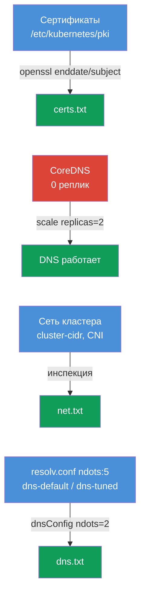

# Lab 118 — Диагностика: сертификаты, CoreDNS и сеть кластера

## Описание

Практическая работа по низкоуровневой диагностике кластера: чтение и проверка
**TLS-сертификатов** control plane (`openssl`, `kubeadm certs`), починка **CoreDNS** и
инспекция **сети/CNI** (Pod CIDR, агент CNI). Часть заданий — в формате «найди и
запиши в отчёт» (как отдельные под-задачи на экзамене), часть — реальная починка.
Работа ведётся `kubectl`-ом и по SSH на control plane. Отчёты сохраняются на рабочей
машине в `/home/ubuntu/answers/`.

Все задания оформлены в экзаменационном стиле (как реальные вопросы CKA) с
автоматической проверкой командой `check_result`.

## Цель

Закрепить материал глав курса:

- [Глава 31. Service изнутри, DNS и CoreDNS](../../course/31/ru.md) — как работает DNS кластера, роль CoreDNS, `ndots` и resolv.conf
- [Глава 39. TLS-сертификаты, kubeconfig и CSR API](../../course/39/ru.md) — чтение сертификатов control plane, срок действия и CN
- [Глава 40. Интерфейсы расширения: CNI, CSI, CRI](../../course/40/ru.md) — CNI, Pod CIDR и агент сети
- [Глава 46. Отладка сервисов и сети](../../course/46/ru.md) — диагностика DNS и сетевой связности

## Что мы делаем и зачем

В этой лабе четыре независимые под-задачи: две — «найди факт и запиши в отчёт», одна —
реальная починка DNS, одна — настройка DNS для Pod. Каждая отрабатывает свой навык:

| Задача | Навык | Чему учит |
|--------|-------|-----------|
| **Health-check сертификатов** | `openssl x509`, `kubeadm certs check-expiration` | читать сертификаты кластера, находить срок и CN (глава 39) |
| **Починить CoreDNS** | `kubectl -n kube-system scale/rollout` | диагностика и восстановление DNS кластера (глава 31) |
| **Факты о сети** | `--cluster-cidr`, `calico-node` DaemonSet | понимать Pod CIDR и агент CNI (глава 40) |
| **ndots и resolv.conf** | `cat /etc/resolv.conf`, `dnsConfig.options` | почему `ndots:5` замедляет внешние имена и как понизить порог (глава 31) |

Итоговая картина того, что будет развёрнуто:



## Инфраструктура

Окружение разворачивается в AWS (`eu-central-1`) через Terragrunt и состоит из:

| Компонент  | Описание                                                             |
|------------|----------------------------------------------------------------------|
| `vpc`      | VPC `10.10.0.0/16` с публичными подсетями                             |
| `ssh-keys` | SSH-ключи для доступа к нодам                                         |
| `k8s-1`    | Kubernetes `1.35.2` (kubeadm), Calico, **master + 1 worker**; при старте гасит CoreDNS |
| `worker`   | Рабочая машина с `kubectl` и `check_result`; SSH-доступ к control plane |

Инстансы: `t3.medium` Ubuntu `22.04`. Кластер двухнодовый — master (control-plane) и
один worker.

## Развёртывание

```bash
TASK=118 make run_cka_task
```

После создания подключитесь к рабочей машине (worker) по SSH и выполняйте задания
оттуда. `kubectl` уже настроен на контекст `cluster1-admin@cluster1`. Часть заданий
требует SSH на control plane (`ssh k8s1_controlPlane_1`) — там лежат сертификаты в
`/etc/kubernetes/pki/` и манифесты компонентов.

Полезные команды на рабочей машине:

```bash
time_left       # сколько осталось времени
check_result    # проверить решение
```

## Задания

---
|        **1**        | **Health-check сертификатов**                                |
| :-----------------: | :----------------------------------------------------------- |
| Что делаем          | По SSH на control plane читаем сертификаты в `/etc/kubernetes/pki/`: `openssl x509 -in apiserver.crt -noout -enddate` (срок действия API-сервера) и `openssl x509 -in ca.crt -noout -subject` (CN центра сертификации). На рабочей машине записываем отчёт `/home/ubuntu/answers/certs.txt` в формате `apiserver_notafter=<...>` (значение ровно строкой после `notAfter=`) и `ca_cn=<...>`. |
| Критерии приёмки    | - `apiserver_notafter` совпадает со сроком `notAfter` из `apiserver.crt`;<br/>- `ca_cn=kubernetes`. |
---
|        **2**        | **Починить CoreDNS**                                        |
| :-----------------: | :----------------------------------------------------------- |
| Что делаем          | DNS в кластере не работает: у Deployment `coredns` в `kube-system` обнулены реплики (0). Восстанавливаем — `kubectl -n kube-system scale deployment coredns --replicas=2` и дожидаемся `rollout status`. Резолвинг можно проверить временным Pod с `nslookup kubernetes.default`. |
| Критерии приёмки    | - Deployment `coredns` в `kube-system`: `readyReplicas ≥ 1`. |
---
|        **3**        | **Факты о сети кластера**                                    |
| :-----------------: | :----------------------------------------------------------- |
| Что делаем          | Узнаём Pod CIDR (флаг `--cluster-cidr` у kube-controller-manager в манифесте `/etc/kubernetes/manifests/kube-controller-manager.yaml` на control plane) и имя DaemonSet агента CNI в `kube-system` (`calico-node`). Записываем `/home/ubuntu/answers/net.txt` в формате `pod_cidr=<...>` и `cni_daemonset=<...>`. |
| Критерии приёмки    | - `pod_cidr` совпадает с `--cluster-cidr` kube-controller-manager;<br/>- `cni_daemonset=calico-node`. |
---
|        **4**        | **Понизить ndots для Pod (dnsConfig)**                     |
| :-----------------: | :----------------------------------------------------------- |
| Что делаем          | kubelet прописывает Pods `options ndots:5` — для внешних имён это лишние запросы с search-суффиксами. Создаём Pod `dns-default` (образ `viktoruj/ping_pong:alpine`) с дефолтным DNS и Pod `dns-tuned` (тот же образ) с `dnsConfig.options` `ndots=2` (декларативно — `--dry-run` не умеет dnsConfig). Сравниваем `/etc/resolv.conf` обоих. |
| Критерии приёмки    | - Pod `dns-default` (образ `viktoruj/ping_pong:alpine`) в Running, дефолтный DNS (`ndots:5` в resolv.conf);<br/>- Pod `dns-tuned` (образ `viktoruj/ping_pong:alpine`) с `dnsConfig.options` `ndots=2`. |
---
|        **5**        | **Отчёт по ndots**                                          |
| :-----------------: | :----------------------------------------------------------- |
| Что делаем          | Читаем значение `ndots` из `/etc/resolv.conf` Pod `dns-default` (`kubectl exec dns-default -- cat /etc/resolv.conf`) и записываем `/home/ubuntu/answers/dns.txt` в формате `default_ndots=<...>` и `tuned_ndots=<...>`. |
| Критерии приёмки    | - `default_ndots` совпадает с `ndots` из `/etc/resolv.conf` Pod `dns-default`;<br/>- `tuned_ndots=2`. |
---

## Проверка результата

На рабочей машине запустите автоматическую проверку:

```bash
check_result
```

Скрипт прогонит тесты и покажет, сколько заданий выполнено.

## Решение

Эталонное решение: [worker/files/solutions/1.MD](worker/files/solutions/1.MD)

## Покрытие мок-экзаменов

Лаба отрабатывает навыки CKA: работа с сертификатами (домен Cluster Architecture), DNS
и сеть (Services & Networking), диагностика (Troubleshooting).

## Удаление кластера и ресурсов

```bash
TASK=118 make delete_cka_task
```
