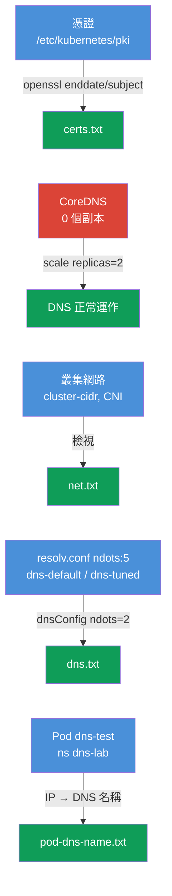

[Русская версия](README_RU.MD) · [Eng version](README.MD) · [Versión en español](README_ES.MD) · [Version française](README_FR.MD) · [Deutsche Version](README_DE.MD) · [ქართული ვერსია](README_GE.MD) · [日本語版](README_JP.MD)

# Lab 118 - 疑難排解:憑證、CoreDNS 與叢集網路

## 說明

一個關於叢集底層疑難排解的實作練習:讀取並檢查 control plane 的
**TLS 憑證**(`openssl`、`kubeadm certs`)、修復 **CoreDNS**,以及
檢視**網路/CNI**(Pod CIDR、CNI 代理程式)。部分任務採用「找出事實並
寫進報告」的形式(就像考試中獨立的子題),另一部分則是真正的修復。
工作透過 `kubectl` 以及 SSH 連上 control plane 完成。報告儲存在工作機
的 `/home/ubuntu/answers/`。

所有任務都以考試風格撰寫(就像真正的 CKA 題目),並透過
`check_result` 指令自動驗證。

## 目標

鞏固以下課程章節的內容:

- [第 31 章。Service 內部原理、DNS 與 CoreDNS](../../course/31/README.md) - 叢集 DNS 如何運作、CoreDNS 的角色、`ndots` 與 resolv.conf
- [第 39 章。TLS 憑證、kubeconfig 與 CSR API](../../course/39/README.md) - 讀取 control plane 憑證、有效期限與 CN
- [第 40 章。擴充介面:CNI、CSI、CRI](../../course/40/README.md) - CNI、Pod CIDR 與網路代理程式
- [第 46 章。除錯 Service 與網路](../../course/46/README.md) - DNS 與網路連通性的診斷

## 我們要做什麼,以及為什麼

這個實驗有四個獨立的子任務:兩個是「找出事實並寫進報告」,一個是真正的
DNS 修復,一個是為 Pod 調整 DNS。每一個都在練習不同的技能:

| 任務 | 技能 | 學到什麼 |
|--------|-------|-----------|
| **憑證健康檢查** | `openssl x509`、`kubeadm certs check-expiration` | 讀取叢集憑證,找出有效期限與 CN(第 39 章) |
| **修復 CoreDNS** | `kubectl -n kube-system scale/rollout` | 診斷並復原叢集 DNS(第 31 章) |
| **網路相關事實** | `--cluster-cidr`、`calico-node` DaemonSet | 理解 Pod CIDR 與 CNI 代理程式(第 40 章) |
| **ndots 與 resolv.conf** | `cat /etc/resolv.conf`、`dnsConfig.options` | 為什麼 `ndots:5` 會拖慢外部名稱的解析,以及如何降低門檻(第 31 章) |
| **Pod 的 DNS 名稱** | `kubectl get pod -o wide` + DNS 公式 | 理解 Pod 的 A 記錄(第 31 章) |

最終部署出來的整體樣貌:



## 基礎架構

環境透過 Terragrunt 部署在 AWS(`eu-central-1`),由以下部分組成:

| 元件       | 說明                                                                 |
|------------|----------------------------------------------------------------------|
| `vpc`      | VPC `10.10.0.0/16`,含公有子網路                                       |
| `ssh-keys` | 用於存取節點的 SSH 金鑰                                                |
| `k8s-1`    | Kubernetes `1.35.2`(kubeadm),Calico,**master + 1 個 worker**;啟動時會把 CoreDNS 關掉 |
| `worker`   | 工作機,具備 `kubectl` 與 `check_result`;可 SSH 連上 control plane      |

執行個體:`t4g.medium`,Ubuntu `22.04`。叢集有兩個節點 - master(control-plane)
與一個 worker。

## 部署

```bash
TASK=118 make run_cka_task
```

建立完成後,請透過 SSH 連線到工作機(worker),並在那裡完成任務。
`kubectl` 已經指向 `cluster1-admin@cluster1` context。部分任務
需要 SSH 連上 control plane(`ssh k8s1_controlPlane_1`)- 憑證就放在
`/etc/kubernetes/pki/`,元件的 manifest 也在那裡。

工作機上的實用指令:

```bash
time_left       # 還剩多少時間
check_result    # 檢查解答
```

## 任務

---
|        **1**        | **憑證健康檢查**                                              |
| :-----------------: | :----------------------------------------------------------- |
| 要做什麼            | 透過 SSH 連上 control plane,讀取 `/etc/kubernetes/pki/` 中的憑證:`openssl x509 -in apiserver.crt -noout -enddate`(API 伺服器的有效期限)與 `openssl x509 -in ca.crt -noout -subject`(憑證授權中心的 CN)。在工作機上把報告寫到 `/home/ubuntu/answers/certs.txt`,格式為 `apiserver_notafter=<...>`(值就是 `notAfter=` 之後那整串字串)與 `ca_cn=<...>`。 |
| 驗收標準            | - `apiserver_notafter` 與 `apiserver.crt` 中的 `notAfter` 期限一致;<br/>- `ca_cn=kubernetes`。 |
---
|        **2**        | **修復 CoreDNS**                                            |
| :-----------------: | :----------------------------------------------------------- |
| 要做什麼            | 叢集中的 DNS 無法運作:`kube-system` 裡的 Deployment `coredns` 副本數被歸零(0)。把它復原 - `kubectl -n kube-system scale deployment coredns --replicas=2`,並等待 `rollout status`。可以用一個臨時 Pod 執行 `nslookup kubernetes.default` 來驗證解析。 |
| 驗收標準            | - `kube-system` 中的 Deployment `coredns`:`readyReplicas ≥ 1`。 |
---
|        **3**        | **叢集網路相關事實**                                          |
| :-----------------: | :----------------------------------------------------------- |
| 要做什麼            | 找出 Pod CIDR(control plane 上 manifest `/etc/kubernetes/manifests/kube-controller-manager.yaml` 中 kube-controller-manager 的 `--cluster-cidr` 旗標)以及 `kube-system` 中 CNI 代理程式 DaemonSet 的名稱(`calico-node`)。把 `/home/ubuntu/answers/net.txt` 寫成 `pod_cidr=<...>` 與 `cni_daemonset=<...>` 的格式。 |
| 驗收標準            | - `pod_cidr` 與 kube-controller-manager 的 `--cluster-cidr` 一致;<br/>- `cni_daemonset=calico-node`。 |
---
|        **4**        | **為 Pod 降低 ndots(dnsConfig)**                          |
| :-----------------: | :----------------------------------------------------------- |
| 要做什麼            | kubelet 會為 Pods 寫入 `options ndots:5` - 對外部名稱來說,這代表多出一堆帶 search 後綴的查詢。建立 Pod `dns-default`(映像 `viktoruj/ping_pong:alpine`)使用預設 DNS,以及 Pod `dns-tuned`(同一個映像)並設定 `dnsConfig.options` 的 `ndots=2`(用宣告式方式 - `--dry-run` 不支援 dnsConfig)。比較兩者的 `/etc/resolv.conf`。 |
| 驗收標準            | - Pod `dns-default`(映像 `viktoruj/ping_pong:alpine`)處於 Running,使用預設 DNS(resolv.conf 中為 `ndots:5`);<br/>- Pod `dns-tuned`(映像 `viktoruj/ping_pong:alpine`)帶有 `dnsConfig.options` 的 `ndots=2`。 |
---
|        **5**        | **ndots 報告**                                              |
| :-----------------: | :----------------------------------------------------------- |
| 要做什麼            | 讀取 Pod `dns-default` 的 `/etc/resolv.conf` 中 `ndots` 的值(`kubectl exec dns-default -- cat /etc/resolv.conf`),並把 `/home/ubuntu/answers/dns.txt` 寫成 `default_ndots=<...>` 與 `tuned_ndots=<...>` 的格式。 |
| 驗收標準            | - `default_ndots` 與 Pod `dns-default` 的 `/etc/resolv.conf` 中的 `ndots` 一致;<br/>- `tuned_ndots=2`。 |
---
|        **6**        | **找出 Pod 的 DNS 名稱**                                     |
| :-----------------: | :----------------------------------------------------------- |
| 要做什麼            | Pod `dns-test`(namespace `dns-lab`)在叢集啟動時就已執行。找出它的 IP(`kubectl get pod dns-test -n dns-lab -o wide`),並依公式組出 Pod 的完整 DNS 名稱:`<把點換成連字號的-ip>.<namespace>.pod.cluster.local`(例如 IP `10.0.1.5` → `10-0-1-5.dns-lab.pod.cluster.local`)。從任一個 Pod 驗證解析(`nslookup <dns-名稱>`),並把 Pod 的 DNS 名稱寫入檔案 `/home/ubuntu/answers/pod-dns-name.txt`。 |
| 驗收標準            | - 檔案 `/home/ubuntu/answers/pod-dns-name.txt` 含有 Pod `dns-test` 正確的 DNS 名稱,格式為 `<ip-dashed>.dns-lab.pod.cluster.local`。 |
---

## 檢查結果

在工作機上執行自動檢查:

```bash
check_result
```

腳本會跑完測試,並顯示已完成多少任務。

## 解答

參考解答:[worker/files/solutions/1_TW.MD](worker/files/solutions/1_TW.MD)

## 模擬考涵蓋範圍

本實驗練習的是 CKA 技能:憑證操作(Cluster Architecture 領域)、DNS
與網路(Services & Networking)、疑難排解(Troubleshooting)。

## 刪除叢集與資源

```bash
TASK=118 make delete_cka_task
```
