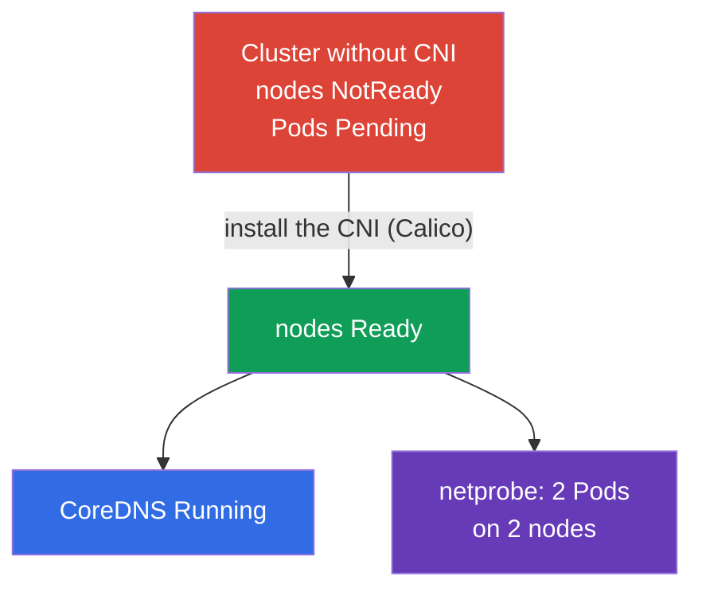

[Русская версия](README_RU.MD) · [Versión en español](README_ES.MD) · [Version française](README_FR.MD) · [Deutsche Version](README_DE.MD) · [ქართული ვერსია](README_GE.MD)

# Lab 123 — Low-Level Networking: Installing a CNI from Scratch

## Description

The cluster is deployed **without a CNI** — there is no network plugin, so all nodes are
`NotReady`, Pods do not start and CoreDNS never comes up. Your task is to install the CNI
**by hand** (just like on a real kubeadm cluster) and make sure Pod networking works,
including across nodes. On top of that — dig into the node's low-level networking
(CNI config, routes, network namespaces, veth) and fill in a report.

All tasks are written in exam style (like real CKA questions) with automatic validation via
the `check_result` command. The difference from lab 118: there the network is already
installed and you inspect/fix it, here you **install the CNI from scratch** — the mandatory
step after `kubeadm init`.

## Goal

Reinforce the material from the course chapters:

- [Chapter 30. Kubernetes network model, Pod networking and CNI](../../course/30/ru.md) — the flat Pod network, network model requirements, the role of the CNI
- [Chapter 40. Extension interfaces: CNI, CSI, CRI](../../course/40/ru.md) — what a CNI plugin is and how it plugs into the kubelet
- [Chapter 46. Debugging services and networking](../../course/46/ru.md) — node network diagnostics: routes, network namespaces, veth

## What We Do and Why

In this lab we bring up Pod networking on a "bare" cluster and take apart how the node's
low-level networking is put together. Every step covers its own skill:

| Task | Skill | What it teaches |
|------|-------|-----------------|
| **Install the CNI by hand** | `kubectl apply` of a CNI manifest | the "Pod network add-on" step of a kubeadm installation |
| **Verify Pod networking** | CoreDNS + cross-node Pods | what the CNI gives you: a flat network, Pod-to-Pod connectivity across nodes |
| **Dig into low-level networking** | `ip route`, `ip netns`, `nsenter`, veth, `/etc/cni/net.d` | how a Pod is attached to the node network |

The final picture of what will be deployed:



## Infrastructure

The environment is deployed in AWS (`eu-central-1`) via Terragrunt and consists of:

| Component  | Description                                                          |
|------------|----------------------------------------------------------------------|
| `vpc`      | VPC `10.10.0.0/16` with public subnets                                |
| `ssh-keys` | SSH keys for node access                                             |
| `k8s-1`    | Kubernetes `1.35.2` (kubeadm), **WITHOUT a CNI**, master + 1 worker node; `netprobe` is deployed in advance (Pods stay `Pending` until the CNI is installed) |
| `worker`   | Work machine with `kubectl` and `check_result`; SSH access to the cluster nodes |

Instances: `t3.medium`, Ubuntu `22.04`. The cluster has two nodes — the master
(control plane) and one worker; no CNI is installed, so the nodes start in NotReady.

## Deployment

```bash
TASK=123 make run_cka_task
```

Once it is created, connect to the work machine (worker) over SSH and do the tasks from
there. `kubectl` is already pointed at the `cluster1-admin@cluster1` context. To install the
CNI and explore low-level networking, connect to the cluster nodes: `ssh k8s1_controlPlane_1`
(control plane) and `ssh k8s1_node_node_1` (worker node).

Handy commands on the work machine:

```bash
time_left       # how much time is left
check_result    # check your solution
```

## Tasks

---
|        **1**        | **Install a CNI from scratch**                               |
| :-----------------: | :----------------------------------------------------------- |
| What to do          | Install the network plugin (Calico) manually — this is the official kubeadm step "Installing a Pod network add-on". Apply the manifest with `kubectl apply -f <URL>`, picking a Calico version compatible with Kubernetes `1.35`. Wait until the `calico-node` Pods in `kube-system` come up and all cluster nodes move from `NotReady` to `Ready`. |
| Acceptance criteria | - all cluster nodes (≥ 2) are in the `Ready` state. |
---
|        **2**        | **Verify CoreDNS**                                           |
| :-----------------: | :----------------------------------------------------------- |
| What to do          | Make sure that `CoreDNS` came up after the CNI was installed — until Pod networking existed, its Pods hung in `Pending`. Wait until the `coredns` Deployment in namespace `kube-system` has at least one ready replica. |
| Acceptance criteria | - Deployment `coredns` in namespace `kube-system`: `readyReplicas ≥ 1`. |
---
|        **3**        | **Verify cross-node networking**                             |
| :-----------------: | :----------------------------------------------------------- |
| What to do          | In namespace `netlab` a Deployment `netprobe` (label `app=netprobe`) is deployed in advance; it was stuck in `Pending` without a CNI. Make sure that after the plugin is installed both of its replicas became `Running` and spread across **two different** nodes — this confirms a working flat Pod-to-Pod network between nodes. |
| Acceptance criteria | - Deployment `netprobe` (namespace `netlab`): 2 ready replicas on 2 different nodes. |
---
|        **4**        | **Low-level networking report**                              |
| :-----------------: | :----------------------------------------------------------- |
| What to do          | Connect to the control-plane node (`ssh k8s1_controlPlane_1`), find out the name of the CNI configuration file in `/etc/cni/net.d` (e.g. `10-calico.conflist`) and the default route device (`ip route show default` → the value after `dev`, e.g. `ens5`). Write both facts into the file `/home/ubuntu/answers/net-lowlevel.txt` in the format `cni_conf=<file>` and `default_route_dev=<interface>`. |
| Acceptance criteria | - `cni_conf` is an existing file in `/etc/cni/net.d` on the control-plane node;<br/>- `default_route_dev` matches the default route device (from `ip route`). |
---

## Checking the Result

On the work machine run the automatic validation:

```bash
check_result
```

The script runs the tests and shows how many tasks are complete.

## Solution

Reference solution: [worker/files/solutions/1.MD](worker/files/solutions/1.MD)

## Mock Exam Coverage

The Services & Networking domain plus cluster installation (Cluster Architecture):
installing the network plugin is a mandatory step after `kubeadm init`.

## Deleting the Cluster and Resources

```bash
TASK=123 make delete_cka_task
```
