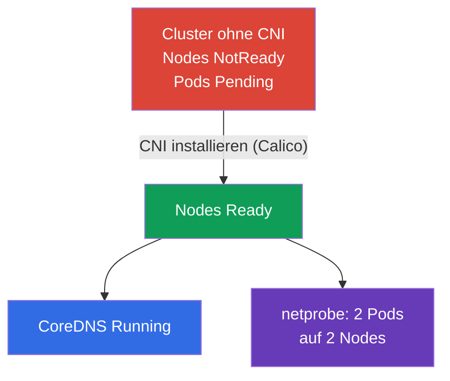

[Русская версия](README_RU.MD) · [Eng version](README.MD) · [Versión en español](README_ES.MD) · [Version française](README_FR.MD) · [ქართული ვერსია](README_GE.MD) · [繁體中文版](README_TW.MD) · [日本語版](README_JP.MD)

# Lab 123 — Netzwerk auf niedriger Ebene: CNI von Null installieren

## Beschreibung

Der Cluster wird **ohne CNI** ausgerollt — es gibt kein Netzwerk-Plugin, daher sind alle Nodes
`NotReady`, Pods starten nicht und CoreDNS kommt nicht hoch. Deine Aufgabe: das CNI **von Hand**
installieren (wie auf einem echten kubeadm-Cluster) und sicherstellen, dass das Pod-Netzwerk
funktioniert, auch node-übergreifend. Zusätzlich — das Netzwerk der Node auf niedriger Ebene
analysieren (CNI-Konfiguration, Routen, Network Namespaces, veth) und einen Report ausfüllen.

Alle Aufgaben sind im Prüfungsstil formuliert (wie echte CKA-Fragen) mit automatischer Prüfung
über den Befehl `check_result`. Der Unterschied zum Lab 118: dort ist das Netzwerk bereits
installiert und du inspizierst bzw. reparierst es, hier **installierst du das CNI von Null** —
der verpflichtende Schritt nach `kubeadm init`.

## Ziel

Den Stoff der Kurskapitel festigen:

- [Kapitel 30. Kubernetes-Netzwerkmodell, Pod-Netzwerk und CNI](../../course/30/de.md) — flaches Pod-Netzwerk, Anforderungen des Netzwerkmodells, Rolle des CNI
- [Kapitel 40. Erweiterungsschnittstellen: CNI, CSI, CRI](../../course/40/de.md) — was ein CNI-Plugin ist und wie es an das kubelet angebunden wird
- [Kapitel 46. Debugging von Services und Netzwerk](../../course/46/de.md) — Netzwerkdiagnose der Node: Routen, Network Namespaces, veth

## Was wir tun und warum

In diesem Lab bringen wir das Pod-Netzwerk auf einem „nackten“ Cluster hoch und sehen uns an,
wie das Netzwerk der Node auf niedriger Ebene aufgebaut ist. Jeder Schritt deckt eine eigene
Fähigkeit ab:

| Aufgabe | Fähigkeit | Was sie lehrt |
|---------|-----------|---------------|
| **CNI von Hand installieren** | `kubectl apply` des CNI-Manifests | der Schritt „Pod network add-on“ der kubeadm-Installation |
| **Pod-Netzwerk prüfen** | CoreDNS + Pods auf verschiedenen Nodes | was das CNI bringt: flaches Netzwerk, Pod-Pod-Verbindung zwischen Nodes |
| **Netzwerk auf niedriger Ebene analysieren** | `ip route`, `ip netns`, `nsenter`, veth, `/etc/cni/net.d` | wie ein Pod an das Netzwerk der Node angebunden wird |

Das Gesamtbild dessen, was bereitgestellt wird:



## Infrastruktur

Die Umgebung wird in AWS (`eu-central-1`) über Terragrunt ausgerollt und besteht aus:

| Komponente | Beschreibung                                                         |
|------------|----------------------------------------------------------------------|
| `vpc`      | VPC `10.10.0.0/16` mit öffentlichen Subnetzen                         |
| `ssh-keys` | SSH-Schlüssel für den Zugriff auf die Nodes                           |
| `k8s-1`    | Kubernetes `1.35.2` (kubeadm), **OHNE CNI**, Master + 1 Worker-Node; `netprobe` ist vorab ausgerollt (Pods bleiben `Pending`, bis das CNI installiert ist) |
| `worker`   | Arbeitsmaschine mit `kubectl` und `check_result`; SSH-Zugriff auf die Cluster-Nodes |

Instanzen: `t3.medium` Ubuntu `22.04`. Der Cluster hat zwei Nodes — Master (Control Plane) und
einen Worker; das CNI ist nicht installiert, deshalb starten die Nodes in NotReady.

## Bereitstellung

```bash
TASK=123 make run_cka_task
```

Verbinde dich nach der Erstellung per SSH mit der Arbeitsmaschine (worker) und erledige die
Aufgaben von dort. `kubectl` ist bereits auf den Kontext `cluster1-admin@cluster1` eingestellt.
Für die CNI-Installation und die Analyse des Netzwerks auf niedriger Ebene verbinde dich mit den
Cluster-Nodes: `ssh k8s1_controlPlane_1` (Control Plane) und `ssh k8s1_node_node_1`
(Worker-Node).

Nützliche Befehle auf der Arbeitsmaschine:

```bash
time_left       # wie viel Zeit noch bleibt
check_result    # Lösung prüfen
```

## Aufgaben

---
|        **1**        | **CNI von Null installieren**                                |
| :-----------------: | :----------------------------------------------------------- |
| Was wir tun         | Installiere das Netzwerk-Plugin (Calico) manuell — das ist der offizielle kubeadm-Schritt „Installing a Pod network add-on“. Wende das Manifest mit `kubectl apply -f <URL>` an und wähle eine Calico-Version, die mit Kubernetes `1.35` kompatibel ist. Warte, bis die `calico-node`-Pods in `kube-system` hochkommen und alle Cluster-Nodes von `NotReady` nach `Ready` wechseln. |
| Abnahmekriterien    | - alle Cluster-Nodes (≥ 2) sind im Status `Ready`. |
---
|        **2**        | **CoreDNS prüfen**                                           |
| :-----------------: | :----------------------------------------------------------- |
| Was wir tun         | Stelle sicher, dass `CoreDNS` nach der CNI-Installation hochgekommen ist — solange es kein Pod-Netzwerk gab, hingen seine Pods in `Pending`. Warte, bis das Deployment `coredns` im Namespace `kube-system` mindestens eine bereite Replica hat. |
| Abnahmekriterien    | - Deployment `coredns` im Namespace `kube-system`: `readyReplicas ≥ 1`. |
---
|        **3**        | **Netzwerk zwischen Nodes prüfen**                           |
| :-----------------: | :----------------------------------------------------------- |
| Was wir tun         | Im Namespace `netlab` ist vorab das Deployment `netprobe` (Label `app=netprobe`) ausgerollt, das ohne CNI in `Pending` hing. Stelle sicher, dass nach der Plugin-Installation beide Replicas `Running` sind und sich auf **zwei unterschiedliche** Nodes verteilt haben — das bestätigt das funktionierende flache Pod-Pod-Netzwerk zwischen Nodes. |
| Abnahmekriterien    | - Deployment `netprobe` (Namespace `netlab`): 2 bereite (ready) Replicas auf 2 unterschiedlichen Nodes. |
---
|        **4**        | **Report zum Netzwerk auf niedriger Ebene**                  |
| :-----------------: | :----------------------------------------------------------- |
| Was wir tun         | Verbinde dich mit der Control-Plane-Node (`ssh k8s1_controlPlane_1`), ermittle den Namen der CNI-Konfigurationsdatei in `/etc/cni/net.d` (z. B. `10-calico.conflist`) und das Gerät der Default-Route (`ip route show default` → der Wert nach `dev`, z. B. `ens5`). Schreibe beide Fakten in die Datei `/home/ubuntu/answers/net-lowlevel.txt` im Format `cni_conf=<Datei>` und `default_route_dev=<Interface>`. |
| Abnahmekriterien    | - `cni_conf` ist eine existierende Datei in `/etc/cni/net.d` auf der Control-Plane-Node;<br/>- `default_route_dev` stimmt mit dem Gerät der Default-Route überein (aus `ip route`). |
---

## Ergebnisprüfung

Starte auf der Arbeitsmaschine die automatische Prüfung:

```bash
check_result
```

Das Skript führt die Tests aus und zeigt, wie viele Aufgaben erledigt sind.

## Lösung

Referenzlösung: [worker/files/solutions/1_DE.MD](worker/files/solutions/1_DE.MD)

## Abdeckung der Mock-Prüfungen

Domäne Services & Networking plus Cluster-Installation (Cluster Architecture): die Installation
des Netzwerk-Plugins ist ein verpflichtender Schritt nach `kubeadm init`.

## Löschen von Cluster und Ressourcen

```bash
TASK=123 make delete_cka_task
```
