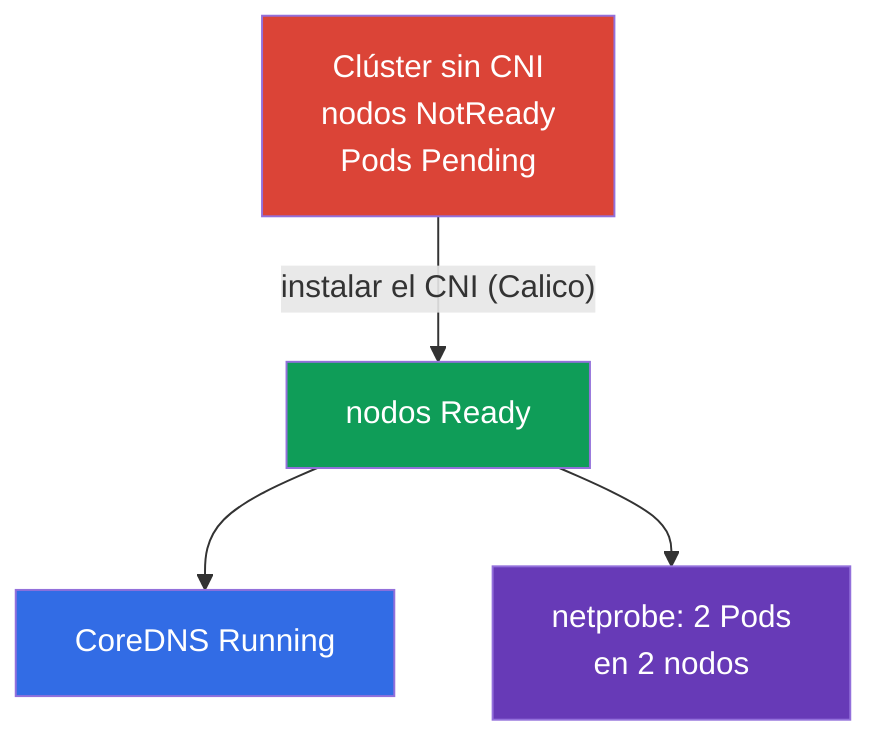

[Русская версия](README_RU.MD) · [Eng version](README.MD) · [Version française](README_FR.MD) · [Deutsche Version](README_DE.MD) · [ქართული ვერსია](README_GE.MD) · [繁體中文版](README_TW.MD) · [日本語版](README_JP.MD)

# Lab 123 — Red de bajo nivel: instalación del CNI desde cero

## Descripción

El clúster se despliega **sin CNI** — no hay plugin de red, por eso todos los nodos están en
`NotReady`, los Pods no arrancan y CoreDNS no se levanta. Tu tarea es instalar el CNI
**a mano** (como en un clúster kubeadm real) y comprobar que la red de Pods funciona,
incluida la comunicación entre nodos. Además, analizarás la red de bajo nivel del nodo
(configuración del CNI, rutas, network namespaces, veth) y rellenarás un informe.

Todas las tareas están redactadas en estilo de examen (como preguntas reales de CKA) con
comprobación automática mediante el comando `check_result`. La diferencia con el laboratorio
118: allí la red ya está instalada y tú la inspeccionas o la arreglas, aquí **instalas el CNI
desde cero** — el paso obligatorio después de `kubeadm init`.

## Objetivo

Consolidar el material de los capítulos del curso:

- [Capítulo 30. Modelo de red de Kubernetes, red de pods y CNI](../../course/30/es.md) — red plana de Pods, requisitos del modelo de red, papel del CNI
- [Capítulo 40. Interfaces de extensión: CNI, CSI, CRI](../../course/40/es.md) — qué es un plugin CNI y cómo se conecta al kubelet
- [Capítulo 46. Depuración de servicios y de la red](../../course/46/es.md) — diagnóstico de la red del nodo: rutas, network namespaces, veth

## Qué hacemos y para qué

En este laboratorio levantamos la red de Pods en un clúster «desnudo» y analizamos cómo está
construida la red de bajo nivel del nodo. Cada paso cubre su propia habilidad:

| Tarea | Habilidad | Qué enseña |
|-------|-----------|------------|
| **Instalar el CNI a mano** | `kubectl apply` del manifiesto del CNI | el paso «Pod network add-on» de la instalación con kubeadm |
| **Comprobar la red de Pods** | CoreDNS + Pods en distintos nodos | qué aporta el CNI: red plana, conectividad Pod-Pod entre nodos |
| **Analizar la red de bajo nivel** | `ip route`, `ip netns`, `nsenter`, veth, `/etc/cni/net.d` | cómo se conecta un Pod a la red del nodo |

Imagen final de lo que se despliega:



## Infraestructura

El entorno se despliega en AWS (`eu-central-1`) mediante Terragrunt y consta de:

| Componente | Descripción                                                          |
|------------|----------------------------------------------------------------------|
| `vpc`      | VPC `10.10.0.0/16` con subredes públicas                              |
| `ssh-keys` | Claves SSH para acceder a los nodos                                   |
| `k8s-1`    | Kubernetes `1.35.2` (kubeadm), **SIN CNI**, master + 1 nodo worker; `netprobe` está desplegado de antemano (los Pods quedan en `Pending` hasta instalar el CNI) |
| `worker`   | Máquina de trabajo con `kubectl` y `check_result`; acceso SSH a los nodos del clúster |

Instancias: `t3.medium` Ubuntu `22.04`. El clúster tiene dos nodos — master (control plane) y
un worker; el CNI no está instalado, por eso los nodos arrancan en NotReady.

## Despliegue

```bash
TASK=123 make run_cka_task
```

Tras la creación, conéctate a la máquina de trabajo (worker) por SSH y realiza las tareas
desde allí. `kubectl` ya está configurado con el contexto `cluster1-admin@cluster1`. Para
instalar el CNI y analizar la red de bajo nivel, conéctate a los nodos del clúster:
`ssh k8s1_controlPlane_1` (control plane) y `ssh k8s1_node_node_1` (nodo worker).

Comandos útiles en la máquina de trabajo:

```bash
time_left       # cuánto tiempo queda
check_result    # comprobar la solución
```

## Tareas

---
|        **1**        | **Instalar el CNI desde cero**                               |
| :-----------------: | :----------------------------------------------------------- |
| Qué hacemos         | Instala el plugin de red (Calico) manualmente — es el paso oficial de kubeadm «Installing a Pod network add-on». Aplica el manifiesto con `kubectl apply -f <URL>`, eligiendo una versión de Calico compatible con Kubernetes `1.35`. Espera hasta que los Pods `calico-node` en `kube-system` se levanten y todos los nodos del clúster pasen de `NotReady` a `Ready`. |
| Criterios de aceptación | - todos los nodos del clúster (≥ 2) están en estado `Ready`. |
---
|        **2**        | **Comprobar CoreDNS**                                        |
| :-----------------: | :----------------------------------------------------------- |
| Qué hacemos         | Asegúrate de que tras instalar el CNI se levantó `CoreDNS` — mientras no había red de Pods, sus Pods estaban en `Pending`. Espera hasta que el Deployment `coredns` del namespace `kube-system` tenga al menos una réplica lista. |
| Criterios de aceptación | - Deployment `coredns` en el namespace `kube-system`: `readyReplicas ≥ 1`. |
---
|        **3**        | **Comprobar la red entre nodos**                             |
| :-----------------: | :----------------------------------------------------------- |
| Qué hacemos         | En el namespace `netlab` está desplegado de antemano el Deployment `netprobe` (label `app=netprobe`), que estaba en `Pending` sin CNI. Asegúrate de que tras instalar el plugin sus dos réplicas pasaron a `Running` y se repartieron en **dos nodos distintos** — eso confirma que la red plana Pod-Pod entre nodos funciona. |
| Criterios de aceptación | - Deployment `netprobe` (namespace `netlab`): 2 réplicas listas (ready) en 2 nodos distintos. |
---
|        **4**        | **Informe sobre la red de bajo nivel**                       |
| :-----------------: | :----------------------------------------------------------- |
| Qué hacemos         | Conéctate al nodo control-plane (`ssh k8s1_controlPlane_1`), averigua el nombre del fichero de configuración del CNI en `/etc/cni/net.d` (p. ej. `10-calico.conflist`) y el dispositivo de la ruta por defecto (`ip route show default` → el valor tras `dev`, p. ej. `ens5`). Escribe ambos datos en el fichero `/home/ubuntu/answers/net-lowlevel.txt` con el formato `cni_conf=<fichero>` y `default_route_dev=<interfaz>`. |
| Criterios de aceptación | - `cni_conf` es un fichero existente en `/etc/cni/net.d` del nodo control-plane;<br/>- `default_route_dev` coincide con el dispositivo de la ruta por defecto (de `ip route`). |
---

## Comprobación del resultado

En la máquina de trabajo ejecuta la comprobación automática:

```bash
check_result
```

El script lanzará las pruebas y mostrará cuántas tareas están completadas.

## Solución

Solución de referencia: [worker/files/solutions/1_ES.MD](worker/files/solutions/1_ES.MD)

## Cobertura de exámenes simulados

Dominio Services & Networking más la instalación del clúster (Cluster Architecture): la
instalación del plugin de red es un paso obligatorio después de `kubeadm init`.

## Eliminación del clúster y los recursos

```bash
TASK=123 make delete_cka_task
```
