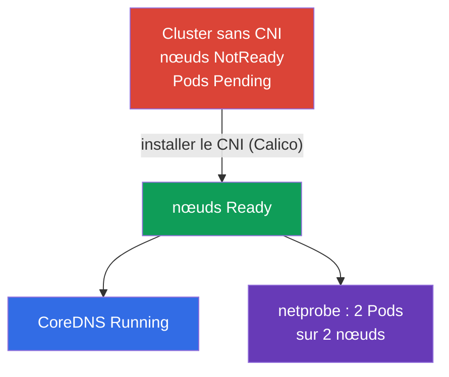

[Русская версия](README_RU.MD) · [Eng version](README.MD) · [Versión en español](README_ES.MD) · [Deutsche Version](README_DE.MD) · [ქართული ვერსია](README_GE.MD) · [繁體中文版](README_TW.MD) · [日本語版](README_JP.MD)

# Lab 123 — Réseau bas niveau : installation du CNI depuis zéro

## Description

Le cluster est déployé **sans CNI** — il n'y a pas de plugin réseau, donc tous les nœuds sont
`NotReady`, les Pods ne démarrent pas et CoreDNS ne se lance pas. Votre tâche est d'installer
le CNI **à la main** (comme sur un vrai cluster kubeadm) et de vérifier que le réseau des Pods
fonctionne, y compris entre les nœuds. En complément — analyser le réseau bas niveau du nœud
(configuration CNI, routes, network namespaces, veth) et remplir un rapport.

Toutes les tâches sont rédigées dans le style de l'examen (comme de vraies questions CKA) avec
une vérification automatique via la commande `check_result`. Différence avec le lab 118 : là le
réseau est déjà installé et vous l'inspectez ou le réparez, ici vous **installez le CNI depuis
zéro** — l'étape obligatoire après `kubeadm init`.

## Objectif

Consolider le contenu des chapitres du cours :

- [Chapitre 30. Modèle réseau de Kubernetes, réseau des pods et CNI](../../course/30/fr.md) — réseau plat des Pods, exigences du modèle réseau, rôle du CNI
- [Chapitre 40. Interfaces d'extension : CNI, CSI, CRI](../../course/40/fr.md) — ce qu'est un plugin CNI et comment il se branche au kubelet
- [Chapitre 46. Débogage des services et du réseau](../../course/46/fr.md) — diagnostic du réseau du nœud : routes, network namespaces, veth

## Ce que nous faisons et pourquoi

Dans ce lab, nous mettons en place le réseau des Pods sur un cluster « nu » et nous analysons
comment est construit le réseau bas niveau du nœud. Chaque étape couvre sa propre compétence :

| Tâche | Compétence | Ce que ça apprend |
|-------|------------|-------------------|
| **Installer le CNI à la main** | `kubectl apply` du manifeste CNI | l'étape « Pod network add-on » de l'installation kubeadm |
| **Vérifier le réseau des Pods** | CoreDNS + Pods sur des nœuds différents | ce qu'apporte le CNI : réseau plat, connectivité Pod-Pod entre nœuds |
| **Analyser le réseau bas niveau** | `ip route`, `ip netns`, `nsenter`, veth, `/etc/cni/net.d` | comment un Pod est raccordé au réseau du nœud |

Image finale de ce qui sera déployé :



## Infrastructure

L'environnement est déployé dans AWS (`eu-central-1`) via Terragrunt et comprend :

| Composant  | Description                                                          |
|------------|----------------------------------------------------------------------|
| `vpc`      | VPC `10.10.0.0/16` avec des sous-réseaux publics                      |
| `ssh-keys` | Clés SSH pour l'accès aux nœuds                                       |
| `k8s-1`    | Kubernetes `1.35.2` (kubeadm), **SANS CNI**, master + 1 nœud worker ; `netprobe` est déployé à l'avance (Pods en `Pending` jusqu'à l'installation du CNI) |
| `worker`   | Machine de travail avec `kubectl` et `check_result` ; accès SSH aux nœuds du cluster |

Instances : `t4g.medium` Ubuntu `22.04`. Le cluster a deux nœuds — master (control plane) et un
worker ; le CNI n'est pas installé, donc les nœuds démarrent en NotReady.

## Déploiement

```bash
TASK=123 make run_cka_task
```

Après la création, connectez-vous à la machine de travail (worker) en SSH et effectuez les
tâches depuis celle-ci. `kubectl` est déjà configuré sur le contexte `cluster1-admin@cluster1`.
Pour installer le CNI et analyser le réseau bas niveau, connectez-vous aux nœuds du cluster :
`ssh k8s1_controlPlane_1` (control plane) et `ssh k8s1_node_node_1` (nœud worker).

Commandes utiles sur la machine de travail :

```bash
time_left       # combien de temps il reste
check_result    # vérifier la solution
```

## Tâches

---
|        **1**        | **Installer le CNI depuis zéro**                             |
| :-----------------: | :----------------------------------------------------------- |
| Ce qu'on fait       | Installez le plugin réseau (Calico) manuellement — c'est l'étape officielle kubeadm « Installing a Pod network add-on ». Appliquez le manifeste avec `kubectl apply -f <URL>`, en choisissant une version de Calico compatible avec Kubernetes `1.35`. Attendez que les Pods `calico-node` dans `kube-system` démarrent et que tous les nœuds du cluster passent de `NotReady` à `Ready`. |
| Critères d'acceptation | - tous les nœuds du cluster (≥ 2) sont à l'état `Ready`. |
---
|        **2**        | **Vérifier CoreDNS**                                         |
| :-----------------: | :----------------------------------------------------------- |
| Ce qu'on fait       | Assurez-vous qu'après l'installation du CNI, `CoreDNS` a démarré — tant que le réseau des Pods n'existait pas, ses Pods restaient en `Pending`. Attendez que le Deployment `coredns` du namespace `kube-system` ait au moins une réplique prête. |
| Critères d'acceptation | - Deployment `coredns` dans le namespace `kube-system` : `readyReplicas ≥ 1`. |
---
|        **3**        | **Vérifier le réseau entre nœuds**                           |
| :-----------------: | :----------------------------------------------------------- |
| Ce qu'on fait       | Dans le namespace `netlab` est déployé à l'avance le Deployment `netprobe` (label `app=netprobe`), qui restait en `Pending` sans CNI. Assurez-vous qu'après l'installation du plugin ses deux répliques sont passées en `Running` et se sont réparties sur **deux nœuds différents** — cela confirme que le réseau plat Pod-Pod entre nœuds fonctionne. |
| Critères d'acceptation | - Deployment `netprobe` (namespace `netlab`) : 2 répliques prêtes (ready) sur 2 nœuds différents. |
---
|        **4**        | **Rapport sur le réseau bas niveau**                         |
| :-----------------: | :----------------------------------------------------------- |
| Ce qu'on fait       | Connectez-vous au nœud control-plane (`ssh k8s1_controlPlane_1`), trouvez le nom du fichier de configuration CNI dans `/etc/cni/net.d` (p. ex. `10-calico.conflist`) et le périphérique de la route par défaut (`ip route show default` → la valeur après `dev`, p. ex. `ens5`). Écrivez ces deux faits dans le fichier `/home/ubuntu/answers/net-lowlevel.txt` au format `cni_conf=<fichier>` et `default_route_dev=<interface>`. |
| Critères d'acceptation | - `cni_conf` est un fichier existant dans `/etc/cni/net.d` sur le nœud control-plane ;<br/>- `default_route_dev` correspond au périphérique de la route par défaut (issu de `ip route`). |
---

## Vérification du résultat

Sur la machine de travail, lancez la vérification automatique :

```bash
check_result
```

Le script exécutera les tests et affichera combien de tâches sont réussies.

## Solution

Solution de référence : [worker/files/solutions/1_FR.MD](worker/files/solutions/1_FR.MD)

## Couverture des examens blancs

Domaine Services & Networking et installation du cluster (Cluster Architecture) :
l'installation du plugin réseau est une étape obligatoire après `kubeadm init`.

## Suppression du cluster et des ressources

```bash
TASK=123 make delete_cka_task
```
