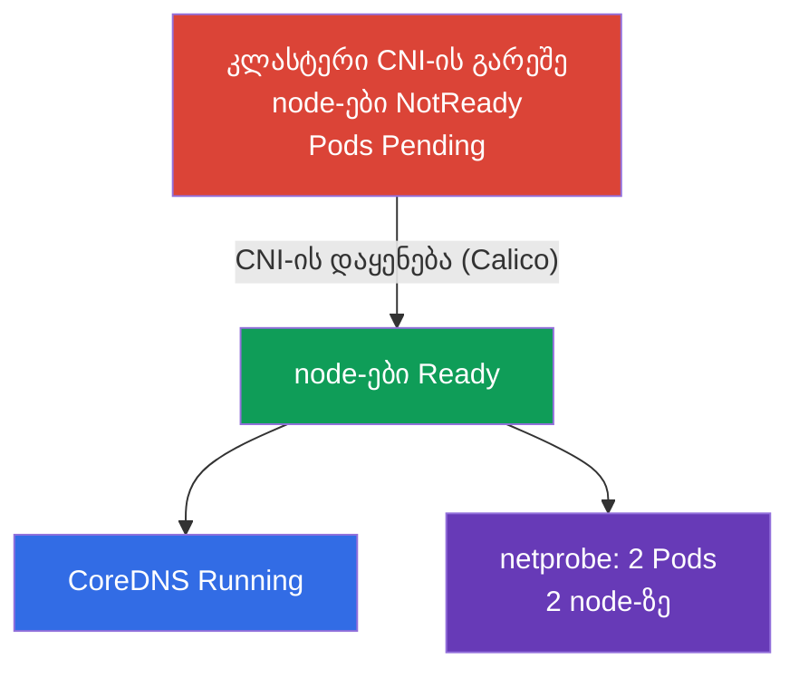

[Русская версия](README_RU.MD) · [Eng version](README.MD) · [Versión en español](README_ES.MD) · [Version française](README_FR.MD) · [Deutsche Version](README_DE.MD) · [繁體中文版](README_TW.MD) · [日本語版](README_JP.MD)

# Lab 123 — დაბალი დონის ქსელი: CNI-ის ინსტალაცია ნულიდან

## აღწერა

კლასტერი იშლება **CNI-ის გარეშე** — ქსელური პლაგინი არ არის, ამიტომ ყველა node
`NotReady`-შია, Pods არ ეშვება, CoreDNS არ იწყებს მუშაობას. თქვენი ამოცანაა დააყენოთ CNI
**ხელით** (როგორც რეალურ kubeadm-კლასტერზე) და დარწმუნდეთ, რომ Pods-ის ქსელი მუშაობს,
მათ შორის node-ებს შორისაც. დამატებით — გაარჩიოთ node-ის დაბალი დონის ქსელი
(CNI-ის კონფიგი, მარშრუტები, network namespace-ები, veth) და შეავსოთ ანგარიში.

ყველა დავალება გამოცდის სტილშია გაფორმებული (როგორც რეალური CKA კითხვები) და მათი
შემოწმება ავტომატურად ხდება ბრძანებით `check_result`. განსხვავება ლაბორატორია 118-სგან: იქ ქსელი
უკვე დაყენებულია და თქვენ მას ამოწმებთ/აკეთებთ, აქ თქვენ **აყენებთ CNI-ს ნულიდან** — სავალდებულო
ნაბიჯი `kubeadm init`-ის შემდეგ.

## მიზანი

განამტკიცოთ კურსის თავების მასალა:

- [თავი 30. Kubernetes-ის ქსელური მოდელი, pod-ების ქსელი და CNI](../../course/30/ge.md) — Pods-ის ბრტყელი ქსელი, ქსელური მოდელის მოთხოვნები, CNI-ის როლი
- [თავი 40. გაფართოების ინტერფეისები: CNI, CSI, CRI](../../course/40/ge.md) — რა არის CNI-პლაგინი და როგორ უერთდება kubelet-ს
- [თავი 46. სერვისებისა და ქსელის გამართვა](../../course/46/ge.md) — node-ის ქსელის დიაგნოსტიკა: მარშრუტები, network namespace-ები, veth

## რას ვაკეთებთ და რისთვის

ამ ლაბორატორიაში „შიშველ“ კლასტერზე ვაშენებთ Pods-ის ქსელს და ვარჩევთ, როგორ არის აწყობილი
node-ის დაბალი დონის ქსელი. თითოეული ნაბიჯი თავის უნარს ფარავს:

| დავალება | უნარი | რას ასწავლის |
|----------|-------|--------------|
| **CNI-ის ხელით დაყენება** | CNI-ის მანიფესტის `kubectl apply` | kubeadm-ინსტალაციის ნაბიჯი „Pod network add-on“ |
| **Pods-ის ქსელის შემოწმება** | CoreDNS + Pods სხვადასხვა node-ზე | რას იძლევა CNI: ბრტყელი ქსელი, Pod-Pod კავშირი node-ებს შორის |
| **დაბალი დონის ქსელის გარჩევა** | `ip route`, `ip netns`, `nsenter`, veth, `/etc/cni/net.d` | როგორ უერთდება Pod node-ის ქსელს |

საბოლოო სურათი იმისა, რაც განთავსდება:



## ინფრასტრუქტურა

გარემო იშლება AWS-ში (`eu-central-1`) Terragrunt-ის მეშვეობით და შედგება:

| კომპონენტი | აღწერა                                                              |
|------------|----------------------------------------------------------------------|
| `vpc`      | VPC `10.10.0.0/16` საჯარო ქვექსელებით                                 |
| `ssh-keys` | SSH-გასაღებები node-ებზე წვდომისთვის                                  |
| `k8s-1`    | Kubernetes `1.35.2` (kubeadm), **CNI-ის გარეშე**, master + 1 worker-node; წინასწარ განთავსებულია `netprobe` (Pods `Pending`-შია CNI-ის დაყენებამდე) |
| `worker`   | სამუშაო მანქანა `kubectl`-ითა და `check_result`-ით; SSH-წვდომა კლასტერის node-ებზე |

ინსტანსები: `t4g.medium` Ubuntu `22.04`. კლასტერი ორკვანძიანია — master (control plane) და
ერთი worker; CNI დაყენებული არ არის, ამიტომ node-ები NotReady მდგომარეობაში იწყებენ.

## განთავსება

```bash
TASK=123 make run_cka_task
```

შექმნის შემდეგ დაუკავშირდით სამუშაო მანქანას (worker) SSH-ით და დავალებები შეასრულეთ
იქიდან. `kubectl` უკვე კონფიგურირებულია კონტექსტზე `cluster1-admin@cluster1`. CNI-ის დაყენებისა
და დაბალი დონის ქსელის გარჩევისთვის დაუკავშირდით კლასტერის node-ებს: `ssh k8s1_controlPlane_1`
(control plane) და `ssh k8s1_node_node_1` (worker-node).

სასარგებლო ბრძანებები სამუშაო მანქანაზე:

```bash
time_left       # რამდენი დრო დარჩა
check_result    # ამოხსნის შემოწმება
```

## დავალებები

---
|        **1**        | **CNI-ის დაყენება ნულიდან**                                  |
| :-----------------: | :----------------------------------------------------------- |
| რას ვაკეთებთ        | დააყენეთ ქსელური პლაგინი (Calico) ხელით — ეს kubeadm-ის ოფიციალური ნაბიჯია „Installing a Pod network add-on“. გამოიყენეთ მანიფესტი `kubectl apply -f <URL>`-ით და აირჩიეთ Calico-ს ვერსია, რომელიც თავსებადია Kubernetes `1.35`-თან. დაელოდეთ, სანამ `kube-system`-ში `calico-node` Pods ამუშავდება და კლასტერის ყველა node `NotReady`-დან `Ready`-ში გადავა. |
| მიღების კრიტერიუმები | - კლასტერის ყველა node (≥ 2) `Ready` სტატუსშია. |
---
|        **2**        | **CoreDNS-ის შემოწმება**                                     |
| :-----------------: | :----------------------------------------------------------- |
| რას ვაკეთებთ        | დარწმუნდით, რომ CNI-ის დაყენების შემდეგ ამუშავდა `CoreDNS` — სანამ Pods-ის ქსელი არ იყო, მისი Pods `Pending`-ში ეკიდა. დაელოდეთ, სანამ namespace `kube-system`-ის Deployment `coredns` მიიღებს სულ მცირე ერთ მზა რეპლიკას. |
| მიღების კრიტერიუმები | - Deployment `coredns` namespace `kube-system`-ში: `readyReplicas ≥ 1`. |
---
|        **3**        | **node-ებს შორის ქსელის შემოწმება**                          |
| :-----------------: | :----------------------------------------------------------- |
| რას ვაკეთებთ        | namespace `netlab`-ში წინასწარ განთავსებულია Deployment `netprobe` (label `app=netprobe`), რომელიც CNI-ის გარეშე `Pending`-ში ეკიდა. დარწმუნდით, რომ პლაგინის დაყენების შემდეგ მისი ორივე რეპლიკა `Running` გახდა და **ორ სხვადასხვა** node-ზე გაიშალა — ეს ადასტურებს node-ებს შორის მომუშავე ბრტყელ Pod-Pod ქსელს. |
| მიღების კრიტერიუმები | - Deployment `netprobe` (namespace `netlab`): 2 მზა (ready) რეპლიკა 2 სხვადასხვა node-ზე. |
---
|        **4**        | **ანგარიში დაბალი დონის ქსელზე**                             |
| :-----------------: | :----------------------------------------------------------- |
| რას ვაკეთებთ        | დაუკავშირდით control-plane node-ს (`ssh k8s1_controlPlane_1`), გაარკვიეთ CNI-ის კონფიგურაციის ფაილის სახელი `/etc/cni/net.d`-ში (მაგ. `10-calico.conflist`) და ნაგულისხმევი მარშრუტის მოწყობილობა (`ip route show default` → მნიშვნელობა `dev`-ის შემდეგ, მაგ. `ens5`). ჩაწერეთ ორივე ფაქტი ფაილში `/home/ubuntu/answers/net-lowlevel.txt` ფორმატით `cni_conf=<ფაილი>` და `default_route_dev=<ინტერფეისი>`. |
| მიღების კრიტერიუმები | - `cni_conf` — არსებული ფაილი `/etc/cni/net.d`-ში control-plane node-ზე;<br/>- `default_route_dev` ემთხვევა ნაგულისხმევი მარშრუტის მოწყობილობას (`ip route`-დან). |
---

## შედეგის შემოწმება

სამუშაო მანქანაზე გაუშვით ავტომატური შემოწმება:

```bash
check_result
```

სკრიპტი გაატარებს ტესტებს და აჩვენებს, რამდენი დავალებაა შესრულებული.

## ამოხსნა

ეტალონური ამოხსნა: [worker/files/solutions/1_GE.MD](worker/files/solutions/1_GE.MD)

## Mock-გამოცდების დაფარვა

დომენი Services & Networking + კლასტერის ინსტალაცია (Cluster Architecture): ქსელური პლაგინის
დაყენება სავალდებულო ნაბიჯია `kubeadm init`-ის შემდეგ.

## კლასტერისა და რესურსების წაშლა

```bash
TASK=123 make delete_cka_task
```
