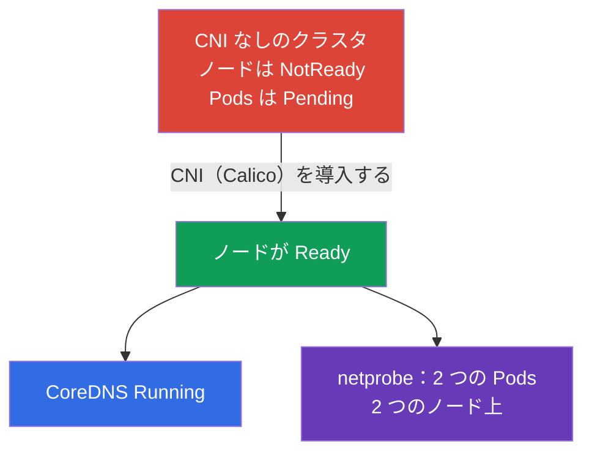

[Русская версия](README_RU.MD) · [Eng version](README.MD) · [Versión en español](README_ES.MD) · [Version française](README_FR.MD) · [Deutsche Version](README_DE.MD) · [ქართული ვერსია](README_GE.MD) · [繁體中文版](README_TW.MD)

# Lab 123 - 低レベルのネットワーク：CNI をゼロから導入する

## 概要

クラスタは **CNI なし**で展開されます - ネットワークプラグインが存在しないため、すべてのノードは
`NotReady` のままで、Pods は起動せず、CoreDNS も立ち上がりません。あなたの課題は CNI を
**手作業で**導入し（実際の kubeadm クラスタと同じように）、ノードをまたぐ通信も含めて
Pod のネットワークが動き出したことを確認することです。さらに、ノードの低レベルなネットワーク
（CNI の設定ファイル、ルート、network namespaces、veth）を掘り下げてレポートを埋めます。

すべての課題は試験形式（実際の CKA の問題と同じスタイル）で書かれており、
`check_result` コマンドで自動的に検証されます。実習 118 との違い：あちらではネットワークは
すでに導入済みで、あなたはそれを調べたり直したりしますが、ここでは **CNI をゼロから導入**します -
`kubeadm init` の後に必ず必要となる手順です。

## 目的

次のコース章の内容を定着させます：

- [第 30 章。Kubernetes のネットワークモデル、Pod のネットワーク、CNI](../../course/30/README.md) - フラットな Pod ネットワーク、ネットワークモデルの要件、CNI の役割
- [第 40 章。拡張インターフェース：CNI、CSI、CRI](../../course/40/README.md) - CNI プラグインとは何か、そしてそれがどのように kubelet に組み込まれるか
- [第 46 章。サービスとネットワークのデバッグ](../../course/46/README.md) - ノードのネットワーク診断：ルート、network namespaces、veth

## 何を作り、なぜ作るのか

この実習では「素の」クラスタ上に Pod のネットワークを立ち上げ、ノードの低レベルな
ネットワークがどう組み立てられているかを解きほどきます。各ステップはそれぞれのスキルに対応します：

| 課題 | スキル | 何を学ぶか |
|--------|-------|-----------|
| **CNI を手作業で導入する** | CNI マニフェストへの `kubectl apply` | kubeadm 導入手順の「Pod network add-on」のステップ |
| **Pod のネットワークを確認する** | CoreDNS + ノードをまたぐ Pods | CNI が何をもたらすか：フラットなネットワーク、ノード間の Pod-Pod 通信 |
| **低レベルのネットワークを解きほどく** | `ip route`、`ip netns`、`nsenter`、veth、`/etc/cni/net.d` | Pod がどのようにノードのネットワークへつながるか |

最終的にデプロイされる全体像：



## インフラ

環境は Terragrunt により AWS（`eu-central-1`）に展開され、次の要素で構成されます：

| コンポーネント | 説明                                                             |
|------------|----------------------------------------------------------------------|
| `vpc`      | パブリックサブネットを持つ VPC `10.10.0.0/16`                          |
| `ssh-keys` | ノードへアクセスするための SSH キー                                     |
| `k8s-1`    | Kubernetes `1.35.2`（kubeadm）、**CNI なし**、master + worker ノード 1 台；`netprobe` は事前にデプロイ済み（CNI 導入までは Pods は `Pending`） |
| `worker`   | `kubectl` と `check_result` を備えた作業マシン；クラスタのノードへ SSH でアクセス可能 |

インスタンス：`t4g.medium`、Ubuntu `22.04`。クラスタは 2 ノード構成で、master（control-plane）と
worker 1 台です；CNI が導入されていないため、ノードは NotReady で起動します。

## デプロイ

```bash
TASK=123 make run_cka_task
```

作成が完了したら、SSH で作業マシン（worker）に接続し、そこから課題を進めてください。
`kubectl` はすでに `cluster1-admin@cluster1` コンテキストに設定されています。CNI の導入と
低レベルネットワークの調査のためには、クラスタのノードへ接続します：`ssh k8s1_controlPlane_1`
（control plane）と `ssh k8s1_node_node_1`（worker ノード）。

作業マシンで使える便利なコマンド：

```bash
time_left       # 残り時間
check_result    # 解答をチェックする
```

## 課題

---
|        **1**        | **CNI をゼロから導入する**                                    |
| :-----------------: | :----------------------------------------------------------- |
| やること            | ネットワークプラグイン（Calico）を手作業で導入してください - これは kubeadm の公式手順「Installing a Pod network add-on」です。Kubernetes `1.35` と互換のある Calico のバージョンを選び、`kubectl apply -f <URL>` でマニフェストを適用します。`kube-system` の Pods `calico-node` が立ち上がり、クラスタのすべてのノードが `NotReady` から `Ready` に移るまで待ちます。 |
| 受け入れ基準        | - クラスタのすべてのノード（≥ 2）が `Ready` の状態にある。 |
---
|        **2**        | **CoreDNS を確認する**                                       |
| :-----------------: | :----------------------------------------------------------- |
| やること            | CNI の導入後に `CoreDNS` が立ち上がったことを確認してください - Pod のネットワークが現れるまで、その Pods は `Pending` のままでした。namespace `kube-system` の Deployment `coredns` が少なくとも 1 つの ready なレプリカを得るまで待ちます。 |
| 受け入れ基準        | - namespace `kube-system` の Deployment `coredns`：`readyReplicas ≥ 1`。 |
---
|        **3**        | **ノードをまたぐネットワークを確認する**                      |
| :-----------------: | :----------------------------------------------------------- |
| やること            | namespace `netlab` には Deployment `netprobe`（label `app=netprobe`）が事前にデプロイされており、CNI がない状態では `Pending` のままでした。プラグインの導入後に 2 つのレプリカがどちらも `Running` になり、**異なる 2 つの**ノードへ分散したことを確認してください - これはノード間でフラットな Pod-Pod ネットワークが動いていることの裏付けになります。 |
| 受け入れ基準        | - Deployment `netprobe`（namespace `netlab`）：2 つの ready なレプリカが異なる 2 つのノード上にある。 |
---
|        **4**        | **低レベルネットワークのレポート**                            |
| :-----------------: | :----------------------------------------------------------- |
| やること            | control-plane ノードへ接続し（`ssh k8s1_controlPlane_1`）、`/etc/cni/net.d` にある CNI 設定ファイルの名前（例：`10-calico.conflist`）と、デフォルトルートのデバイス（`ip route show default` → `dev` の後の値、例：`ens5`）を調べてください。この 2 つの事実を `cni_conf=<ファイル>` と `default_route_dev=<インターフェース>` の形式でファイル `/home/ubuntu/answers/net-lowlevel.txt` に書き込みます。 |
| 受け入れ基準        | - `cni_conf` が control-plane ノードの `/etc/cni/net.d` に実際に存在するファイルである；<br/>- `default_route_dev` がデフォルトルートのデバイス（`ip route` の出力）と一致する。 |
---

## 結果のチェック

作業マシンで自動チェックを実行します：

```bash
check_result
```

スクリプトがテストを実行し、いくつの課題が完了したかを表示します。

## 解答

参考解答：[worker/files/solutions/1_JP.MD](worker/files/solutions/1_JP.MD)

## 模擬試験のカバー範囲

Services & Networking のドメインと、クラスタの導入（Cluster Architecture）：ネットワーク
プラグインの導入は `kubeadm init` の後に必ず必要となる手順です。

## クラスタとリソースの削除

```bash
TASK=123 make delete_cka_task
```
