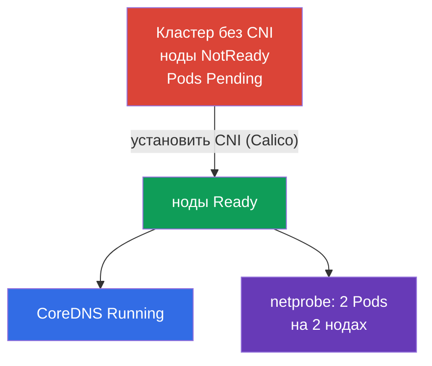

# Lab 123 — Низкоуровневая сеть: установка CNI с нуля

## Описание

Кластер разворачивается **без CNI** — сетевого плагина нет, поэтому все ноды в
`NotReady`, Pods не запускаются, CoreDNS не поднимается. Ваша задача — установить CNI
**руками** (как на реальном kubeadm-кластере) и убедиться, что заработала сеть Pods,
в том числе меж-нодовая. Дополнительно — разобрать низкоуровневую сеть ноды
(конфиг CNI, маршруты, network namespaces, veth) и заполнить отчёт.

Все задания оформлены в экзаменационном стиле (как реальные вопросы CKA) с
автоматической проверкой командой `check_result`. Отличие от лабы 118: там сеть уже
установлена и вы её инспектируете/чините, здесь вы **ставите CNI с нуля** — обязательный
шаг после `kubeadm init`.

## Цель

Закрепить материал глав курса:

- [Глава 30. Сетевая модель Kubernetes, сеть подов и CNI](../../course/30/ru.md) — плоская сеть Pods, требования сетевой модели, роль CNI
- [Глава 40. Интерфейсы расширения: CNI, CSI, CRI](../../course/40/ru.md) — что такое CNI-плагин и как он подключается к kubelet
- [Глава 46. Отладка сервисов и сети](../../course/46/ru.md) — диагностика сети ноды: маршруты, network namespaces, veth

## Что мы делаем и зачем

В этой лабе мы поднимаем сеть Pods на «голом» кластере и разбираем, как устроена
низкоуровневая сеть ноды. Каждый шаг закрывает свой навык:

| Задача | Навык | Чему учит |
|--------|-------|-----------|
| **Установить CNI руками** | `kubectl apply` манифеста CNI | шаг «Pod network add-on» из kubeadm-установки |
| **Проверить сеть Pods** | CoreDNS + меж-нодовые Pods | что даёт CNI: плоская сеть, связь Pod-Pod между нодами |
| **Разобрать низкоуровневую сеть** | `ip route`, `ip netns`, `nsenter`, veth, `/etc/cni/net.d` | как Pod подключается к сети ноды |

Итоговая картина того, что будет развёрнуто:



## Инфраструктура

Окружение разворачивается в AWS (`eu-central-1`) через Terragrunt и состоит из:

| Компонент  | Описание                                                             |
|------------|----------------------------------------------------------------------|
| `vpc`      | VPC `10.10.0.0/16` с публичными подсетями                            |
| `ssh-keys` | SSH-ключи для доступа к нодам                                        |
| `k8s-1`    | Kubernetes `1.35.2` (kubeadm), **БЕЗ CNI**, master + 1 worker-нода; заранее развёрнут `netprobe` (Pods в `Pending` до установки CNI) |
| `worker`   | Рабочая машина с `kubectl` и `check_result`; SSH-доступ к нодам кластера |

Инстансы: `t3.medium` Ubuntu `22.04`. Кластер двухнодовый — master (control-plane) и
один worker; CNI не установлен, поэтому ноды стартуют в NotReady.

## Развёртывание

```bash
TASK=123 make run_cka_task
```

После создания подключитесь к рабочей машине (worker) по SSH и выполняйте задания
оттуда. `kubectl` уже настроен на контекст `cluster1-admin@cluster1`. Для установки CNI
и разбора низкоуровневой сети подключайтесь к нодам кластера: `ssh k8s1_controlPlane_1`
(control plane) и `ssh k8s1_node_node_1` (worker-нода).

Полезные команды на рабочей машине:

```bash
time_left       # сколько осталось времени
check_result    # проверить решение
```

## Задания

---
|        **1**        | **Установить CNI с нуля**                                    |
| :-----------------: | :----------------------------------------------------------- |
| Что делаем          | Установите сетевой плагин (Calico) вручную — это официальный шаг kubeadm «Installing a Pod network add-on». Примените манифест через `kubectl apply -f <URL>`, выбрав версию Calico, совместимую с Kubernetes `1.35`. Дождитесь, пока Pods `calico-node` в `kube-system` поднимутся и все ноды кластера перейдут из `NotReady` в `Ready`. |
| Критерии приёмки    | - все ноды кластера (≥ 2) в статусе `Ready`. |
---
|        **2**        | **Проверить CoreDNS**                                       |
| :-----------------: | :----------------------------------------------------------- |
| Что делаем          | Убедитесь, что после установки CNI поднялся `CoreDNS` — до появления сети Pods его Pods висели в `Pending`. Дождитесь, пока Deployment `coredns` в namespace `kube-system` получит хотя бы одну готовую реплику. |
| Критерии приёмки    | - Deployment `coredns` в namespace `kube-system`: `readyReplicas ≥ 1`. |
---
|        **3**        | **Проверить меж-нодовую сеть**                              |
| :-----------------: | :----------------------------------------------------------- |
| Что делаем          | В namespace `netlab` заранее развёрнут Deployment `netprobe` (label `app=netprobe`), который висел в `Pending` без CNI. Убедитесь, что после установки плагина обе его реплики стали `Running` и разъехались на **две разные** ноды — это подтверждает работающую плоскую сеть Pod-Pod между нодами. |
| Критерии приёмки    | - Deployment `netprobe` (namespace `netlab`): 2 готовые (ready) реплики на 2 разных нодах. |
---
|        **4**        | **Отчёт по низкоуровневой сети**                            |
| :-----------------: | :----------------------------------------------------------- |
| Что делаем          | Подключитесь к control-plane ноде (`ssh k8s1_controlPlane_1`), выясните имя файла конфигурации CNI в `/etc/cni/net.d` (напр. `10-calico.conflist`) и устройство маршрута по умолчанию (`ip route show default` → значение после `dev`, напр. `ens5`). Запишите оба факта в файл `/home/ubuntu/answers/net-lowlevel.txt` в формате `cni_conf=<файл>` и `default_route_dev=<интерфейс>`. |
| Критерии приёмки    | - `cni_conf` — существующий файл в `/etc/cni/net.d` на control-plane ноде;<br/>- `default_route_dev` совпадает с устройством маршрута по умолчанию (из `ip route`). |
---

## Проверка результата

На рабочей машине запустите автоматическую проверку:

```bash
check_result
```

Скрипт прогонит тесты и покажет, сколько заданий выполнено.

## Решение

Эталонное решение: [worker/files/solutions/1.MD](worker/files/solutions/1.MD)

## Покрытие мок-экзаменов

Домен Services & Networking + установка кластера (Cluster Architecture): установка
сетевого плагина — обязательный шаг после `kubeadm init`.

## Удаление кластера и ресурсов

```bash
TASK=123 make delete_cka_task
```
