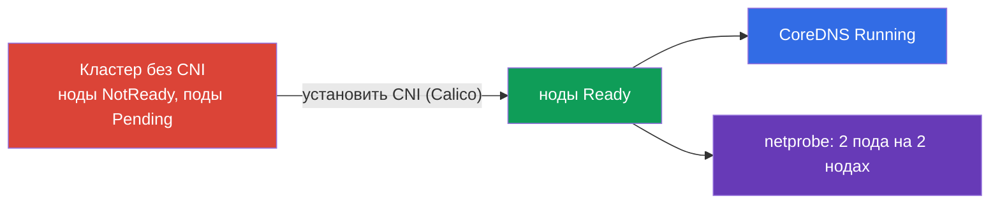

# Lab 123 — Низкоуровневая сеть: установка CNI с нуля

## Описание

Кластер разворачивается **без CNI** — сетевого плагина нет, поэтому все ноды в
`NotReady`, поды не запускаются, CoreDNS не поднимается. Ваша задача — установить CNI
**руками** (как на реальном kubeadm-кластере) и убедиться, что заработала сеть подов,
в том числе меж-нодовая. Дополнительно — разобрать низкоуровневую сеть ноды
(конфиг CNI, маршруты, network namespaces, veth) и заполнить отчёт.

Отличие от лабы 118: там сеть уже установлена и вы её инспектируете/чините, здесь вы
**ставите CNI с нуля**.

## Цель

Закрепить главы курса:

- [Глава 30. Сетевая модель Kubernetes, сеть подов и CNI](../../course/30/ru.md)
- [Глава 40. Интерфейсы расширения: CNI, CSI, CRI](../../course/40/ru.md)
- [Глава 46. Отладка сервисов и сети](../../course/46/ru.md)

## Что мы делаем и зачем

| Задача | Навык | Чему учит |
|--------|-------|-----------|
| **Установить CNI руками** | `kubectl apply` манифеста CNI | шаг «Pod network add-on» из kubeadm-установки |
| **Проверить сеть подов** | CoreDNS + меж-нодовые поды | что даёт CNI: плоская сеть, связь под-под между нодами |
| **Разобрать низкоуровневую сеть** | `ip route`, `ip netns`, `nsenter`, veth, `/etc/cni/net.d` | как под подключается к сети ноды |



## Инфраструктура

| Компонент  | Описание                                                             |
|------------|----------------------------------------------------------------------|
| `k8s-1`    | Kubernetes `1.35.2` (kubeadm), **БЕЗ CNI**, master + 1 worker; заранее развёрнут `netprobe` (Pending до установки CNI) |
| `worker`   | Рабочая машина с `kubectl` и `check_result`; SSH-доступ к нодам      |

## Развёртывание

```bash
TASK=123 make run_cka_task
```

## Задания

---
|        **1**        | **Установить CNI с нуля**                                    |
| :-----------------: | :----------------------------------------------------------- |
| Что делаем          | Установить сетевой плагин (Calico) вручную по официальной документации |
| Критерии приёмки    | - Все ноды (≥2) в статусе `Ready` |
---
|        **2**        | **Проверить CoreDNS**                                       |
| :-----------------: | :----------------------------------------------------------- |
| Что делаем          | Убедиться, что после установки CNI поднялся CoreDNS |
| Критерии приёмки    | - Deployment `coredns`: `readyReplicas ≥ 1` |
---
|        **3**        | **Проверить меж-нодовую сеть**                              |
| :-----------------: | :----------------------------------------------------------- |
| Что делаем          | Убедиться, что поды `netprobe` (ns `netlab`) запустились на разных нодах |
| Критерии приёмки    | - `netprobe`: 2 готовые реплики на 2 разных нодах |
---
|        **4**        | **Отчёт по низкоуровневой сети**                            |
| :-----------------: | :----------------------------------------------------------- |
| Что делаем          | Записать `/home/ubuntu/answers/net-lowlevel.txt`: `cni_conf=<файл в /etc/cni/net.d>` и `default_route_dev=<интерфейс из ip route>` |
| Критерии приёмки    | - `cni_conf` — существующий файл в `/etc/cni/net.d` на control plane<br>- `default_route_dev` совпадает с устройством маршрута по умолчанию |
---

## Проверка результата

```bash
check_result
```

## Решение

[worker/files/solutions/1.MD](worker/files/solutions/1.MD)

## Покрытие мок-экзаменов

Домен Services & Networking + установка кластера (Cluster Architecture): установка
сетевого плагина — обязательный шаг после `kubeadm init`.

## Удаление

```bash
TASK=123 make delete_cka_task
```
