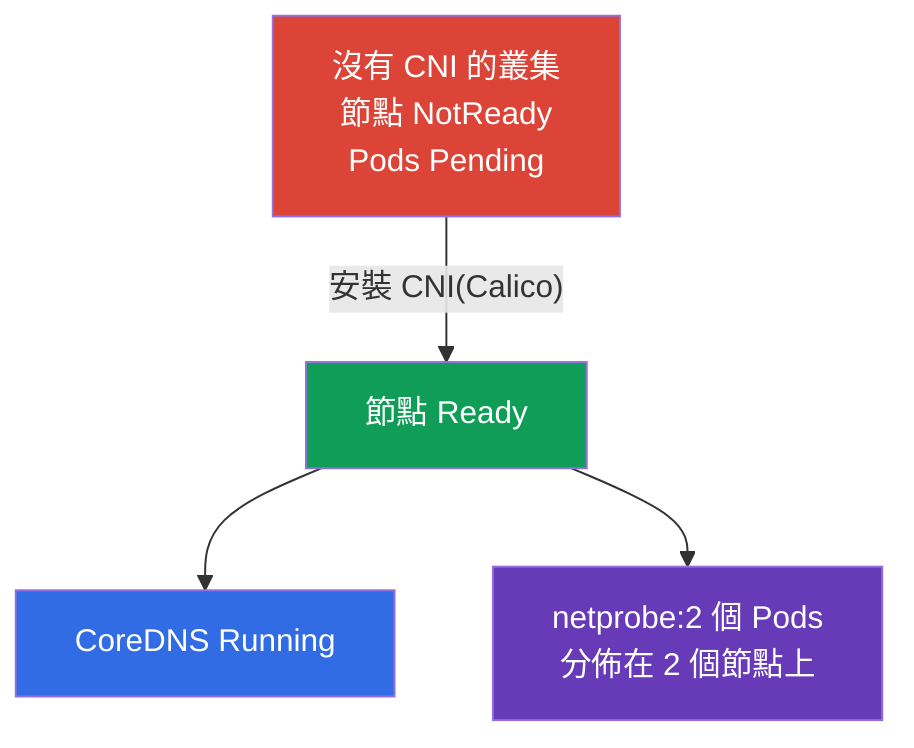

[Русская версия](README_RU.MD) · [Eng version](README.MD) · [Versión en español](README_ES.MD) · [Version française](README_FR.MD) · [Deutsche Version](README_DE.MD) · [ქართული ვერსია](README_GE.MD) · [日本語版](README_JP.MD)

# Lab 123 - 低階網路:從零安裝 CNI

## 說明

叢集在部署時**不含 CNI** - 沒有網路外掛,因此所有節點都處於
`NotReady`,Pods 無法啟動,CoreDNS 也起不來。你的任務是**手動**安裝 CNI
(就像在真實的 kubeadm 叢集上那樣),並確認 Pod 網路已經可以運作,
包含跨節點的通訊。此外還要深入拆解節點的低階網路
(CNI 設定檔、路由、network namespaces、veth)並填寫一份報告。

所有任務都以考試風格撰寫(就像真正的 CKA 題目),並透過
`check_result` 指令自動驗證。與實驗 118 的差別:那裡的網路已經
安裝好,你只是檢查/修復它,而這裡你要**從零安裝 CNI** - 這是
`kubeadm init` 之後的必要步驟。

## 目標

鞏固以下課程章節的內容:

- [第 30 章。Kubernetes 網路模型、Pod 網路與 CNI](../../course/30/README.md) - 扁平的 Pod 網路、網路模型的要求、CNI 的角色
- [第 40 章。擴充介面:CNI、CSI、CRI](../../course/40/README.md) - 什麼是 CNI 外掛,以及它如何接入 kubelet
- [第 46 章。除錯服務與網路](../../course/46/README.md) - 節點網路診斷:路由、network namespaces、veth

## 我們要做什麼,以及為什麼

在這個實驗中,我們要在一個「裸」叢集上把 Pod 網路建立起來,並拆解節點的
低階網路是怎麼組成的。每個步驟都對應一項技能:

| 任務 | 技能 | 學到什麼 |
|--------|-------|-----------|
| **手動安裝 CNI** | 對 CNI manifest 執行 `kubectl apply` | kubeadm 安裝流程中的「Pod network add-on」步驟 |
| **檢查 Pod 網路** | CoreDNS + 跨節點的 Pods | CNI 帶來什麼:扁平網路、節點之間的 Pod-Pod 連通性 |
| **拆解低階網路** | `ip route`、`ip netns`、`nsenter`、veth、`/etc/cni/net.d` | Pod 是如何接上節點網路的 |

最終部署出來的整體樣貌:



## 基礎架構

環境透過 Terragrunt 部署在 AWS(`eu-central-1`),由以下部分組成:

| 元件       | 說明                                                                 |
|------------|----------------------------------------------------------------------|
| `vpc`      | VPC `10.10.0.0/16`,含公有子網路                                      |
| `ssh-keys` | 用於存取節點的 SSH 金鑰                                               |
| `k8s-1`    | Kubernetes `1.35.2`(kubeadm),**不含 CNI**,master + 1 個 worker 節點;`netprobe` 已預先部署(在安裝 CNI 之前 Pods 會停在 `Pending`) |
| `worker`   | 工作機,具備 `kubectl` 與 `check_result`;可透過 SSH 存取叢集節點        |

執行個體:`t3.medium`,Ubuntu `22.04`。叢集為雙節點 - master(control plane)與
一個 worker;由於沒有安裝 CNI,節點啟動後會處於 NotReady。

## 部署

```bash
TASK=123 make run_cka_task
```

建立完成後,請透過 SSH 連線到工作機(worker),並在那裡完成任務。
`kubectl` 已經指向 `cluster1-admin@cluster1` context。若要安裝 CNI
並拆解低階網路,請連線到叢集節點:`ssh k8s1_controlPlane_1`
(control plane)與 `ssh k8s1_node_node_1`(worker 節點)。

工作機上的實用指令:

```bash
time_left       # 還剩多少時間
check_result    # 檢查解答
```

## 任務

---
|        **1**        | **從零安裝 CNI**                                              |
| :-----------------: | :----------------------------------------------------------- |
| 要做什麼            | 手動安裝網路外掛(Calico)- 這是官方 kubeadm 的「Installing a Pod network add-on」步驟。使用 `kubectl apply -f <URL>` 套用 manifest,並選擇與 Kubernetes `1.35` 相容的 Calico 版本。等到 `kube-system` 中的 `calico-node` Pods 起來,且叢集所有節點都從 `NotReady` 變成 `Ready`。 |
| 驗收標準            | - 叢集所有節點(≥ 2)都處於 `Ready` 狀態。 |
---
|        **2**        | **檢查 CoreDNS**                                             |
| :-----------------: | :----------------------------------------------------------- |
| 要做什麼            | 確認在安裝 CNI 之後 `CoreDNS` 已經起來 - 在 Pod 網路出現之前,它的 Pods 一直停在 `Pending`。等到 namespace `kube-system` 中的 Deployment `coredns` 至少有一個就緒副本。 |
| 驗收標準            | - namespace `kube-system` 中的 Deployment `coredns`:`readyReplicas ≥ 1`。 |
---
|        **3**        | **檢查跨節點網路**                                            |
| :-----------------: | :----------------------------------------------------------- |
| 要做什麼            | namespace `netlab` 中已預先部署 Deployment `netprobe`(label `app=netprobe`),在沒有 CNI 時它一直停在 `Pending`。確認在安裝外掛之後,它的兩個副本都變成 `Running`,並且分散到**兩個不同的**節點上 - 這證明節點之間的扁平 Pod-Pod 網路已經可以運作。 |
| 驗收標準            | - Deployment `netprobe`(namespace `netlab`):2 個就緒(ready)副本,分佈在 2 個不同節點上。 |
---
|        **4**        | **低階網路報告**                                              |
| :-----------------: | :----------------------------------------------------------- |
| 要做什麼            | 連線到 control-plane 節點(`ssh k8s1_controlPlane_1`),找出 `/etc/cni/net.d` 中 CNI 設定檔的名稱(例如 `10-calico.conflist`),以及預設路由的裝置(`ip route show default` → `dev` 後面的值,例如 `ens5`)。把這兩項事實寫入檔案 `/home/ubuntu/answers/net-lowlevel.txt`,格式為 `cni_conf=<檔案>` 與 `default_route_dev=<介面>`。 |
| 驗收標準            | - `cni_conf` 是 control-plane 節點上 `/etc/cni/net.d` 中實際存在的檔案;<br/>- `default_route_dev` 與預設路由的裝置一致(取自 `ip route`)。 |
---

## 檢查結果

在工作機上執行自動檢查:

```bash
check_result
```

腳本會跑完測試,並顯示已完成多少任務。

## 解答

參考解答:[worker/files/solutions/1_TW.MD](worker/files/solutions/1_TW.MD)

## 模擬考涵蓋範圍

Services & Networking 領域加上叢集安裝(Cluster Architecture):安裝
網路外掛是 `kubeadm init` 之後的必要步驟。

## 刪除叢集與資源

```bash
TASK=123 make delete_cka_task
```
